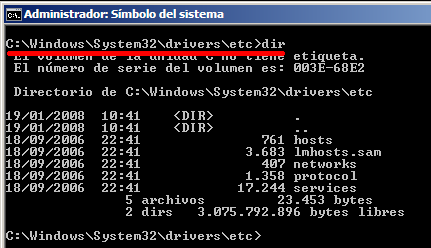
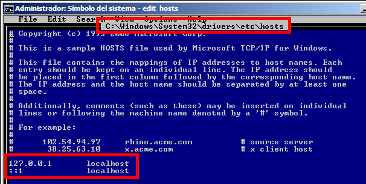
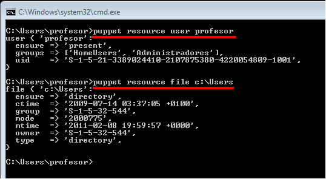

```
* Adaptada para el curso 201516.
* Comprobada en 201617.
```

# 1. Introducción

Existen varias herramientas para realizar instalaciones desde un punto central,
como Chef, Ansible, CFEngine, etc. En este ejemplo, vamos a usar Puppet.

Según Wikipedia, Puppet es una herramienta diseñada para administrar la configuración
de sistemas Unix-like y de Microsoft Windows de forma declarativa. El usuario describe
los recursos del sistema y sus estados, ya sea utilizando el lenguaje declarativo de
Puppet o un DSL (lenguaje específico del dominio) de Ruby.

Enlaces de interés:

* Vídeo en inglés ["LINUX: Installing the Puppet Master on openSUSE" by TheUrbanPenguin](https://www.youtube.com/watch?v=8jBlUKimPVc&feature=youtu.be)
* Vídeo en inglés ["LINUX: The Puppet Client and basic site.pp" by por TheUrbanPenguin](https://youtu.be/KLF1-i8RzGU)
* [Puppetcookbook](http://www.puppetcookbook.com/posts/show-resources-with-ralsh.html)
* Vídeo sin audio (14 minutos) sobre [Puppet en Debian](https://youtu.be/kPyaI--iAcA)
* [Vídeo en inglés](https://youtu.be/Hiu_ui2nZa0) minuto 15, 36 minutos de duración.

## 1.1 Entrega

* El trabajo se entregará vía repositorio GitHub del alumno.
* Usaremos la etiqueta `puppet` para la entrega.

## 1.2 Configuración

> **ADVERTENCIA**
>
> * Los nombres de máquinas, dominios, usuarios, etc., deben estar siempre en minúsculas.
> * No usar tildes, caracteres especiales (ñ, ü, etc.)
>
> En OpenSUSE podemos hacer configurar el equipo a través de `Yast`

Vamos a usar 3 MV's con las siguientes configuraciones:
* MV1 - master: Dará las órdenes de instalación/configuración a los clientes.
    * [Configuración OpenSUSE](../../global/configuracion/opensuse.md).
    * IP estática 172.AA.XX.100
    * Nombre del equipo: `masterXX`
    * Dominio: `curso1617`
* MV2 - cliente 1: recibe órdenes del master.
    * [Configuración OpenSUSE](../../global/configuracion/opensuse.md).
    * IP estática 172.AA.XX.101
    * Nombre del equipo: `cli1aluXX`
    * Dominio: `curso1617`
* MV3 - client2: recibe órdenes del master.
    * [Configuración SO Windows 7](../../global/configuracion/windows.md).
    Este SO debe haber sido instalado por cada alumno.
    NO clonar de un compañero y/o profesor.
    * IP estática 172.18.XX.102
    * Nombre Netbios: `cli2aluXX`
    * Nombre del equipo: `cli2aluXX`

### Configurar /etc/hosts

* Cada MV debe tener configurada en su `/etc/hosts` al resto de hosts, para
poder hacer `ping` entre ellas usando los nombres. Con este fichero obtenemos
resolución de nombres para nuestras propias MV's sin tener un servidor DNS.

> **GNU/Linux**
>
> El fichero `/etc/hosts` debe tener un contenido similar a:
>
>     127.0.0.1       localhost
>     127.0.0.2       master42.curso1617    master42
>     172.18.30.100   master42.curso1617    master42
>     172.18.30.101   cli1alu42.curso1617   cli1alu42
>     172.18.30.102   cli2alu42.curso1617   cli2alu42

> **Windows**
>
> Para localizar el fichero hosts de Windows, vamos a la ruta de la imagen:
>
> 
>
> El contenido del fichero hosts de Windows tiene el siguiente aspecto:
>
> 

## 1.3 Comprobaar las configuraciones

En GNU/Linux, para comprobar que las configuraciones son correctas hacemos:

```
date
ip a
route -n
host www.google.es
hostname -a
hostname -f
hostname -d
tail -n 5 /etc/hosts
ping masterXX
ping masterXX.curso1617
ping cli1aluXX
ping cli1aluXX.curso1617
ping cli2aluXX
ping cli2aluXX.curso1617   
```

En Windows comprobamos con:

```
date
ipconfig
route /PRINT
nslookup www.google.es
ping masterXX
ping masterXX.curso1617
ping cli1aluXX
ping cli1aluXX.curso1617
ping cli2aluXX
ping cli2aluXX.curso1617   
```

> **IMPORTANTE**: Asegurarse de que todas las máquinas tienen la fecha/hora correcta.

## 1.4 Veamos un ejemplo

*Esto NO HAY QUE HACERLO. Sólo es un ejemplo.*

Vamos a ver un ejemplo de cómo usar `puppet` manualmente. Esto nos puede
ayudar a comprender cómo es la sintaxis de la herramienta.

Al instalar el servidor Puppet en la máquina master, también tenemos instalado el Agente puppet.
Vamos a preguntar a puppet para ver cómo responde:
* sobre el paquete `tree` instalado en el sistema.
* sobre el usuario `barbaroja` creado en el sistema, y
* sobre la carpeta `/home/barbaroja/barco` que ya existe en el sistema.

Vamos a averiguar la configuración que lee puppet de estos recursos, y guardamos los datos
obtenidos de puppet en el fichero de prueba `piratas.pp`. Para ello ejecutamos los comandos siguientes:

    puppet resource package tree > piratas.pp
    puppet resource user barbaroja >> piratas.pp
    puppet resource file /home/barbaroja/barco >> piratas.pp

El contenido del fichero `piratas.pp` debe ser parecido a:

```
package { 'tree':
  ensure => 'present',
}

user { 'barbaroja':
  ensure => 'present',
  home => '/home/barbaroja',
  password => '$6$G09ynAifi7mX$6pag6BIvQWT6iLa8fjQx20nEev3PabB6HdbqBX37oXrmP6y0',
  shell => '/bin/bash',
}

file { '/home/barbaroja/barco/':
  ensure => 'directory',
  group => '100',
  mode => '755',
  owner => '1001',
  type => 'directory',
}
```

Si nos lleváramos el fichero `piratas.pp` a otro PC con el Agente puppet instalado, podemos forzar a que se creen estos cambios con el comando: `puppet apply piratas.pp`

---

# 2. Primera versión del fichero pp

* Instalamos Puppet Master en la MV masterXX:
    * `zypper install rubygem-puppet-master` (Leap).
    * `zypper install puppet-server puppet puppet-vim` (13.2).

> El paquete `puppet-vim`, sólo es para que el editor vim detecte la sintaxis de puppet.

* `systemctl status puppetmaster`: Consultar el estado del servicio.
* `systemctl enable puppetmaster`: Permitir que el servicio se inicie automáticamente en el inicio de la máquina.
* `systemctl start puppetmaster`: Iniciar el servicio.
* `systemctl status puppetmaster`: Consultar el estado del servicio.
* En este momento debería haberse creado el directorio `/etc/puppet/manifests`.
* Preparamos los ficheros/directorios en el master:
```
mkdir /etc/puppet/files
touch /etc/puppet/files/readme.txt
mkdir /etc/puppet/manifests
touch /etc/puppet/manifests/site.pp
mkdir /etc/puppet/manifests/classes
touch /etc/puppet/manifests/classes/hostlinux1.pp
```

## 2.1 /etc/puppet/files/readme.txt

Los ficheros que se guardan en `/etc/puppet/files` se pueden
descargar desde el resto de máquinas cliente puppet.

* Contenido para readme.txt: `"¡Al abordaje!"`.

> Ejemplo de configuración puppet para descargar fichero:
> ```
> file {  '/opt/readme.txt' :
>         source => 'puppet:///files/readme.txt',
> }
> ```

## 2.2 /etc/puppet/manifests/site.pp

* `/etc/puppet/manifests/site.pp` es el fichero principal de configuración
de órdenes para los agentes/nodos puppet.
* Contenido de nuestro `site.pp`:

```
import "classes/*"

node default {
  include hostlinux1
}
```

> Esta configuración significa:
>
> * Todos los ficheros de configuración del directorio classes se añadirán a este fichero.
> * Todos los nodos/clientes van a usar la configuración `hostlinux1`

## 2.3 /etc/puppet/manifests/classes/hostlinux1.pp

Como podemos tener muchas configuraciones, vamos a separarlas en distintos ficheros para organizarnos mejor, y las vamos a guardar en la ruta `/etc/puppet/manifests/classes`

Vamos a crear una primera configuración para máquina estándar GNU/Linux.

* Contenido para `/etc/puppet/manifiests/classes/hostlinux1.pp`:

```
class hostlinux1 {
  package { "tree": ensure => installed }
  package { "traceroute": ensure => installed }
  package { "geany": ensure => installed }
}
```

> **OJO**: La ruta del fichero es `/etc/puppet/manifests/classes/hostlinux1.pp`.

* `tree /etc/puppet`, consultar los ficheros/directorios que tenemos creado.
* Comprobar que tenemos los permisos adecuados en la ruta `/var/lib/puppet`.
* Reiniciamos el servicio `systemctl restart puppetmaster`.
* Comprobamos que el servicio está en ejecución de forma correcta.
    * `systemctl status puppetmaster`
    * `netstat -ntap |grep ruby`
* Consultamos log por si hay errores: `tail /var/log/puppet/*.log`
* Abrir el cortafuegos para el servicio.

---

# 3. Instalación y configuración del cliente1

Vamos a instalar y configurar el cliente 1.
* Vamos a la MV cliente 1.
* `zypper install puppet`, para instalar el Agente Puppet.
* El cliente puppet debe ser informado de quien será su master.
Para ello, vamos a configurar `/etc/puppet/puppet.conf`:

```
[main]
server=masterXX.curso1617
...
```  

* Comprobar que tenemos los permisos adecuados en la ruta `/var/lib/puppet`.  
* `systemctl status puppet`: Ver el estado del servicio puppet.
* `systemctl enable puppet`: Activar el servicio en cada reinicio de la máquina.
* `systemctl start puppet`: Iniciar el servicio puppet.
* `systemctl status puppet`: Ver el estado del servicio puppet.
* `netstat -ntap |grep ruby`: Muestra los servicios conectados a cada puerto.
* Comprobamos los log del cliente: `tail /var/log/puppet/puppet.log`

---

# 4. Certificados

Antes de que el master acepte a cliente1 como cliente, se deben intercambiar los certificados entre ambas máquinas. Esto sólo hay que hacerlo una vez.

A partir de este momento ya no deberíamos cambiar los nombres de las máquinas.

## 4.1 Aceptar certificado

* Vamos a la MV master.
* `puppet cert list`, consultamos las peticiones pendientes de unión al master:
```
root@master42# puppet cert list
"cli1alu30.curso1617" (D8:EC:E4:A2:10:55:00:32:30:F2:88:9D:94:E5:41:D6)
root@master42#
```

> **En caso de no aparecer el certificado en espera**
>
> * Si no aparece el certificado del cliente en la lista de espera del servidor, quizás el cortafuegos del servidor y/o cliente, está impidiendo el acceso.
> * Volver a reiniciar el servicio en el cliente y comprobar su estado.

* `puppet cert sign "nombre-máquina-cliente"`, aceptar al nuevo cliente desde el master:

```
root@master42# puppet cert sign "cli1alu42.curso1617"
notice: Signed certificate request for cli1alu42.curso1617
notice: Removing file Puppet::SSL::CertificateRequest cli1alu42.curso1617 at '/var/lib/puppet/ssl/ca/requests/cli1alu42.curso1617.pem'

root@master42# puppet cert list

root@master42# puppet cert print cli1alu42.curso1617
Certificate:
Data:
....
```

A continuación podemos ver una imagen de ejemplo, los datos no tienen que coincidir con lo que se pide en el ejercicio.


## 4.2 Comprobación

Vamos a comprobar que las órdenes (manifiesto) del master, llega bien al cliente y éste las ejecuta.
* Vamos a cliente1 y reiniciamos la máquina y/o el servicio Puppet.
* Comprobar que los cambios configurados en Puppet se han realizado.
    * `tree /home/nuevo-usuario`
* En caso contrario, ejecutar comando para comprobar errores:
    * `puppet agent --test`
    * `puppet agent --server master30.vargas --test`
* Para ver el detalle de los errores, podemos reiniciar el servicio puppet en el cliente, y consultar el archivo de log del cliente: `tail /var/log/puppet/puppet.log`.
* Puede ser que tengamos algún mensaje de error de configuración del fichero `/etc/puppet/manifests/site.pp del master`. En tal caso, ir a los ficheros del master y corregir los errores de sintáxis.

> **¿Cómo eliminar certificados?** (*Esto NO HAY QUE HACERLO*)
>
> Sólo es información, para el caso que tengamos que eliminar los certificados. Cuando tenemos
problemas con los certificados, o los identificadores de las máquinas han cambiado suele ser
buena idea eliminar los certificados y volverlos a generar con la nueva información.
>
> Si tenemos problemas con los certificados, y queremos eliminar los certificados actuales, podemos hacer lo siguiente:
> * `puppet cert revoke cli1alu42.curso1617`: Lo ejecutamos en el master para revocar certificado del cliente.
> * `puppet cert clean  cli1alu42.curso1617`: Lo ejecutamos en el master para eliminar ficheros del certificado del cliente.
> * `puppet cert print --all`: Muestra todos los certificados del servidor. No debe verse el del cliente que queremos eliminar.
> *  `rm -rf /var/lib/puppet/ssl`: Lo ejecutamos en el cliente para eliminar los certificados del cliente.
>
> Consultar [URL https://wiki.tegnix.com/wiki/Puppet](https://wiki.tegnix.com/wiki/Puppet), para más información.

---

# 5. Segunda versión del fichero pp

Ya hemos probado una configuración sencilla en PuppetMaster.
Ahora vamos a pasar a configurar algo más complejo.

* Contenido para `/etc/puppet/manifests/classes/hostlinux2.pp`:

```
class hostlinux2 {
  package { "tree": ensure => installed }
  package { "traceroute": ensure => installed }
  package { "geany": ensure => installed }

  group { "piratas": ensure => "present", }
  group { "admin": ensure => "present", }

  user { 'barbaroja':
    home => '/home/barbaroja',
    shell => '/bin/bash',
    password => 'saqueo',
    groups => ['piratas','admin','root']
  }

  file { "/home/barbaroja":
    ensure => "directory",
    owner => "barbaroja",
    group => "piratas",
    mode => 750
  }

  file { "/home/barbaroja/share":
    ensure => "directory",
    owner => "barbaroja",
    group => "piratas",
    mode => 750
  }

  file { "/home/barbaroja/share/private":
    ensure => "directory",
    owner => "barbaroja",
    group => "piratas",
    mode => 700
  }

  file { "/home/barbaroja/share/public":
    ensure => "directory",
    owner => "barbaroja",
    group => "piratas",
    mode => 755
  }

  package { "gnomine": ensure => purged }

  file {  '/opt/readme.txt' :
    source => 'puppet:///files/readme.txt',
  }
}
```

> Las órdenes anteriores de configuración de recursos puppet, tienen el significado siguiente:
>
> * **package**: indica paquetes que queremos que estén o no en el sistema.
> * **group**: creación o eliminación de grupos.
> * **user**: Creación o eliminación de usuarios.
> * **file**: directorios o ficheros para crear o descargar desde servidor.
> * **exec**: Para ejecutar comandos/scripts.
>
> Veamos imagen de ejemplo:
> 
>

* Modificar `/etc/puppet/manifests/site.pp` con:

```
import "classes/*"

node default {
  include hostlinux2
}
```

> Por defecto todos los nodos (máquinas clientes) van a coger la misma configuración.
* `tree /etc/puppet`

---

# 6. Cliente puppet Windows

Vamos a configurar Puppet para atender también a clientes Windows.

Enlace de interés:
* [http://docs.puppetlabs.com/windows/writing.html](http://docs.puppetlabs.com/windows/writing.html)

## 6.1 Modificaciones en el Master

* Vamos a la MV master.
* En el master vamos a crear una configuración puppet para las máquinas windows,
dentro del fichero `/etc/puppet/manifests/classes/hostwindows3.pp`, con el siguiente contenido:

```
class hostwindows3 {
  file {'C:\warning.txt':
    ensure => 'present',
    content => "Hola Mundo Puppet!",
  }
}
```

> De momento, esta configuración es muy básica. Al final la ampliaremos algo más.

* Ahora vamos a modificar el fichero `site.pp` del master, para que tenga en cuenta
la configuración de clientes GNU/Linux y clientes Windows, de modo diferenciado:

```
import "classes/*"

node 'cli1alu42.curso1617' {
  include hostlinux2
}

node 'cli2alu42' {
  include hostwindows3
}
```

> **NOMBRES DE MÁQUINA**
> * El master GNU/Linux del ejemplo se llama `master42.curso1617`
> * El cliente1 GNU/Linux del ejemplo se llama `cli1alu42.curso1617`
> * El cliente2 Windows del ejemplo se llama `cli2alu42`

* `tree /etc/puppet`, para confirmar que tenemos los nuevos archivos.
* Reiniciamos el servicio PuppetMaster.

 Debemos instalar la misma versión de puppet en master y en los clientes.
 * Ejecutamos el comando `facter`, para ver la versión de Puppet que está usando el master.


## 6.2 Modificaciones en el cliente2

Ahora vamos a instalar AgentePuppet en Windows. Recordar que debemos instalar la misma versión en ambos equipos (Usar comando `facter` para ver la versión de puppet).

> Enlaces de interés:
>
> * [http://docs.puppetlabs.com/windows?/installing.html](http://docs.puppetlabs.com/windows?/installing.html)
> * [https://downloads.puppetlabs.com/windows/](https://downloads.puppetlabs.com/windows/)

* Instalamos Agente Puppet.
* Reiniciamos la MV.
* Debemos aceptar el certificado en el master para este nuevo cliente. Consultar apartado anterior y repetir los pasos para este nuevo cliente.

> *Consejo/sugerencia de Héctor Pedraza*:
>
> Si tenemos problemas con el certificado de la máquina windows cliente tenemos que seguir los siguientes pasos para eliminar cualquier rastro de los mismos y poder reintentar la comunicación:
> * Borrar en el maestro el certificado correspondiente a esa máquina `puppet cert clean nombre-netbios-cliente`.
> * Desinstalar el agente puppet en windows.
> * Borrar las carpetas de datos del puppet, ya que no se borran en la desinstalación. Las carpetas son:
>     * `C:\ProgramData\PuppetLabs` y
>     * `C:\Users\usuario\.puppet`.
> * Después reinstalamos y volvemos a probar.
>
> Si seguimos teniendo problemas para unir/conectar el cliente windows con el puppetmaster, porque no se realice el intercambio de certificados podemos:
> * Repetir las recomendaciones anteriores para limpiar los datos, poner un nombre nuevo y diferente a la máquina Windows e intentarlo de nuevo.
> * o usar una máquina Windows nueva (limpia de las acciones anteriores).

Con los comandos siguentes podremos hacernos una idea de como terminar de configurar el fichero puppet del master para la máquina Windows.

* Iniciar consola puppet como administrador y probar los comandos:
    * `puppet agent --configprint server`, debe mostrar el nombre del servidor puppet.
    En nuestro ejemplo debe ser `master30.vargas`.
    * `puppet agent --server master30.vargas --test`: Comprobar el estado del agente puppet.
    * `puppet agent -t --debug --verbose`: Comprobar el estado del agente puppet.
    * `facter`: Para consultar datos de la máquina windows, como por ejemplo la versión de puppet del cliente.
    * `puppet resource user nombre-alumno1`: Para ver la configuración puppet del usuario.
    * `puppet resource file c:\Users`: Para var la configuración puppet de la carpeta.

Veamos imagen de ejemplo:



* Configuración en el master del fichero `/etc/puppet/manifests/classes/hostwindows3.pp`
para el cliente Windows:

```
class hostwindows4 {
  user { 'darth-sidius':
    ensure => 'present',
    groups => ['Administradores']
  }

  user { 'darth-maul':
    ensure => 'present',
    groups => ['Usuarios']
  }
}
```

* Crear un nuevo fichero de configuración para la máquina cliente Windows.
Nombrar el fichero con `/etc/puppet/manifests/classes/hostalumno5.pp`.
Incluir configuraciones elegidas por el alumno.

---

# ANEXO

Relación de comandos de puppet que han cambiado al cambiar la versión:

|Pre-2.6        | Post-2.6          |
|-------------- |-------------------|
| puppetmasterd | puppet master     |
| puppetd       | puppet agent      |
| puppet        | puppet apply      |
| puppetca      | puppet cert       |
| ralsh         | puppet resource   |
| puppetrun     | puppet kick       |
| puppetqd      | puppet queue      |
| filebucket    | puppet filebucket |
| puppetdoc     | puppet doc        |
| pi            | puppet describe   |
