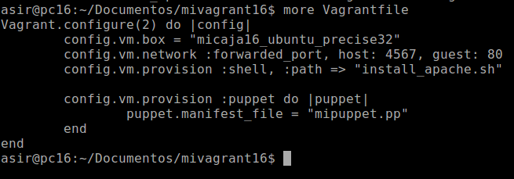
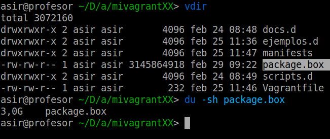
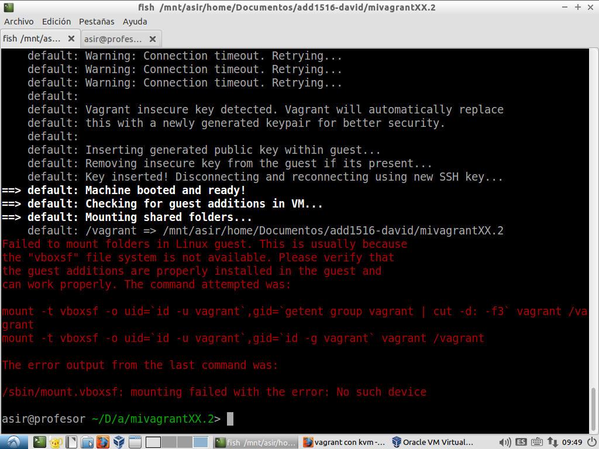

# Vagrant y VirtualBox

Ejemplo de rúbrica:

| Sección               | Muy bien (2) | Regular (1) | Poco adecuado (0) |
| --------------------- | ------------ | ----------- | ----------------- |
| (2.4) Primer vagrant up             | | | |
| (3.2) Redireccionamiento de puertos | | | |
| (5.1) Suministro Shell Script | | | |
| (5.2) Suministro Puppet       | | | |
| (6.1) Preparar MV para Box    | | | |
| (6.2) Crear Box Vagrant       | | |. |

---

# 1. Introducción

Según *Wikipedia*:

```
Vagrant es una herramienta para la creación y configuración de entornos
de desarrollo virtualizados.

Originalmente se desarrolló para VirtualBox y sistemas de configuración tales
como Chef, Salt y Puppet. Sin embargo desde la versión 1.1 Vagrant es
capaz de trabajar con múltiples proveedores, como VMware, Amazon EC2, LXC, DigitalOcean, etc.2

Aunque Vagrant se ha desarrollado en Ruby se puede usar en multitud de
proyectos escritos en otros lenguajes.
```

Enlaces de interés:
* [Cómo instalar y configurar Vagrant](http://codehero.co/como-instalar-y-configurar-vagrant/)
* [Instalar vagrant en OpenSUSE 13.2](http://gattaca.es/post/running-vagrant-on-opensuse/)  

> Para desarrollar esta actividad se ha utilizado principalmente
la información del enlace anterior publicado por *Jonathan Wiesel, el 16/07/2013*.

---

# 2. Primeros pasos

## 2.1 Instalar Vagrant

La instalación vamos a hacerla en una máquina real. A día de hoy, no he
probado a instalar VirtualBox dentro de una MV de VirtualBox. Y desconozco si
funcionaría o no.
* Hay varias formas de instalar Vagrant:
    * `zypper in vagrant`, por comandos en OpenSUSE.
    * `apt-get install vagrant`, por comandos en Debian.
    * En Debian usando un paquete [vagrant.deb](http://172.20.1.2/~david/add)
Disponible para descargar del servidor Leela.
* Si vamos a trabajar Vagrant con MV de VirtualBox, hay que comprobar que las
versiones de ambos son compatibles entre sí.
    * `vagrant version`, para comprobar la versión actual de Vagrant.
    * `VBoxManage -v`, para comprobar la versión actual de VirtualBox.

## 2.2. Carpeta del Proyecto

* Crear un directorio para nuestro proyecto vagrant (Donde XX es el número de cada alumno):
```
mkdir vagrantXX-proyecto
cd vagrantXX-proyecto
```

* `vagrant init`
```
vagrant42-proyecto> vagrant init

A `Vagrantfile` has been placed in this directory. You are now
ready to `vagrant up` your first virtual environment! Please read
the comments in the Vagrantfile as well as documentation on
`vagrantup.com` for more information on using Vagrant.
```

## 2.3 Imagen, caja o box

Existen muchos repositorios desde donde podemos descargar la cajas de Vagrant (Imágenes o boxes). Por ejemplo:
* [Vagrant Box List](http://www.vagrantbox.es)
* [HashiCorp's Atlas box catalog](https://atlas.hashicorp.com/boxes/search)
Incluso podemos descargarnos cajas con Windows, GNU/Linux con entorno gráfico, BSD, etc.

En este curso1819 vamos a usar los siguientes valores:
* **BOXURL**: https://cloud-images.ubuntu.com/vagrant/trusty/20181207/trusty-server-cloudimg-i386-vagrant-disk1.box
* **BOXNAME**: `ubuntuXX`

Veamos el siguiente ejemplo y adaptémoslo a nuestras necesidades para descargar una caja de Vagrant y comprobar que la tenemos disponible en nuestra máquina:

```
vagrant42-proyecto> vagrant box list
There are no installed boxes! Use `vagrant box add` to add some.
david@camaleon:~/Documentos/vagrant42-proyecto> vagrant box add ubuntu42 https://cloud-images.ubuntu.com/vagrant/trusty/20181207/trusty-server-cloudimg-i386-vagrant-disk1.box
/usr/share/vagrant/plugins/commands/login/client.rb:8: warning: already initialized constant VagrantPlugins::LoginCommand::Client::APP
/usr/lib64/ruby/gems/2.5.0/gems/vagrant-2.2.0/plugins/commands/login/client.rb:8: warning: previous definition of APP was here
==> box: Box file was not detected as metadata. Adding it directly...
==> box: Adding box 'ubuntu42' (v0) for provider:
    box: Downloading: https://cloud-images.ubuntu.com/vagrant/trusty/20181207/trusty-server-cloudimg-i386-vagrant-disk1.box
==> box: Successfully added box 'ubuntu42' (v0) for 'virtualbox'!
david@camaleon:~/Documentos/vagrant42-proyecto> vagrant box list
ubuntu42 (virtualbox, 0)
david@camaleon:~/Documentos/vagrant42-proyecto>
```
    * `vagrant box add BOXNAME BOXURL`, descargar la caja que necesitamos a través de vagrant.
    * `vagrant box list`, lista las cajas/imágenes disponibles actualmente en nuestra máquina.
* Hacer una copia de seguridad del archivo `Vagrantfile` a `Vagrantfile.bak`.
* Editar el fichero de configuración de nuestro proyecto Vagrant. Esto es  fichero `Vagrantfile`.
    * Es más cómodo trabajar con el fichero si eliminamos todas las líneas de comentarios.
* Configurar nuestro proyecto para usar nuestra caja BOXNAME.
    * `config.vm.box = "BOXNAME"`

```
vagrant42-proyecto> v
total 8
-rw-r--r-- 1 david users   69 dic 14 08:40 Vagrantfile
-rw-r--r-- 1 david users 3011 dic 14 08:38 Vagrantfile.bak
vagrant42-proyecto> more Vagrantfile

Vagrant.configure("2") do |config|
  config.vm.box = "ubuntu42"
end
```

## 2.4 Levantar el proyecto

Vamos a crear una MV nueva y la vamos a iniciar usando Vagrant:
* Debemos estar dentro de `vagrantXX-proyecto`.
* `vagrant up`: comando para iniciar una nueva instancia de la máquina.

```
vagrant42-proyecto> vagrant up

Bringing machine 'default' up with 'virtualbox' provider...
==> default: Importing base box 'ubuntu42'...
==> default: Matching MAC address for NAT networking...
==> default: Setting the name of the VM: vagrant42-proyecto_default_1544777053818_55375
==> default: Clearing any previously set forwarded ports...
    Vagrant is currently configured to create VirtualBox synced folders with
    the `SharedFoldersEnableSymlinksCreate` option enabled. If the Vagrant
    guest is not trusted, you may want to disable this option. For more
    information on this option, please refer to the VirtualBox manual:

    https://www.virtualbox.org/manual/ch04.html#sharedfolders

    This option can be disabled globally with an environment variable:
      VAGRANT_DISABLE_VBOXSYMLINKCREATE=1
    or on a per folder basis within the Vagrantfile:
      config.vm.synced_folder '/host/path', '/guest/path', SharedFoldersEnableSymlinksCreate: false

==> default: Clearing any previously set network interfaces...
==> default: Preparing network interfaces based on configuration...
    default: Adapter 1: nat
==> default: Forwarding ports...
    default: 22 (guest) => 2222 (host) (adapter 1)
==> default: Booting VM...
==> default: Waiting for machine to boot. This may take a few minutes...
    default: SSH address: 127.0.0.1:2222
    default: SSH username: vagrant
    default: SSH auth method: private key
    default: Warning: Connection reset. Retrying...
    default: Warning: Remote connection disconnect. Retrying...
    default: Warning: Connection reset. Retrying...
    default: Warning: Remote connection disconnect. Retrying...
    default: Warning: Connection reset. Retrying...
    default:
    default: Vagrant insecure key detected. Vagrant will automatically replace
    default: this with a newly generated keypair for better security.
    default:
    default: Inserting generated public key within guest...
    default: Removing insecure key from the guest if it's present...
    default: Key inserted! Disconnecting and reconnecting using new SSH key...
==> default: Machine booted and ready!
==> default: Checking for guest additions in VM...
    default: The guest additions on this VM do not match the installed version of
    default: VirtualBox! In most cases this is fine, but in rare cases it can
    default: prevent things such as shared folders from working properly. If you see
    default: shared folder errors, please make sure the guest additions within the
    default: virtual machine match the version of VirtualBox you have installed on
    default: your host and reload your VM.
    default:
    default: Guest Additions Version: 4.3.36
    default: VirtualBox Version: 5.2
==> default: Mounting shared folders...
    default: /vagrant => /home/david/Documentos/vagrant42-proyecto

vagrant42-proyecto>
```

* `vagrant ssh`: Conectar/entrar en nuestra máquina virtual usando SSH.
* Otros comandos últiles de Vagrant son:
    * `vagrant suspend`: Suspender la máquina virtual. Tener en cuenta que la
    MV en modo **suspendido** consume más espacio en disco debido a que el
    estado de la máquina virtual que suele almacenarse en la RAM se pasa a disco.
    * `vagrant resume` : Volver a despertar la máquina virtual.
    * `vagrant halt`: Apagarla la máquina virtual.
    * `vagrant status`: Estado actual de la máquina virtual.
    * `vagrant destroy`: Para eliminar la máquina virtual (No los ficheros de configuración).

---

# 3. Configuración del entorno virtual

## 3.1 Carpetas sincronizadas

> La carpeta del proyecto que contiene el `Vagrantfile` es visible
para el sistema el virtualizado, esto nos permite compartir archivos fácilmente
entre los dos entornos.

* Para identificar las carpetas compartidas dentro del entorno virtual, hacemos:
```
vagrant up
vagrant ssh
ls /vagrant
```

> Esto nos mostrará que efectivamente el directorio `/vagrant` dentro del entorno
virtual posee el mismo `Vagrantfile` que se encuentra en nuestro sistema anfitrión.

## 3.2 Redireccionamiento de los puertos

Cuando trabajamos con máquinas virtuales, es frecuente usarlas para proyectos
enfocados a la web, y para acceder a las páginas es necesario configurar el
enrutamiento de puertos.

* Entramos en la MV e instalamos apache.
    * `vagrant ssh`
    * `apt-get update`
    * `apt-get install apache2`
* Modificar el fichero `Vagrantfile`, de modo que el puerto 4567 del sistema anfitrión sea enrutado al puerto 80 del ambiente virtualizado.
  * `config.vm.network :forwarded_port, host: 4567, guest: 80`
* Luego iniciamos la MV (si ya se encuentra en ejecución lo podemos recargar
  la configuración con `vagrant reload`)

Para confirmar que hay un servicio a la escucha en 4567, desde la máquina real
podemos ejecutar los siguientes comandos:
* `nmap -p 4500-4600 localhost`, debe mostrar `4567/tcp open tram`.
* `netstat -ntap`, debe mostrar `tcp 0.0.0.0:4567 0.0.0.0:* ESCUCHAR`.

* En la máquina real, abrimos el navegador web con el URL `http://127.0.0.1:4567`.
En realidad estamos accediendo al puerto 80 de nuestro sistema virtualizado.


---

# 4. Ejemplos de configuración Vagrantfile

A continuación se muestran ejemplos de configuración Vagrantfile que NO ES NECESARIO hacer. Sólo es información.

> Enlace de interés [Tutorial Vagrant. ¿Qué es y cómo usarlo?](https://geekytheory.com/tutorial-vagrant-1-que-es-y-como-usarlo)

Ejemplo para configurar la red:
```
config.vm.network "private_network", ip: "192.168.33.10"
```

Ejemplo para configurar las carpetas compartidas:
```
config.vm.synced_folder "htdocs", "/var/www/html"
```

Ejemplo para configurar la conexión SSH de vagrant a nuestra máquina virtual:
```
config.ssh.username = 'root'
config.ssh.password = 'vagrant'
config.ssh.insert_key = 'true'
```

Ejemplo para configurar la ejecución remota de aplicaciones gráficas instaladas en la máquina virtual, mediante SSH:
```
config.ssh.forward_agent = true
config.ssh.forward_x11 = true
```

---

# 5.Suministro

Una de los mejores aspectos de Vagrant es el uso de herramientas de suministro.
Esto es, ejecutar *"una receta"* o una serie de scripts durante el proceso de
arranque del entorno virtual para instalar, configurar y personalizar un sin fin
de aspectos del SO del sistema anfitrión.

* `vagrant halt`, apagamos la MV.
* `vagrant destroy` y la destruimos para volver a empezar.

## 5.1 Suministro mediante shell script

Ahora vamos a suministrar a la MV un pequeño script para instalar Apache.
* Crear el script `install_apache.sh`, dentro del proyecto con el siguiente
contenido:

```
#!/usr/bin/env bash

apt-get update
apt-get install -y apache2
rm -rf /var/www
ln -fs /vagrant /var/www
echo "<h1>Actividad de Vagrant</h1>" > /var/www/index.html
echo "<p>Curso201516</p>" >> /var/www/index.html
echo "<p>Nombre-del-alumno</p>" >> /var/www/index.html
```

> Poner permisos de ejecución al script.

Vamos a indicar a Vagrant que debe ejecutar dentro del entorno virtual un archivo `install_apache.sh`.

* Modificar Vagrantfile y agregar la siguiente línea a la configuración:
`config.vm.provision :shell, :path => "install_apache.sh"`

> Si usamos los siguiente `config.vm.provision "shell", inline: '"echo "Hola"'`, ejecuta
directamente el comando especificado.

* Volvemos a crear la MV.

> Podemos usar `vagrant reload` si está en ejecución para que coja el cambio de la configuración.

Podremos notar, al iniciar la máquina, que en los mensajes de salida se muestran
mensajes que indican cómo se va instalando el paquete de Apache que indicamos.

* Para verificar que efectivamente el servidor Apache ha sido instalado e iniciado,
abrimos navegador en la máquina real con URL `http://127.0.0.1:4567`.

## 5.2 Suministro mediante Puppet

> Enlace de interés:
> * [Crear un entorno de desarrollo con vagrant y puppet](http://developerlover.com/crear-un-entorno-de-desarrollo-con-vagrant-y-puppet/)
> * `friendsofvagrant.github.io -> Puppet Provisioning`
>
> Veamos imágenes de ejemplo (de Aarón Gonźalez Díaz) con Vagrantfile configurado con puppet:
>
> 
>
> Fichero de configuración de puppet `mipuppet.pp`:
>
> 

Se pide hacer lo siguiente.

* Modificar el archivo el archivo Vagrantfile de la siguiente forma:

```
Vagrant.configure(2) do |config|
  ...
  config.vm.provision "puppet" do |puppet|
    puppet.manifest_file = "default.pp"
  end
 end
```

* Crear un fichero `manifests/default.pp`, con las órdenes/instrucciones puppet para instalar el programa `nmap`. Ejemplo:

```
package { 'nmap':
  ensure => 'present',
}
```

Para que se apliquen los cambios de configuración, tenemos dos formas:
* (A) Parar la MV, destruirla y crearla de nuevo (`vagrant halt`, `vagrant destroy` y `vagrant up`).
* (B) Con la MV encendida recargar la configuración (`vagrant reload`), y volver
a ejecutar la provisión (`vagrant provision`).

---

# 6. Nuestra caja personalizada

En los apartados anteriores hemos descargado una caja/box de un repositorio de Internet,
y luego la hemos provisionado para personalizarla. En este apartado vamos a crear
nuestra propia caja/box personalizada a partir de una MV de VirtualBox.

## 6.1 Preparar la MV VirtualBox

Lo primero que tenemos que hacer es preparar nuestra máquina virtual con una configuración por defecto, por si queremos publicar nuestro Box, ésto se realiza para seguir un estándar y que todo el mundo pueda usar dicho Box.

* Crear una MV VirtualBox nueva o usar una que ya tengamos.
* Instalar OpenSSH Server en la MV.

> Indicaciones de [¿Cómo crear una Base Box en Vagrant a partir de una máquina virtual](http://www.dbigcloud.com/virtualizacion/146-como-crear-un-vase-box-en-vagrant-a-partir-de-una-maquina-virtual.html) para preparar la MV de VirtualBox.

* Crear el usuario `vagrant`, para poder acceder a la máquina virtual por SSH.
A este usuario le agregamos una clave pública para autorizar el acceso sin clave
desde Vagrant.
```
useradd -m vagrant
su - vagrant
mkdir .ssh
wget https://raw.githubusercontent.com/mitchellh/vagrant/master/keys/vagrant.pub -O .ssh/authorized_keys
chmod 700 .ssh
chmod 600 .ssh/authorized_keys
```

* Poner clave `vagrant` al usuario vagrant y al usuario root.

Tenemos que conceder permisos al usuario vagrant para que pueda configurar la red,
instalar software, montar carpetas compartidas, etc. para ello debemos configurar
`/etc/sudoers` (visudo) para que no nos solicite la password de root, cuando
realicemos estas operación con el usuario vagrant.

* Añadir `vagrant ALL=(ALL) NOPASSWD: ALL` a /etc/sudoers.

> Hay que comprobar que no existe una linea indicando requiretty si existe la comentamos.

* Debemos asegurarnos que tenemos instalado las VirtualBox Guest Additions
con una versión compatible con el host anfitrion.

```
root@hostname:~# modinfo vboxguest
filename:       /lib/modules/3.13.0-32-generic/updates/dkms/vboxguest.ko
version:        4.3.20
license:        GPL
description:    Oracle VM VirtualBox Guest Additions for Linux Module
author:         Oracle Corporation
srcversion:     22BF504734255C977E4D805
alias:          pci:v000080EEd0000CAFEsv00000000sd00000000bc*sc*i*
depends:        
vermagic:       3.13.0-32-generic SMP mod_unload modversions

root@hostname:~# modinfo vboxguest |grep version
version:        4.3.20
```

## 6.2 Crear caja Vagrant

Una vez hemos preparado la máquina virtual ya podemos crear el box.

* Vamos a crear una nueva carpeta `mivagrantXXconmicaja`, para este nuevo proyecto vagrant.
* Ejecutamos `vagrant init` para crear el fichero de configuración nuevo.
* Localizar el nombre de nuestra máquina VirtualBox (Por ejemplo, `v1-opensuse132-xfce`).
    * `VBoxManage list vms`, comando de VirtualBox que lista las MV que tenemos.
* Crear la caja `package.box` a partir de la MV.


* Comprobamos que se ha creado la caja `package.box` en el directorio donde
hemos ejecutado el comando.



* Muestro la lista de cajas disponibles, pero sólo tengo 1 porque todavía
no he incluido la que acabo de crear. Finalmente, añado la nueva caja creada
por mí al repositorio de vagrant.


* Al levantar la máquina con esta nueva caja obtengo este error.
Probablemente por tener mal las GuestAdittions.



* Pero haciendo `vagrant ssh` nos conectamos sin problemas con la máquina.

> Recordar que podemos cambiar los parámetros de configuración de acceso SSH.
> Ver ejemplo:
>
>     config.ssh.username = 'root'
>     config.ssh.password = 'vagrant'
>     config.ssh.insert_key = 'true'
>

---

# ANEXO

## 2018123
> **Ejemplos**
>
> Crear un proyecto vagrant con Windows7 e iniciar la MV:
> * `vagrant init opentable/win-7-professional-amd64-nocm`
> * `vagrant up --provider virtualbox`
>
> Crear un proyecto vagrant con MV OpenSUSE 42.1 e iniciar la MV:
> * `vagrant init opensuse/openSUSE-42.1-x86_64`
> * `vagrant up --provider virtualbox`


## A.1 Directorios
¿Dónde se guardan las imágenes base? ¿Las cajas de vagrant que nos vamos descargando?


## A.2 Windows

Ampliar esta práctica para comprobar el funcionamiento de Vagrant bajo Windows
y usar cajas/boxes vagrant con Windows.

## A.3 Cambios próximo Curso

* Probar Vagrant dentro de una MV...y luego con VBox dentro de la MV.
* Arreglar warning que Apache2 "Fully qualified. domain name".
* Añadir ejemplo de provisión con "inline"
* Duda: ¿El comando vagrant package XXX debe ejecutarse en $HOME? Porque parece
que se crea un directorio .vagrant.
* Cambiar los nombres "mivagrantXX"y "mivagrantXXconmicaja".
* Recomendar usa Shutter en las capturas y marcar/resaltar la parte donde hay que fijarse.

## A.4 VBoxManage

https://www.garron.me/es/gnu-linux/controla-maquinas-virtuales-virtualbox.html

VBoxManage showvminfo VMNAME | grep State
