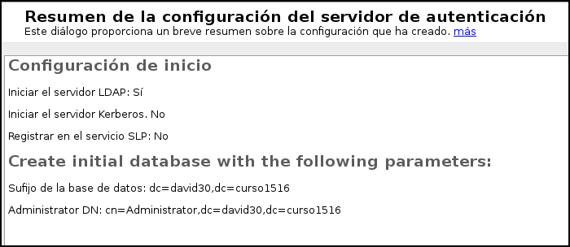
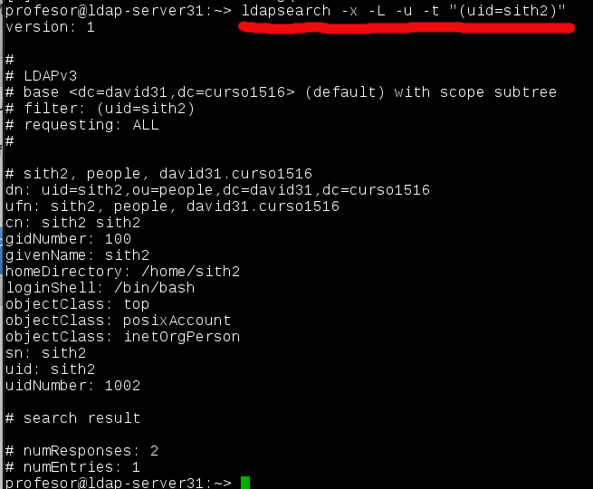
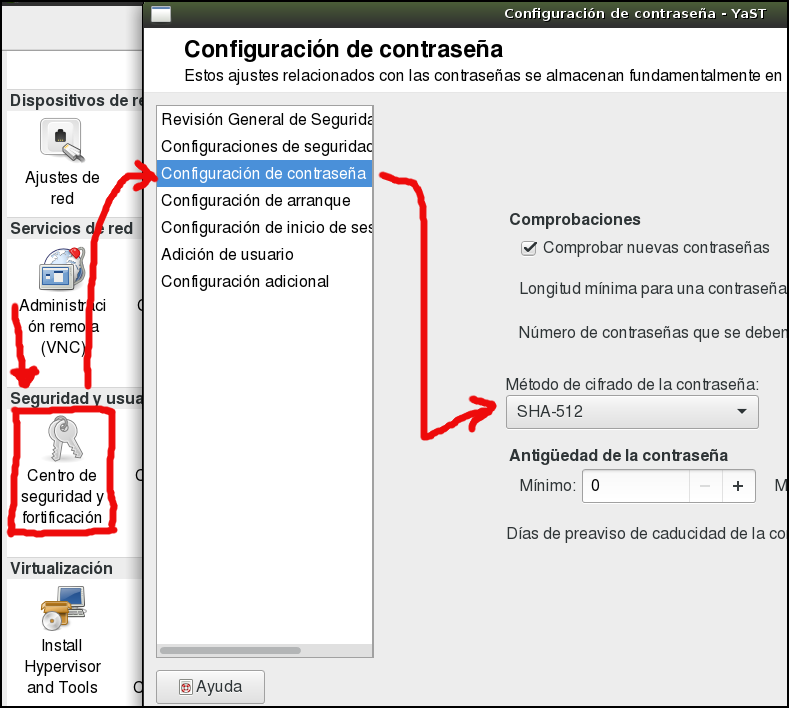

```
* Curso 2015-2016:  adaptada para OpenSUSE
* Curso 2016-2017
```

# Servidor LDAP - OpenSUSE


> Enlaces de interés sobre teoría LDAP:
> * VÍDEO [¿Qué es LDAP?](http://www.youtube.com/watch?v=CXe0Wxqep_g)
> * VÍDEO [Los ficheros LDIF](http://www.youtube.com/watch?v=ccFT94M-c4Y)

## 1. Servidor LDAP

Comenzamos la instalación y configuración del servidor LDAP.

> Enlaces de interés:
> * Guía sobre  [Configurar_LDAP_usando_YaST](https://es.opensuse.org/Configurar_LDAP_usando_YaST)
> * VIDEO [Configurar servidor LDAP en OpenSUSE con Yast](http://www.youtube.com/watch?v=NsQ1zPpoVBc)
> * VIDEO [LD01: Instalar Servidor OpenLDAP](http://www.youtube.com/watch?v=E0mIYO_vbx8) Min 38: Crear config dir a partir de config text.
> * Consultar documento `ldap-auth-pminik-taller.pdf`, página 20.

## 1.1 Preparar la máquina

* Vamos a usar una MV OpenSUSE 13.2 para montar nuestro servidor LDAP con:
    * [Configuración MV](../../global/configuracion/opensuse.md)
    * Nombre equipo: `ldap-serverXX`
    * Además en `/etc/hosts` añadiremos:
```
127.0.0.2   ldap-serverXX.curso1617   ldap-serverXX
127.0.0.3   nombrealumnoXX.curso1617  nombrealumnoXX
```

Veamos imagen de ejemplo:


## 1.2 Instalación del Servidor LDAP

* Procedemos a la instalación del módulo Yast que sirve para gestionar el servidor LDAP (`yast2-auth-server`).

Enlaces de interés:
* [Servidor LDAP Leap 42.1](https://en.opensuse.org/SDB:LDAP_server)
* [Vídeo](https://www.youtube.com/watch?v=F14x3fGPN9E)
* [Servidor LDAP Suse 11](https://es.opensuse.org/Configurar_LDAP_usando_YaST)

Hacemos lo siguiente:
* Ir a Yast -> Servidor de autenticación. Aparecerá como `Authentication Server`.
* Instalar los paquetes openldap2, krb5-server y krb5-client -> Aceptar
* Iniciar servidor LDAP -> Sí
* Registrar dameon SLP -> No
* Puerto abierto en el cortafuegos -> Sí -> Siguiente
* Tipo de servidor -> autónomo -> Siguiente
* Configuración TLS -> NO habilitar -> Siguiente
* Tipo de BD -> hdb
* DN base -> `dc=nombredealumnoXX,dc=curso1617`. Donde XX es el número del puesto de cada uno.
* DN administrador -> `dn=Administrator`
* Añadir DN base -> Sí
* Contraseña del administrador
* Directorio de BD -> /var/lib/ldap
* Usar esta BD predeterminada para clientes LDAP -> Sí -> Siguiente


* Habilitar kerberos -> No

Veamos ejemplo de la configuración final:



Comprobaciones
* `systemctl status slapd`, para comprobar el estado del servicio.

> `systemctl enable slapd`, para activar el servicio automáticamente al reiniciar la máquina.

* `nmap localhost | grep -P '389|636'`, para comprobar que el servidor LDAP es accesible desde la red.
* `slapcat` para comprobar que la base de datos está bien configurada.
* Podemos comprobar el contenido de la base de datos LDAP usando la herramienta `gq`.
Esta herramienta es un browser LDAP.
* Comprobar que tenemos creadas las unidades organizativas: `groups` y `people`.


## 1.3 Problemas

Si tenemos que desinstalar el paquete hacemos:
```
zypper remove yast2-auth-server
zypper remove openldap2 krb5-server krb5-client
mv /etc/openldap /etc/openldap.000
mv /var/lib/ldap /var/lib/ldap.000
```
---

## 1.4 Crear usuarios y grupos LDAP

* `Yast -> Usuarios Grupos -> Filtro -> LDAP`.
* Crear los grupos `piratas` (Estos se crearán dentro de la `ou=groups`).
* Crear los usuarios `pirata21`, `pirata21` (Estos se crearán dentro de la `ou=people`).

# 2. Autenticación

En este punto vamos a escribir información en el servidor LDAP.

> Enlaces de interés:
> * [ Crear usuarios y grupos LDAP ](https://es.opensuse.org/Ingreso_de_usuarios_y_grupos_en_LDAP_usando_YaST)
> * [ Autenticación con OpenLDAP ](http://www.ite.educacion.es/formacion/materiales/85/cd/linux/m6/autentificacin_del_sistema_con_openldap.html).
> * VIDEO [LPIC-2 202 LDAP Client Usage](http://www.youtube.com/embed/ZAHj93YWY84).

## 2.1 Preparativos

* Vamos a otra MV OpenSUSE 13.2.
* Cliente LDAP con OpenSUSE 13.2:    
    * [Configuración MV](../../global/configuracion/opensuse.md)
    * Nombre equipo: `ldap-clientXX`
    * Dominio: `curso1617`
    * Asegurarse que tenemos definido en el fichero /etc/hosts del cliente,
el nombre DNS con su IP correspondiente:
```
127.0.0.2         ldap-clientXX.curso1617   ldap-clientXX
ip-del-servidor   ldap-serverXX.curso1617   ldap-serverXX   nombredealumnoXX.curso1617   nombrealumnoXX
```

## Comprobación

* `nmap ldap-serverXX | grep -P '389|636'`, para comprobar que el servidor LDAP es accesible desde el cliente.
* Usar `gq` en el cliente para comprobar que se han creado bien los usuarios.
    * `File -> Preferencias -> Servidor -> Nuevo`
    * URI = `ldap://ldap-serverXX`
    * Base DN = `dc=vargasXX,dc=curso1617`

## 2.2 Instalar cliente LDAP

* Debemos instalar el paquete `yast2-auth-client`, que nos ayudará a configurar la máquina para autenticación. En Yast aparecerá como `Authentication Client`.

### Configuración de la conexión

> Información extraída de https://forums.opensuse.org/showthread.php/502305-Setting-up-LDAP-on-13-2

* `Yast -> Authentication client`
* Under Basic Settings click on sssd. A new dialogue box will appear, in that write LDAP under domain section. Click OK & Close the dialogue box.
* Under Configured Authentication Domains list, you can see domain/LDAP. Click Edit
    * id_provider = ldap
    * auth_provider = ldap
    * chpass_provider = ldap
    * ldap_schema = rfc2307bis
    . ldap_uri = `ldap://ldapserver.mycompany.in`
    * ldap_search base = `dc=example, dc=com`

> Consultar el fichero `/etc/sssd/sssd.conf` para confirmar el valor de ldap_schema.

Ver imagen de ejemplo:


* Vamos a la consola y probamos con
```
$ systemctl status sssd | grep domain
$ id pirata21
$ finger pirata21
$ cat /etc/passwd | grep pirata21
$ su pirata21
```

---

# HASTA AQUÍ ES LA ENTREGA DEL INFORME

---

> **Default Re: Setting up LDAP on 13.2**
>
> Did you ever resolve your secondary group issues? I'm seeing the same problem and have already changed ldap_schema to rfc2307bis.
>
> sorry for my late replay. Yes. I have resolved this issue. My solution was in `/etc/sssd/sssd.conf`
>
>  comment out the lines
> ```
> # ldap_user_uuid = entryuuid
> # ldap_group_uuid = entryuuid
> ```

## 2.3 Crear usuarios y grupos en LDAP

Vamos a crear los usuarios y grupos en LDAP.

> Enlace de interés:
>
> * [Introducir datos de usuarios y grupos](https://es.opensuse.org/Ingreso_de_usuarios_y_grupos_en_LDAP_usando_YaST)

* `Yast -> Usuarios Grupos -> Filtro -> LDAP`.
* Crear los grupos `aldeanos` y `soldados` (Estos se crearán dentro de la `ou=groups`).
* Crear los usuarios `aldeano21`, `aldeano21`, `soldado21`, `soldado22` (Estos se crearán dentro de la `ou=people`).

## 2.4 Comprobación desde el servidor

* Vamos al servidor y comprobamos que se han creado los usuarios.

> Vemos un ejemplo de un árbol de datos en LDAP:
>
> 

* Comprobar mediante un browser LDAP (`gq`) la información que tenemos en la base de datos LDAP.

> Imagen de ejemplo:
>
> 

* `ldapsearch -x -L -u -t "(uid=nombre-del-usuario)"`, comando para consultar
en la base de datos LDAP la información del usuario con uid concreto.

> Veamos imagen de ejemplo:
>
> 

## 2.5 Autenticación desde el cliente

Con autenticacion LDAP prentendemos usar la máquina servidor LDAP, como repositorio
centralizado de la información de grupos, usuarios, claves, etc.
Desde otras máquinas conseguiremos autenticarnos (entrar al sistema) con los
usuarios definidos no en la máquina local, sino en la máquina remota con
LDAP. Una especie de *Domain Controller*.

* Comprobar que podemos entrar (Inicio de sesión) en la MV `ldap-slaveXX`
usando los usuarios definidos en el LDAP.
* Capturar imagen de la salida de los siguientes comandos:
```
hostname -f                          # Muestra nombre de la MV actual
ip a                                 # Muestra datos de red de la MV actual
date                                 # Fecha actual
cat /etc/passwd |grep nombre-usuario # No debe existir este usuario en la MV local
finger nombre-usuario                # Consulta info del usuario
id nombre-usuario
su nombre-usuario
```

---

# A. ANEXO

Podemos tener un problema con las claves si el método de encriptación de las claves
del sistema operativo es diferente al utilizado en el servidor LDAP.

## A.1 Cambiar el método de encriptación en el SO

Veamos ejemplo donde se establece el método de encriptación durante la instalación del SO.


Veamos otro ejemplo donde podemos cambiar el método de encriptación de claves con el SO
ya instalado, usando Yast.



## A.2 Cambiar el método de encriptación en la base de datos LDAP

*(Pendiente)*

## A.3 Configuración

* Seguir las instrucciones del siguiente [enlace](https://es.opensuse.org/Ingreso_de_usuarios_y_grupos_en_LDAP_usando_YaST)
para crear el grupo LDAP `aldeanos` y dentro de éste los usuarios `aldeano21` y `aldeano22`.
* Usar la herramienta `gq` para comprobar los datos del servidor LDAP.
* Comprobar que podemos entrar (Inicio de sesión) en la MV `ldap-slaveXX` usando los usuarios
definidos en el LDAP remoto.
* Capturar imagen de la salida de los siguientes comandos:
```
hostname -f                          # Muestra nombre de la MV actual
ip a                                 # Muestra datos de red de la MV actual
date                                 # Fecha actual
cat /etc/passwd |grep nombre-usuario # No debe existir este usuario en la MV local
finger nombre-usuario                # Consulta info del usuario
id nombre-usuario
su nombre-usuario
```
