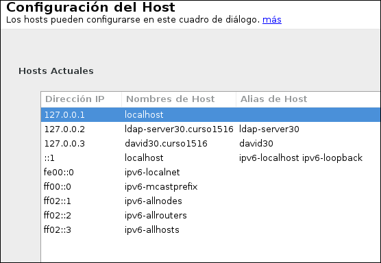
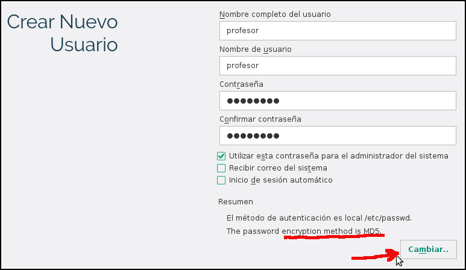

```
* Curso 2015-2016:  adaptada para OpenSUSE
* Curso 2016-2017
```

# Servidor LDAP - OpenSUSE


> Enlaces de interés sobre teoría LDAP:
> * VÍDEO [¿Qué es LDAP?](http://www.youtube.com/watch?v=CXe0Wxqep_g)
> * VÍDEO [Los ficheros LDIF](http://www.youtube.com/watch?v=ccFT94M-c4Y)

## 1. Servidor LDAP

Comenzamos la instalación y configuración del servidor LDAP.

> Enlaces de interés:
> * [Configurar_LDAP_usando_YaST](https://es.opensuse.org/Configurar_LDAP_usando_YaST)
> * VIDEO [Configurar servidor LDAP en OpenSUSE con Yast](http://www.youtube.com/watch?v=NsQ1zPpoVBc)
> * VIDEO [LD01: Instalar Servidor OpenLDAP](http://www.youtube.com/watch?v=E0mIYO_vbx8) Min 38: Crear config dir a partir de config text.
> * Consultar documento `ldap-auth-pminik-taller.pdf`, página 20.

## 1.1 Preparar la máquina

* Vamos a usar una MV OpenSUSE 13.2 para montar nuestro servidor LDAP con:
    * [Configuración MV](../../global/configuracion/opensuse.md)
    * Nombre equipo: `ldap-serverXX`
    * Además en `/etc/hosts` añadiremos:
```
127.0.0.2   ldap-serverXX.curso1617   ldap-serverXX
127.0.0.3   nombrealumnoXX.curso1617  nombrealumnoXX
```

Veamos imagen de ejemplo:



## 1.2 Instalación del Servidor LDAP

* Procedemos a la instalación del módulo Yast que sirve para gestionar el servidor LDAP (`yast2-auth-server`).


* Apartir de aquí seguimos las indicaciones de [servidor LDAP](https://es.opensuse.org/Configurar_LDAP_usando_YaST)
de la siguiente forma:
   * Ir a Yast -> Servidor de autenticación. Aparecerá como `Authentication Server`.
   * Instalar los paquetes openldap2, krb5-server y krb5-client -> Aceptar
   * Iniciar servidor LDAP -> Sí
   * Registrar dameon SLP -> No
   * Puerto abierto en el cortafuegos -> Sí -> Siguiente
   * Tipo de servidor -> autónomo -> Siguiente
   * Configuración TLS -> NO habilitar -> Siguiente
   * Tipo de BD -> hdb
   * DN base -> `dc=nombredealumnoXX,dc=curso1617`. Donde XX es el número del puesto de cada uno.
   * DN administrador -> `dn=Administrator`
   * Añadir DN base -> Sí
   * Contraseña del administrador
   * Directorio de BD -> /var/lib/ldap
   * Usar esta BD predeterminada para clientes LDAP -> Sí -> Siguiente


   * Habilitar kerberos -> No

Veamos ejemplo de la configuración final:


* `systemctl status slapd`, para comprobar el estado del servicio.
* `systemctl enable slapd`, para activar el servicio automáticamente al reiniciar la máquina.
* `netstat -tap`
* `slapcat` para consultar los datos.
* Podemos comprobar el contenido de la base de datos LDAP usando la herramienta `gq`.
Esta herramienta es un browser LDAP.
* Comprobar que tenemos creadas las unidades organizativas: `groups` y `people`.


## 1.3 Problemas

Si tenemos que desinstalar el paquete hacemos:
```
zypper remove yast2-auth-server
zypper remove openldap2 krb5-server krb5-client
mv /etc/openldap /etc/openldap.000
mv /var/lib/ldap /var/lib/ldap.000
```
---

# 2. Autenticación

> Enlaces de interés:
> * [ Autenticación con OpenLDAP ](http://www.ite.educacion.es/formacion/materiales/85/cd/linux/m6/autentificacin_del_sistema_con_openldap.html).
> * VIDEO [LPIC-2 202 LDAP Client Usage](http://www.youtube.com/embed/ZAHj93YWY84).

## 2.1. Crear usuarios y grupos en LDAP

En este punto vamos a escribir información en el servidor LDAP.

* Debemos instalar el paquete `yast2-auth-client`, que nos ayudará a configurar la máquina para autenticación. En Yast aparecerá como `Authentication Client`.


> LDAP URI es un localizador del recurso de la base de datos LDAP.
Veamos un ejemplo: `ldap://ldap-serverXX/dc=nombrealumnoXX,dc=curso1617`.

Vamos a crear los usuarios y grupos en LDAP.

* Enlace de interés: [Introducir datos de usuarios y grupos](https://es.opensuse.org/Ingreso_de_usuarios_y_grupos_en_LDAP_usando_YaST)
* Crear los grupos `piratas` y `soldados` (Estos se crearán dentro de la `ou=groups`).
* Crear los usuarios `pirata21`, `pirata21`, `soldado21`, `soldado22` (Estos se crearán dentro de la `ou=people`).

Vemos un ejemplo de un árbol de datos en LDAP:


* Comprobar mediante un browser LDAP (`gq`) la información que tenemos en la base de datos LDAP.

Imagen de ejemplo:


* `ldapsearch -x -L -u -t "(uid=nombre-del-usuario)"`, comando para consultar en la base de datos LDAP la información del usuario con uid concreto.

Veamos imagen de ejemplo:


## 2.2. Autenticación

Con autenticacion LDAP prentendemos usar la máquina servidor LDAP, como repositorio
centralizado de la información de grupos, usuarios, claves, etc.
Desde otras máquinas conseguiremos autenticarnos (entrar al sistema) con los
usuarios definidos no en la máquina local, sino en la máquina remota con
LDAP. Una especie de *Domain Controller*.

* Comprobar que podemos entrar (Inicio de sesión) en la MV `ldap-serverXX`
usando los usuarios definidos en el LDAP.
* Capturar imagen de la salida de los siguientes comandos:
```
hostname -f                          # Muestra nombre de la MV actual
ip a                                 # Muestra datos de red de la MV actual
date                                 # Fecha actual
cat /etc/passwd |grep nombre-usuario # No debe existir este usuario en la MV local
finger nombre-usuario                # Consulta info del usuario
id nombre-usuario
su nombre-usuario
```

---

# 3. Otro equipo

Ahora que tenemos una máquina con la información cargada en LDAP, vamos a tratar
de usarla desde otra máquina distinta.

## 3.1 Preparativos
* Slave LDAP con OpenSUSE 13.2:    
    * [Configuración MV](../../global/configuracion/opensuse.md)
    * Nombre equipo: `ldap-slaveXX`
    * Dominio: `curso1617`
    * Asegurarse que tenemos definido en el fichero /etc/hosts del cliente,
el nombre DNS con su IP correspondiente:
```
127.0.0.2         ldap-slaveXX.curso1617   ldap-slaveXX
ip-del-servidor   ldap-serverXX.curso1617   ldap-serverXX   nombredealumnoXX.curso1617   nombrealumnoXX
```

## 3.2 Configuración

* Seguir las instrucciones del siguiente [enlace](https://es.opensuse.org/Ingreso_de_usuarios_y_grupos_en_LDAP_usando_YaST)
para crear el grupo LDAP `aldeanos` y dentro de éste los usuarios `aldeano21` y `aldeano22`.
* Usar la herramienta `gq` para comprobar los datos del servidor LDAP.
* Comprobar que podemos entrar (Inicio de sesión) en la MV `ldap-slaveXX` usando los usuarios
definidos en el LDAP remoto.
* Capturar imagen de la salida de los siguientes comandos:
```
hostname -f                          # Muestra nombre de la MV actual
ip a                                 # Muestra datos de red de la MV actual
date                                 # Fecha actual
cat /etc/passwd |grep nombre-usuario # No debe existir este usuario en la MV local
finger nombre-usuario                # Consulta info del usuario
id nombre-usuario
su nombre-usuario
```

---

# A1. ANEXO

Podemos tener un problema con las claves si el método de encriptación de las claves
del sistema operativo es diferente al utilizado en el servidor LDAP.

## A1.2. Cambiar el método de encriptación en el SO

Veamos ejemplo donde se establece el método de encriptación durante la instalación del SO.



Veamos otro ejemplo donde podemos cambiar el método de encriptación de claves con el SO
ya instalado, usando Yast.


## A1.3. Cambiar el método de encriptación en la base de datos LDAP

*(Pendiente)*
