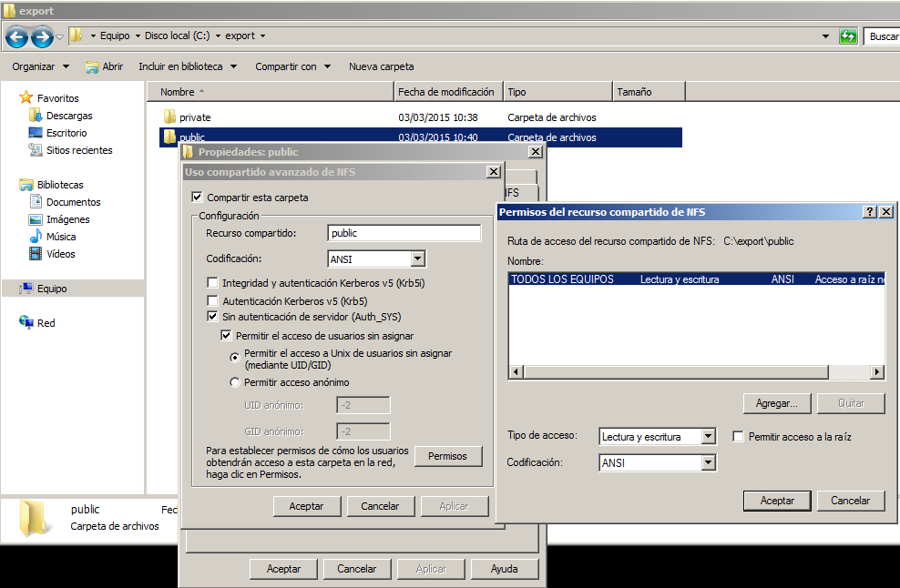
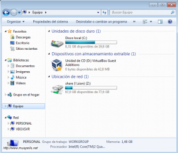

#NFS (Network File System)

#1. SO Windows
Vamos a necesitar 2 máquinas:

* MV Windows 2008 Server (Enterprise) como nuestro servidor NFS.
* Como nombre de esta máquina usar "primer-apellido-alumno+1".
* IP estática 172.18.XX.11
* Grupo de trabajo AULA108
* MV Windows 7 (Enterprise) como nuestro cliente NFS.
* Como nombre de esta máquina usar "primer-apellido-alumno+2".
* IP dinámica
* Grupo de trabajo AULA108

> Donde XX es el número de PC de la máquina real de cada uno. Para averiguar XX ejecuten en la máquina real, "ifconfig" o "if a s", si muestra IP 172.16.8.30 entonces XX=30.

##1.1 Servidor NFS Windows

> **Enlaces de interés:**
>
> Vídeo
>
> * Cliente NFS: [Montar directorios NFS bajo Windows 7](http://www.muspells.net/blog/2011/08/montar-directorios-nfs-bajo-windows-7/)
> * Servidor NFS: [Servidor NFS para Windows con WinNFSd](https://robleshermoso.wordpress.com/2010/07/15/tip-servidor-nfs-para-windows/)
> * Cliente NFS: [Compartir carpetas Windows mediante Servidor NFS](https://support.microsoft.com/es-es/kb/324089)
> * Comandos NFS: [Guía paso a paso de Servicios para NFS para Windows Server 2008 R2](https://support.microsoft.com/es-es/kb/324089)
>
> Vídeo que explica cómo instalar NFS en Windows Server:

Instalación del servicio NFS en Windows 2008 Server
* Agregar rol "Servidor de Archivos".
* Marcar "Servicio para NFS"

Configurar el servidor NFS de la siguiente forma:
* Crear la carpeta `c:\export\public`. Picar en la carpeta `botón derecho propiedades -> Compartir NFS`, y configurarla para que sea accesible desde la red en modo lectura/escritura con NFS
* Crear la carpeta `c:\export\private`. Picar en la carpeta `botón derecho propiedades -> Compartir NFS`, y configurarla para que sea accesible desde la red sólo en modo sólo lectura.



* Ejecutamos el comando "showmount -e ip-del-servidor", para comprobar los recursos compartidos.

##1.2 Cliente NFS

Las últimas versiones de Windows permiten trabajar con directorios de red NFS nativos de sistemas UNIX. 
En esta sección veremos como montar y desmontar estos directorios bajo un entorno de Windows 7 
Enterprise (Las versiones home y starter no tienen soporte para NFS).

###1.2.1 Instalar el soporte cliente NFS bajo Windows.

En primer lugar vamos a instalar el componente cliente NFS para Windows:
* para ello vamos a `Panel de Control -> Programas -> Activar o desactivar características de Windows`.


* Nos desplazamos por el menú hasta localizar Servicios para NFS y dentro de este, Cliente NFS. 
* Marcamos ambos y le damos a Aceptar.
* En unos instantes tendremos el soporte habilitado.

###1.2.2 Iniciar el servicio cliente NFS

* Para iniciar el servicio NFS en el cliente, abrimos una consola con permisos de Administrador.
* Ejecutamos el siguiente comando: `nfsadmin client start`

###1.2.3 Montando el directorio

Ahora necesitamos montar el recurso remoto para poder trabajar con él.
* Para montar el recurso (esta vez no lo hacemos con Administrador) y escribimos:
    * Montar recurso remoto: `mount –o anon,nolock,r,casesensitive \\\ip-del-servidor\Nombre-recurso-NFS *`
    * Comprobar: `net use`
    * Comprobar: `showmount -a ip-del-servidor`
    
> Donde
>
> * anon: Acceso anónimo al directorio de red.
> * nolock: Deshabilita el bloqueo. Esta opción puede mejorar el rendimiento si sólo necesita leer archivos.
> * r: Sólo lectura. Para montar en modo lectura/escritura no usaremos este parámetro.
> * casesensitive: Fuerza la búsqueda de archivos con distinción de mayúsculas y minúsculas (similar a los clientes de NFS basados en UNIX).


* Hemos decidido asignar la letra de unidad de forma automática, así que si no hay otras unidades de red 
en el sistema nos asignará la Z.




> Si hay problemas, comprobar que la configuración del cortafuegos del servidor permite accesos NFS.
>
> * Desde un cliente GNU/Linux hacemos `nmap IP-del-servidor`.
> * Debe aparecer abierto el puerto del servicio NFS


###1.2.4 Desmontando la unidad
* Para desmontar la unidad simplemente escribimos en una consola: `umount z:`
* Para probarlo desde un cliente Debian el comando es: `mount.nfs 172.16.108.227:/c/export/public /mnt/`


#2. SO Debian

Vamos a necesitar 2 máquinas GNU/Linux:

* MV Debian, donde instalamos el servicio NFS (directorios compartidos por red)
    * Como nombre de esta máquina usar "primer-apellido-alumno3". Modificar el fichero /etc/hostname, para establecer el nombre de máquina.
    * IP estática 172.16.108.1XX
    * VirtualBox Red en Modo Puente
* MV Debian/Ubuntu/OpenSUSE, donde instalaremos el cliente NFS.
    * Como nombre de esta máquina usar "primer-apellido-alumno4".
    * IP estática 172.16.108.2XX
    * VirtualBox Red en Modo Puente

##2.1 Recomendaciones previas
###2.1.1 GNU/Linux Debian

* **IP ESTÁTICA**: La configuración de red estática en Debian, se establece en el fichero 
`/etc/network/interfaces`. Veamos ejemplo con IP estática:

```
#File:/etc/network/interfaces
auto lo
iface lo inet loopback

#OJO: cambien ethZ por el valor que cada uno tenga
#OJO: para averiguar el valor de ethZ ejecuten el comando "ifconfig -a"

auto ethZ
iface ethZ inet static
address 172.16.108.XX
netmask 255.255.0.0
gateway 172.16.1.1
dns-nameservers 172.16.1.1
```

* **CONFIGURACIÓN DNS:**
    * Si tenemos instalado la aplicación "resolvconf", entonces añadimos "dns-nameservers 172.16.1.1" en la configuración del interfaz de red (Fichero /etc/network/interfaces").
    * Si no tenemos el programa "resolvconf" entonces añadimos "nameserver 172.16.1.1" al fichero /etc/resolv.conf.
    * Otra opción es configurarlo por el entorno gráfico (NetworkManager).
* /ETC/HOSTS: Por comodidad podemos configurar el fichero /etc/hosts del cliente y servidor, añadiendo estas líneas:
```
172.16.108.1XX server.nombregrupo server
172.16.108.2XX client.nombregrupo client
```
* Modificar /etc/apt/sources.list, convertir la línea "deb cdrom:..." en un comentario "#deb cdrom:...". Esto es para que las instalaciones NO busquen en la unidad de CDROM.
* Ejemplo /etc/apt/sources.list en Debian7:
```
deb http://ftp.es.debian.org/debian/ wheezy main
deb-src http://ftp.es.debian.org/debian/ wheezy main
deb http::/security.debain.org/ wheezy/updates main
deb-src http://security.debian.org/ wheezy/updates main
deb http://ftp.es.debian.org/debian/ wheezy-updates main
deb-src http://ftp.es.debian.org/debian/ wheezy-updates main
```

###2.1.2 GNU/Linux OpenSUSE
* La configuración de los interfaces de red, servidores de nombres, etc. la podemos hacer en YAST.

###2.1.3 GNU/Linux Ubuntu
* La configuración de los interfaces de red está en el fichero /etc/network/interfaces.
* La configuración de servidores de nombres se establece en el fichero /etc/resolvconf/resolv.conf.d/base.

##2.2 Servidor NFS

Vídeo "LPIC-2 202 NFS Server Configuration":


Vídeo "NFS. Learning Linux: Lesson 17 NFS Server and Installation Repository".


    Enlace de interés a NFS Sistema de Archivos de red.
    Instalar servidor NFS:
        apt-get update
        apt-get install nfs-common nfs-kernel-server
    Crear las siguientes carpetas/permisos:

mkdir /var/export/public
chown nobody:nogroup /var/export/public
mkdir /var/export/private
chown nobody:nogroup /var/export/private
chmod 770 /var/export/private

Vamos configurar el servidor NFS de la siguiente forma:

    La carpeta /var/export/public, será accesible desde toda la red en modo lectura/escritura.
    La carpeta /var/export/private, sea accesible sólo desde la IP del cliente, sólo en modo lectura.

Para ello Modificamos el fichero /etc/exports añadiendo las siguientes líneas:

#FILE /etc/exports
#OJO: NO debe haber espacios entre la IP y abrir paréntesis.
...
/var/export/public *(rw,sync,subtree_check)
/var/export/private ip-del-cliente/32(ro,sync,subtree_check)
...

Para iniciar y parar el servicio NFS:

    service nfs-kernel-server status
    service nfs-kernel-server stop
    service nfs-kernel-server start

NOTA: Antes se usaban los métodos de iniciar/para del Modo System V, esto es:

    /etc/init.d/nfs-kernel-server status
    /etc/init.d/nfs-kernel-server stop
    /etc/init.d/nfs-kernel-server start

Comprobaciones:

    showmount -e localhost: Muestra la lista de recursos exportados por el servidor NFS.
    Si al iniciar el servicio aparecen mensaje de error o advertencias, debemos resolverlas. Consultar los mensajes de error del servicio: tail /var/log/syslog


##2.3 Cliente NFS

En esta parte, vamos a comprobar que las carpetas del servidor son accesibles desde el cliente. Normalmente el software cliente NFS ya viene preinstalado pero si tuviéramos que instalarlo:

    Debian: apt-get install nfs-common.
    OpenSUSE: zypper in nfs-common.

Comprobar el acceso desde cliente al servidor:

    ping ip-del-servidor: Comprobar la conectividad del cliente con el servidor. Si falla hay que revisar las configuraciones de red.
    nmap ip-del-servidor: nmap sirve para escanear equipos remotos, y averiguar que servicios están ofreciendo al exterior. Hay que instalar el paquete nmap, porque normalemente no viene preinstalado.
    showmount -e ip-del-servidor: Muestra la lista de recursos exportados por el servidor NFS.

Por ejemplo en un sistema con soporte NFS cliente podemos hacer lo siguiente:

    mkdir /mnt/remoto/public
    mount ip-del-servidor:/var/export/public /mnt/remoto/public
    mkdir /mnt/remoto/private
    mount ip-del-servidor:/var/export/private /mnt/remoto/private
    Ejecutar df -hT, y veremos que los recursos remotos están montados en nuestras carpetas locales.

Ahora podemos crear carpetas/ficheros en el recurso public, pero sólo podremos leer lo que aparezca en private. Comprobarlo.

##2.4. Montaje automático
Acabamos de acceder a recursos remotos, realizando un montaje de forma manual (comandos mount/umount). 
Si reiniciamos el equipo cliente, podremos ver que los montajes realizados de forma manual ya no están establecidos. 
Si queremos volver a acceder a los recursos remotos debemos repetir el proceso, a no ser que hagamos una configuración 
permanente o automática.

Para configurar acciones de montaje autoḿaticos cada vez que se inicie el equipo, debemos 
modificar la configuración del fichero `/etc/fstab`. Comprobarlo.

Incluir contenido del fichero `/etc/fstab` en la entrega.

#3. Preguntas

* ¿Nuestro cliente GNU/Linux NFS puede acceder al servidor Windows NFS? Comprobarlo.
* ¿Nuestro cliente Windows NFS podría acceder al servidor GNU/Linux NFS? Comprobarlo.
* Fijarse en los valores de usuarios propietario y grupo propietario de los ficheros que se guardan en el servidor, cuando los creamos desde una conexión cliente NFS.


