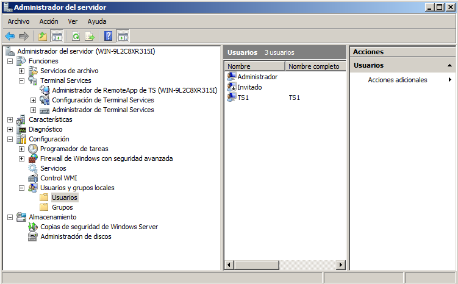

#1. Introducción
Entrega:
* URL con la ruta al/los archivo/s dentro del repositorio del alumno.
* URl commit del repositorio con la versión entregada.
* Etiquetaremos la entrega en el repositorio Git con `vnc`.

Configurar las máquinas virtuales según este [documento](../../global/configuracion-aula108.md).

#2. Escritorio Remoto con RDP

Realizar las siguientes tareas:

* Leer la documentación sobre escritorio remoto.
* Instalar software RDP.
    * En Windows no hay que instalar nada, puesto que ya viene con el software
    de escritorio remoto RDP preinstalado.
* Capturar imagen de la configuración escritorio remoto para poder acceder a otra máquina
(`Panel de control -> Sistema -> Configuración de Acceso Remoto`).
* Capturar imagenes probando las conexiones remotas, y ejecutando el
comando `netstat -ntap` en cada caso, para verificar que se han establecido
las conexiones remotas siguientes:
    * **Acceder a Windows7 - desde Window Server**: El software ya viene preinstalado, sólo falta configurarlo.
    * **Acceder a Windows7 - desde Linux**: Instalar software cliente RDP en GNU/Linux. Ejemplos de clientes RDP son: Cliente escritorio remoto de Remmina, vinagre (Usando protocolo RDP), rdesktop, tsclient, grdesktop, krdc, etc. Otra opción usar Knoppix CDLive que ya viene con el software cliente preinstalado.

#3. Instalación y configuración del servidor RDP enGNU/Linux

* Enlaces de interés:
    * [XRDP: Instalar y configurar en ubuntu-12-10] (http://www.adslfaqs.com.ar/como-instalar-y-configurar-xrdp-en-ubuntu-12-10-quantal-quetzal/)
    * [XRDP: Remote desktop para Ubuntu] (http://www.pacorabadan.com/?p=283)usa
* Para  acceder a Linux desde Windows7 usando RDP, debemos instalar en Linux el
software `xrdp`. Es un servidor de conexiones remotas por protocolo RDP.
* Desde Windows iniciamos escritorio remoto. En la ventana de login ponemos:
    * `modulo="vnc-any"`
    * `ip="ip-de-la-máquina-Linux"`
* Capturar imagenes probando las conexiones remotas, y ejecutando el
comando `netstat -ntap` en cada caso, para verificar que se han establecido

#4. Servidor de Terminales

Verificar:
* ¿Se pueden abrir varias sesiones de conexión RDP, accediendo desde varias
máquinas (Windows Server y/o GNU/Linux) a la vez, hacia la misma máquina Windows7 ?

> Enlaces de interés:
>
> * Si está [instalando el servicio de función Terminal Server] (https://technet.microsoft.com/es-es/library/cc754288%28v=ws.10%29.aspx) en un controlador de dominio, recibirá un mensaje de advertencia porque NO es recomendable instalar el servicio de función Terminal Server en un controlador de dominio.
> * Para obtener más información, consulte la página sobre la instalación de Terminal Server en un controlador de dominio en la [Ayuda de Terminal Server en la biblioteca técnica de Windows Server 2008] (http://go.microsoft.com/fwlink/?LinkId=109277, puede estar en inglés).

##4.1 Preparativos

* Leer el documento que se proporciona sobre la conexión Terminal Server entre máquinas Windows.
* Necesitamos una MV con Windows Server. En nuestro ejemplo mejor que NO sea controlador de dominio.
* Preparativos:
    * Es necesario tener el SO actualizado para poder realizar la instalación de los componentes de forma correcta. Por lo que actualizaremos el servidor y volvemos a desactivar las actualizaciones automáticas de Windows Update.

##4.2 Instalación

* Instalar el rol de Terminal Server:
    * IMPORTANTE: Estar atento y leer todos los mensajes para tener claro qué
    tenemos permitido hacer según la licencia, y que no. Traten de entender todos los pasos.
    * Incluir resumen de la licencia de instalación de TS en el informe.
    * Agregar sólo: `Servidor de Terminales` y `Acceso Web para TS`
    * En W2k8server RC2, Terminal Service tiene un nombre diferente. Para instalarlo hay ir a:
    `Agregar roles -> Servicio de Escritorio Remoto -> Host de Sesión de Escritorio Remoto`.

> * Enlaces de Interés:
>     * [Instalación de Terminal Services en Windows 2008] (http://www.bujarra.com/ProcedimientoW2008TSinstalacion.html)
>     * [Vídeo de Youtube] (https://www.youtube.com/watch?v=Z_UeSGRqcG0)

##4.3 Configurar usuarios

Crear usuarios locales:
* Abrir `Administrador de. servidor -> Configuración -> Usuarios locales y grupos`.
* Crear varios usuarios: segundo-apellido-del-alumno1, segundo-apellido-del-alumno2 y
segundo-apellido-del-alumno3.
* Añadir usuarios al grupo de acceso remoto.

Veamos un ejemplo de la creación de usuarios:

##4.4 Probar conexiones al terminal server

* Capturar imagenes probando las conexiones remotas, y ejecutando el
comando `netstat -ntap` en cada caso, para verificar que se han establecido
las conexiones remotas:
    1. Probar la conexión remota de escritorio RDP, desde el cliente Windows hacia el servidor Windows Server.
    1. Probar la conexión remota de escritorio RDP, desde el cliente Linux hacia el servidor Windows Server.
    1. Ambas conexiones de escritorio remoto deben estar funcionando simultáneamente.

#5. Aplicaciones remotas mediante RemoteApp

Realizar las siguientes tareas sólo con servidor Windows Server y cliente Windows 7:
* Leer la documentación PDF proporcionada por el profesor sobre aplicaciones remotas
(Consultar documentación de servidor de terminales).
* Instalar una aplicación en Windows Server que no esté en Windows7, por ejemplo Geany.
* La idea de RemoteApp es tener una aplicación instalada en el Windows Server pero
que pueda ejecutarse desde el Windows7.
* Hay tres formas de implementar el RemoteApp:
    1. Publicar la aplicación en el sitio web del RemoteApp, por defecto https://servidor_remote_app/rdweb.
    1. Mediante la creación de un paquete instalable .msi, muy útil para instalarlo mediante GPO.
    1. Creando un archivo de conexión remota .rdp. Vamos a usar este último método.

> NOTA:
>
> * En las configuraciones usar las IP's de las máquinas y no su nombre NETBIOS.
> * No configurar Puerta de Enlace TS.
> * No usar certificados.

* Probar la aplicación desde el cliente.
* (Opcional) Añadir restricciones temporales en el uso de alguna aplicación remota.
* Comprobar el funcionamiento.

> Enlaces de interés:
> * [RemoteApp guía paso a paso] (https://technet.microsoft.com/es-ES/library/cc730673.aspx)
> * [Technet Microsoft RemoteApp] (https://technet.microsoft.com/en-us/library/cc753844%28WS.10%29.aspx)
