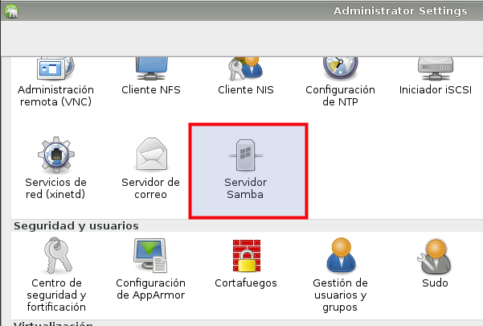
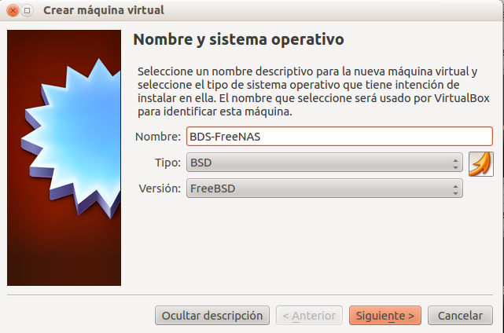
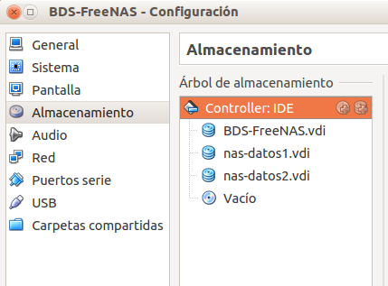
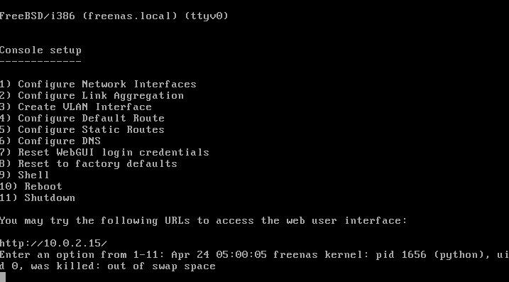
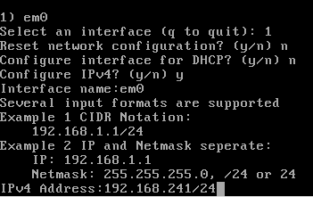
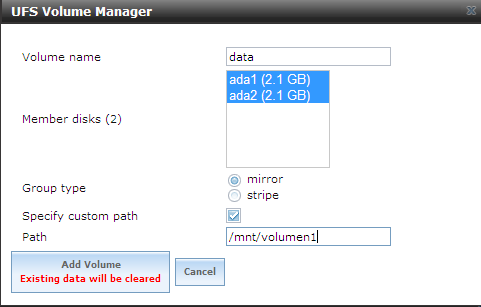
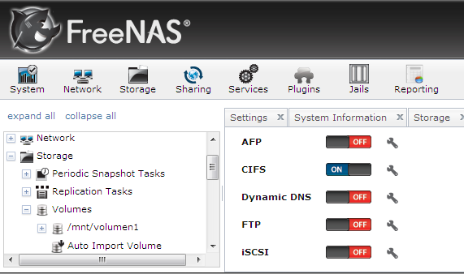
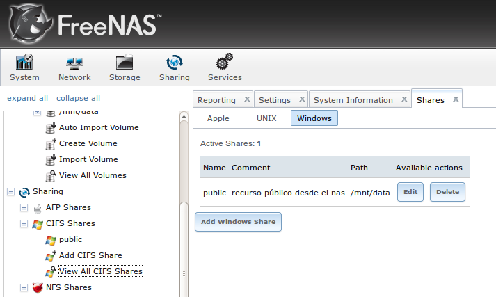
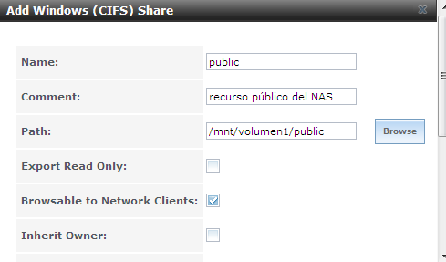

```
* Práctica utilizada en los cursos 201213, 201314, 201415
* Actualizada para el curso 201516
```

#Almacenamiento NAS

* Trabajar de forma individual.
* Entregar informe con capturas de pantalla.
* Esquema de la práctica:
    * Instalar y configurar NAS.
    * Montar 2 discos para guardar los datos en RAID1.
    * Crear 2 recursos compartidos CIFS/SMB en el servidor NAS.
        * Recurso1 compartido de lectura/escritura para el usuario1.
        * Recurso2 de sólo lectura para el usuario2.
    * Crear usuarios/clave para acceder al repositorio NAS.
    * Comprobar el acceso al servdidor NAS desde otra máquina.
* Elegir solamente, una de las siguientes opciones para realizar la práctica.

#1. NAS OpenSUSE 13.2

Montar en una MV con OpenSUSE el servicio Samba
(Consultar [configuración](../../global/configuracion-aula109.md)).

La práctica de NAS consisten en:
* Montar 2 discos para guardar los datos en RAID1.
* Montar el RAID1 en la ruta `/mnt/nas`.
    * Pista. Ejecutando el comando `df -hT` debemos ver los discos montados en la ruta.
    * Pista. En el directorio `/mnt/nas` debe aparecer un `lost+found`.
* Instalar y configurar un servidor Samba (desde Yast por ejemplo o con zypper).



> Samba es un software que permite que el equipo se comunique
usando el protocolo SMB/CIFS típico de las redes Windows.

* Configurar Servidor Samba con:
    * Grupo de trabajo: `AULA108`
    * Sin controlador de Dominio
    * Inicio del servicio: `durante el arranque`
    * Puerto abierto en el cortafuegos
* Crear el grupo `hobbitsXX`
    * Añadir los usuarios `frodoXX` y `bilboXX`
* Crear el grupo `humanosXX`
    * Añadir los usuarios `gandalfXX` y `aragornXX`
* Crear el recurso compartido (I):
    * Crear la carpeta `/mnt/nas/hobbitonXX.d`
    * Con permisos de lectura/navegación para todos.
    * Con permisos de escritura/lectura/navegación para el grupo `hobbitsXX`.
    * Crear recursos compartido (SMB/CIFS) en dicha ruta, con el nombre `hobbitonXX`.
    * Poner permisos al recurso de red de lectura para todos.
    * Poner permisos al recurso de red de lectura/escritura para `hobbitsXX`.
* Crear el recurso compartido (II):
    * Crear la carpeta `/mnt/nas/mordorXX.d`
    * Con permisos de lectura/navegación para todos.
    * Crear recursos compartido (SMB/CIFS) en dicha ruta, con el nombre `mordorXX`.
    * Poner permisos al recurso de red de lectura para todos.
* Poner también clave en Samba para los usuarios.
* Comprobar el acceso al servidor NAS desde otra máquina con todos los 
usuarios, y todos los recursos. 
* Comprobaciones:
    * Ejecutando `smbtree` en OpenSUSE veremos todos los recursos compartidos de red.
    

#2. NAS Hardware

La práctica de NAS consisten en:
* Usar un dispositivo NAS Hardware proporcionado por el profesor.
* Montar 2 discos para guardar los datos en RAID1.
* Crear 2 recursos compartidos CIFS/SMB en el servidor NAS.
    * `profesores`: Recurso compartido de lectura/escritura para el usuario `profesor`
    * `alumnos`: Recurso de sólo lectura para el usuario `alumno`.
* Crear usuarios/clave para acceder al repositorio NAS.
    * Usuario `profesor`.
    * Usuario `alumno`.
* Comprobar el acceso al servdidor NAS desde otra máquina.

#3. Otros NAS

Montar en una MV con otro sistema NAS a elegir por el alumno.
* Antes de empezar consultar el profesor el NAS elegido. 
* Instalar y configurar NAS.
* Montar 2 discos para guardar los datos en RAID1.
* Crear 2 recursos compartidos CIFS/SMB en el servidor NAS.
    * `hobbitonXX`: Recurso compartido de lectura/escritura para el usuario `frodoXX`
    * `mordorXX`: Recurso de sólo lectura para el usuario `gandalfXX`.
* Crear usuarios/clave para acceder al repositorio NAS.
    * Usuario `frodoXX`.
    * Usuario `gandalfXX`.
* Comprobar el acceso al servdidor NAS desde otra máquina. 


#4. FreeNAS

* Como no disponemos de hardware NAS para hacer las prácticas con todos 
los alumnos, nos vamos a crear nuestro propio NAS, en una MV usando 
la distro FreeNAS (Sistema Operativo BDS).

La práctica de NAS consisten en:
* Montar 2 discos para guardar los datos en RAID1.
* Crear 2 recursos compartidos CIFS/SMB en el servidor NAS.
    * `hobbitonXX`: Recurso compartido de lectura/escritura para el usuario `frodoXX`
    * `mordorXX`: Recurso de sólo lectura para el usuario `gandalfXX`.
* Crear usuarios/clave para acceder al repositorio NAS.
    * Usuario `frodoXX`.
    * Usuario `gandalfXX`.
* Comprobar el acceso al servdidor NAS desde otra máquina. 

Enlaces de interés:
* Página web: http://www.freenas.org/
* Consultar vídeo http://www.youtube.com/watch?v=gEjpxQLphxI
* Definición de NAS según wikipedia
* http://cerowarnings.blogspot.com.es/2012/01/servidor-de-discos-en-red-con-freenas.html


##4.1 Preparar la MV

* Crear la MV en VBox.Elegir MV del tipo FreeBSD. Si la ISO es x86 elegimos 
de 32 bits, y si la ISO es amd64 escogemos de 64bits.



* Aumentar la memoria RAM a 256 MB.
* Además del disco duro virtual donde instalar FreeNAS, vamos a añadir 
a la máquina virtual 2 discos más de 2GB cada uno, para crear el volumen de almacenamiento del NAS.




* Configurar MV con la red en modo puente. Para que al terminar podamos 
acceder al NAS desde cualquier equipo de nuestra red.

##4.2 Instalar FreeNAS

* Descargar la ISO del servidor del departamento, o desde la web de FreeNAS.
* Comenzamos la instalación.

> Si la ISO es de 32 bits crear la MV del tipo FreeBSD. 
> SI la ISO es 64 bits, crear la MV del tipo FreeBDS-64-bits (RAM 1128 MB).


> Fijarse que los discos no se llaman sda, sdb, o C:, D:, sino asa0, ada1, etc.


* Apagar el sistema. Quitar el disco de instalación (Fichero ISO).

##4.3 Primera configuración de FreeNAS

* Reiniciar la MV FreeNAS.
* Vamos a realizar la configuración inicial. Éste es el aspecto del menú:



Configuración de red

> El interfaz de red no se llama eth0, eth0, wlan0, etc. sino em0. 
> Por defecto el interfaz de red está configurado de forma automática (DHCP). 
> Nosotros vamos a configurarlo de forma manual (static).

* Pulsamos 1 (Configure Network Interface) para configurar el interfaz de red: 
Configurar la IP, máscara de red. Veamos imagen de ejemplo:



* Pulsamos 4 (Default static route) para configurar la puerta de enlace.
* Pulsamos 6 para configurar el servidor DNS.
* PREGUNTA: ¿Qué parámetros de configuración de red, son los mínimos necesarios 
para tener una comunicación efectiva dentro de la red LAN? ¿ip, máscara, servidor dns, puerta de enlace, servidor dhcp, etc.?
* En la opción 9 entramos en una shell y podemos probar comandos como: ifconfig, ping, nslookup, df -hT.
* Para consultar las particiones usamos los comandos BSD siguientes: fdisk /dev/ada0, fdisk /dev/adad1, fdisk /dev/ada2, etc.
* Con exit volvemos de nuevo al menú de configuración.

Comprobar que esto ha funcionado:

* Para acceder al PANEL de configuración (GUI, por entorno gráfico) de FreeNAS, iniciamos un navegador web desde otro PC de la red. Y navegamos usando la IP del servidor FreeNAS.

##4.4 Crear un volumen

* Para acceder al PANEL de configuración (GUI, por entorno gráfico) de FreeNAS, 
iniciamos un navegador web desde otro PC de la red. Y navegamos usando la IP del servidor FreeNAS.

> Si no recuerdas el usuario/clave... vuelve al la MV FreeNAS, usa la opción 7 (Reset credentials) del menú.

Ahora vamos a crear un VOLUMEN a partir de los dos discos creados de 2GB.

* Ir a "Storage -> Volumes -> UFS Volume Manager".
* Elegir mirror (RAID1) con los dos discos y el montaje en /mnt/volumen1.
* Si lo necesitamos, crear directorio /mnt/volumen1, para montar el volumen.
* Veamos imagen de ejemplo.



> Otras configuraciones también funcionarían pero es para tenerlos todos igual.

* Activar el servicio de carpetas compartidas, ir a "Servicios" -> "Control de Servicios - > CIFS -> ON".



* Ir al servidor FreeNAS. Entrar en la Shell (Opción 9). Ejecutar los comandos siguientes:
    * df -hT (Para comprobar que está montado el volumen1)
    * Crear el directorio `/mnt/volumen1/public`
    * Poner permisos a `/mnt/volumen1/public` (Creamos una carpeta de uso público lectura/escritura).
    * Creamos un recurso compartida CIFS/SMB, ir a "Sharing/Compartido" -> "Añadir recurso CIFS". Path a /mnt/volumen1/public.





* Vamos a permitir el acceso de usuarios invitados.


##4.5 Comprobar desde cliente

* Probar que podemos acceder a dicho recurso compartido SMB/CIFS, desde otro equipo de la red. Por ejemplo, usando un cliente Windows7.
* Para comprobar el acceso al recurso compartido de red desde GNU/Linux:
    * Abrimos un explorador de archivos y en la ruta pondremos "smb://ip-del-servidor-nas".
    * Para comprobar con comandos, podemos montar el recurso compartido de red en una carpeta local, mediante la siguiente orden: "mount -t cifs //ip-del-servidor-nas/public /mnt/nas". Desmontamos mediante "umount /mnt/nas"
* Accedemos al recurso de red y creamos algún archivo.

