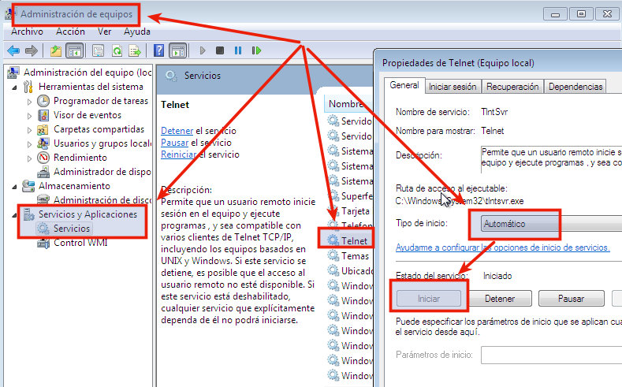

```
* Creado en Marzo 2016 para el curso1516
```

#Configurar acceso remoto

##1. Windows con Servidor Telnet

###1.1 Instalación y configuración de Telnet
* Instalar: Ir a `Panel de Control`->`Instalar Características de Windows`->`Servidor Telnet`.


* Configurar: Ir a `Equipo`->(btn derecho)->`Administrar`->`Servicios`->`Telnet`->`Propiedades`:
    * `Automático`->`Aplicar`
    * `Iniciar`->`Aceptar`



* Usuario/clave
   * Crear usuario `sysadmingame` dentro de los grupos `Administradores` y `TelnetClients`.
   * Clave de `sysadmingame` conocida por el alumno y el profesor.


###1.2 Comprobar el funcionamiento de Telnet

* Comprobamos el acceso al servicio Telnet desde otra máquina
(Por ejemplo la máquina real) con `telnet IP-HOST-WINDOWS`.


* Enlaces de interés:
    * [Vídeo : Configurar un servicio de servidor telnet en Windows 7 con permisos a usuarios](https://www.youtube.com/watch?v=oLnf8MICrL4)

###1.3 Configuración sólo para Directorio Activo

* Cuando tenemos un Windows Server con Directorio Activo podemos crear usuarios del dominio,
pero también usuarios locales. Para crear un usuario local cuando tenemos AD hacemos lo siguiente:
    * Vamos a `USUARIOS Y EQUIPOS DE ACTIVE DIRECTORY -> USERS`
    * Hacemos "click" en `CUENTA`y vemos nuestro nombre de usuario y dominio.
    * Borramos el `Nombre de inicio de sesión`, y se borrará automaticamente el dominio.
    * Reiniciamos y ya tenemos el usuario en local y NO en dominio.
    * Consultar imagen de ejemplo:


##2. Windows con Servidor SSH con CopSSH

* Descargar la versión Free del programa [CopSSH](https://www.itefix.net/copssh).
* Instalar con las opciones por defecto.
* Configurar el usuario siguiente:
    * Crear usuario `sysadmingame` dentro del grupo `Administradores`.
    * Clave de `sysadmingame` conocida por el alumno y el profesor.
    * Shell: `Linux Shell + SFTP`
* Para comprobar el acceso remoto SSH, vamos a la máquina real
y ejecutamos:
    * `ssh nombre-del-alumno@ip-de-la-mv` para entrar en la MV

##3. OpenSUSE Servidor SSH

* Programa SSH server:
    * Para veriguar si lo tenemos instalado: `zypper search openssh`
    * Instalar openssh-server para que el profesor pueda acceder
    de forma remota:`zypper install openssh`.
    * Modificar el fichero `/etc/ssh/sshd_config` y cambiar
    `PermitRootLogin yes`. La línea debe estar descomentada.
    * Reiniciar el servicio: `service ssh restart`
* Para comprobar el acceso remoto SSH, vamos a la máquina real
y ejecutamos:
    * `ssh nombre-del-alumno@ip-de-la-mv` para entrar en la MV
    * `hostname -f` para ver el nombre de la MV donde hemos entrado.

##4. Debian SSH Server

* Programa SSH server:
    * Para averiguar si lo tenemos instalado: `dpkg -l openssh*`.
    * Instalar openssh-server para que el profesor pueda acceder
    de forma remota:`apt-get install openssh-server`.
    * Modificar el fichero `/etc/ssh/sshd_config` y cambiar
    `PermitRootLogin yes`.
    * Reiniciar el servicio: `service ssh restart`
* Para comprobar el acceso remoto SSH, vamos a la máquina real
y ejecutamos:
    * `ssh nombre-del-alumno@ip-de-la-mv` para entrar en la MV
    * `hostname -f` para ver el nombre de la MV donde hemos entrado.
