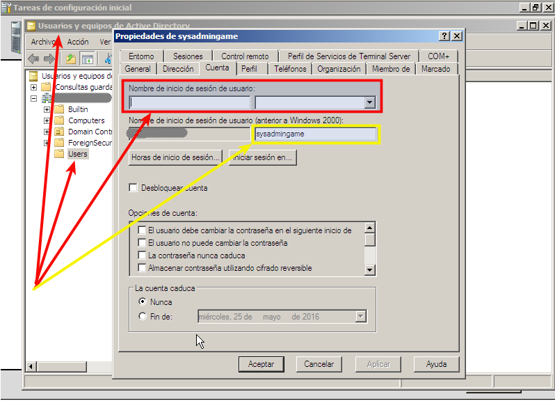

# Configurar acceso remoto en Windows

## 1. Windows7 con Servidor Telnet

### 1.1 Instalación y configuración de Telnet
* Instalar: Ir a `Panel de Control`->`Instalar Características de Windows`->`Servidor Telnet`.

* Configurar: Ir a `Equipo`->(btn derecho)->`Administrar`->`Servicios`->`Telnet`->`Propiedades`:
    * `Automático`->`Aplicar`
    * `Iniciar`->`Aceptar`

* Usuario/clave
   * Crear usuario `teuton`.
   * Clave de `teuton` conocida por el alumno y el profesor.
   * Incluir al usuario dentro de los grupos `Administradores` y `TelnetClients`.

### 1.2 Comprobar el funcionamiento de Telnet

* Comprobamos el acceso al servicio Telnet desde otra máquina
(Por ejemplo la máquina real) con `telnet IP-HOST-WINDOWS`.

> Enlaces de interés:
>
> * [Vídeo : Configurar un servicio de servidor telnet en Windows 7 con permisos a usuarios](https://www.youtube.com/watch?v=oLnf8MICrL4)

---

# 2. Configurar acceso remoto para Windows Server

## 2. Windows con Servidor Telnet

### 2.1 Instalación y configuración de Telnet

En Windows Server podemos instalar el servidor Telnet en agregar características y/o roles.
* Reiniciar la máquina después de instalar el servicio Telnet.
* Ir a `Administrar equipo -> Servicios`. Buscar el servicio Telnet. Iniciarlo y ponerlo en en modo Automático.

* Usuario/clave
   * Crear usuario `teuton` dentro de los grupos `Administradores` y `TelnetClients`.
   * Clave de `teuton` conocida por el alumno y el profesor.

### 2.2 Comprobar el funcionamiento de Telnet

* Comprobamos el acceso al servicio Telnet desde otra máquina
(Por ejemplo la máquina real) con `telnet IP-HOST-WINDOWS`.

* Enlaces de interés:
    * [Vídeo : Configurar un servicio de servidor telnet en Windows 7 con permisos a usuarios](https://www.youtube.com/watch?v=oLnf8MICrL4)

### 2.3 Configuración sólo para Directorio Activo

* Cuando tenemos un Windows Server con Directorio Activo podemos crear usuarios del dominio,
pero también usuarios locales. Para crear un usuario local cuando tenemos AD hacemos lo siguiente:
    * Vamos a `USUARIOS Y EQUIPOS DE ACTIVE DIRECTORY -> USERS`
    * Hacemos "click" en `CUENTA`y vemos nuestro nombre de usuario y dominio.
    * Borramos el `Nombre de inicio de sesión`, y se borrará automaticamente el dominio.
    * Reiniciamos y ya tenemos el usuario en local y NO en dominio.
    * Consultar imagen de ejemplo:

