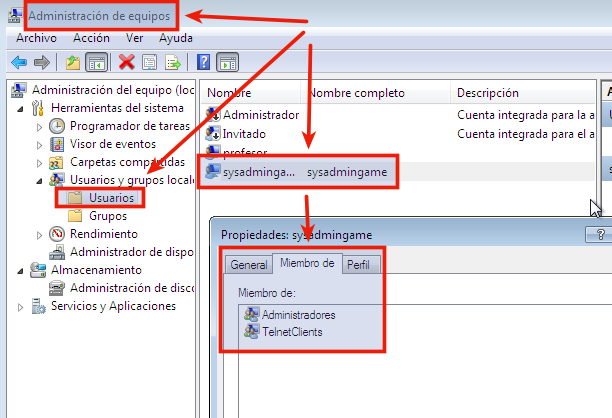

# Configurar acceso remoto en Windows7

## 1. Windows con Servidor Telnet

### 1.1 Instalación y configuración de Telnet
* Instalar: Ir a `Panel de Control`->`Instalar Características de Windows`->`Servidor Telnet`.

* Configurar: Ir a `Equipo`->(btn derecho)->`Administrar`->`Servicios`->`Telnet`->`Propiedades`:
    * `Automático`->`Aplicar`
    * `Iniciar`->`Aceptar`

* Usuario/clave
   * Crear usuario `sysadmingame` dentro de los grupos `Administradores` y `TelnetClients`.
   * Clave de `sysadmingame` conocida por el alumno y el profesor.

### 1.2 Comprobar el funcionamiento de Telnet

* Comprobamos el acceso al servicio Telnet desde otra máquina
(Por ejemplo la máquina real) con `telnet IP-HOST-WINDOWS`.

> Enlaces de interés:
>
> * [Vídeo : Configurar un servicio de servidor telnet en Windows 7 con permisos a usuarios](https://www.youtube.com/watch?v=oLnf8MICrL4)

---

## 2. Windows con Servidor SSH con CopSSH

* Descargar la versión Free del programa [CopSSH](https://www.itefix.net/copssh).
* Instalar con las opciones por defecto.
* Configurar el usuario siguiente:
    * Crear usuario `sysadmingame` dentro del grupo `Administradores`.
    * Clave de `sysadmingame` conocida por el alumno y el profesor.
    * Shell: `Windows Shell`
* Para comprobar el acceso remoto SSH, vamos a la máquina real
y ejecutamos:
    * `ssh nombre-del-alumno@ip-de-la-mv` para entrar en la MV
