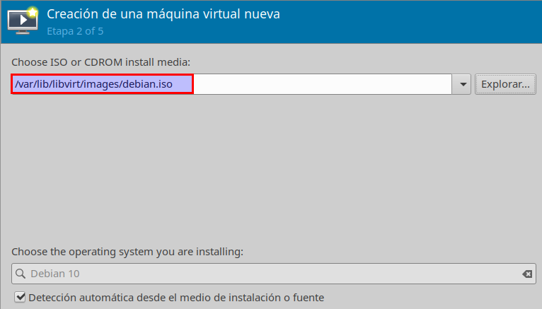
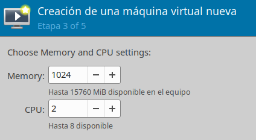
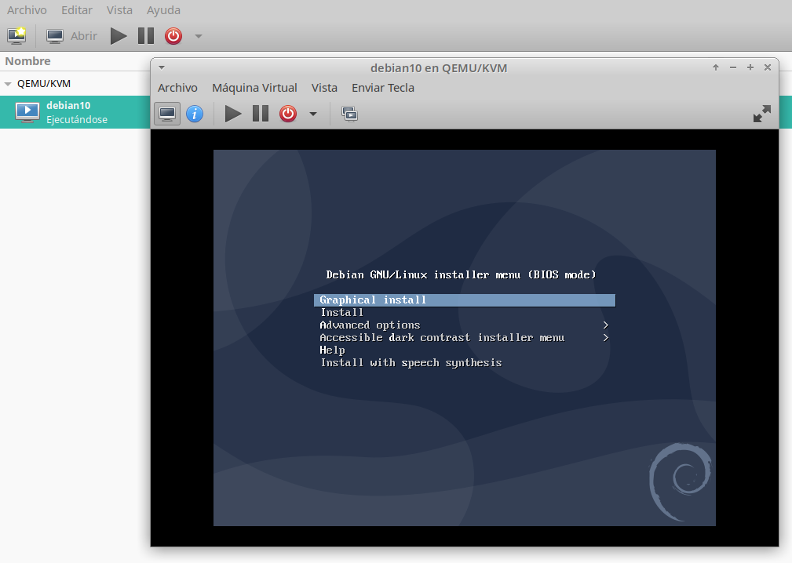

```
Estado      : EN CONSTRUCCION!!!
Cursos      : 202021
Area        : CPD, Virtualización
Descripción : Practicar virtualización KVM
Requisitos  : SO GNU/Linux, isos de otros SSOO
Tiempo      : 3 sesiones
```

# KVM y libvirt (con OpenSUSE)

Ejemplo de rúbrica:

| Sección               | Muy bien (2) | Regular (1) | Poco adecuado (0) |
| --------------------- | ------------ | ----------- | ----------------- |
| (1.4 y 1.5)           | | | |

> Enlaces de interés:
> * https://www.linuxtechi.com/install-configure-kvm-opensuse-leap-15/

# 1. KVM

## 1.1 Instalar KVM

* Ir a `Yast -> Virtualización -> Instalar Hipervisor y herramientas`.
* Elegir `Servidor de KVM` y `Herramientas de KVM`
* `Aceptar`

## 1.2 Crear una MV

* Crear el directorio `/home/david/kvm` para guardar el disco duro de la máquina virtual.
* En el directorio `/var/lib/libvirt/images`, necesitamos tener la ISO del sistema
operativo que queramos instalar en MVs.
* Ir a `Menú -> Create Virtual Machines for Xen and KVM`. Necesitaremos permisos de superusuario.







* Creamos un pool de almacenamiento:
    * Nombre del pool: `alumno`
    * Ubicación: `/home/alumno/kvm`
    * Volumen: `fichero.qcow2`


* Iniciar red virtual: **SI**
* ¡Ya tenemos la MV creada!

## 1.3 Instalar el SO en la MV

* Ir `Menú -> Gestor de Máquinas Virtuales`



* Procedemos a instalar el SO dentro de la MV.

---
# 2. libvirt

> Enlaces de interés:
>
> * [How to get started with libvirt on Linux](http://rabexc.org/posts/how-to-get-started-with-libvirt-on/)
> * [Linux KVM Libvirt Tutorial – POFTUT](https://www.poftut.com/linux-kvm-libvirt-tutorial/)
> * [Virtualization - libvirt | Server documentation | Ubuntu](https://ubuntu.com/server/docs/virtualization-libvirt)

## 2.1 Instalación

Con la instalacion de KVM también tenemos libvirt. Comprobamos `systemctl status libvirtd`.
* `sudo usermod -a -G libvirt alumno`, añadimos a nuestro usuario al grupo libvirt para
que pueda gestionar la herramienta de virtualización sin ser root.
* Consultar los pool disponibles:

```bash
> virsh -c qemu:///system pool-list
 Nombre    Estado   Inicio automático
---------------------------------------
 david     activo   si
 default   activo   si
```

* Consultar los volúmenes de un pool:

```bash
> virsh -c qemu:///system vol-list david
 Nombre              Ruta
--------------------------------------------------------
 debian10.qcow2      /home/david/kvm/debian10.qcow2
 opensuse152.qcow2   /home/david/kvm/opensuse152.qcow2
```

```bash
> virsh net-start default
La red default se ha iniciado

> virsh net-list
 Nombre    Estado   Inicio automático   Persistente
-----------------------------------------------------
 default   activo   no                  si

> virsh list --all
Id   Nombre        Estado
-----------------------------
-    debian10      apagado
-    opensuse152   apagado

> virsh start debian10
> virsh list
Id   Nombre        Estado
--------------------------------
 4    debian10      ejecutando
 -    opensuse152   apagado

> virsh destroy debian10
 El dominio debian10 ha sido destruido
```

---

# ANEXO

* **isardvdi**: https://www.isardvdi.com/

Crear un nuevo pool:

```bash
$ virsh -c qemu:///system \
    pool-define-as devel \
    dir --target /opt/kvms/pools/devel
$ virsh -c qemu:///system pool-autostart devel
$ virsh -c qemu:///system pool-start devel
```

Instalar una MV:
```bash
virt-install -n debian-testing \
             --ram 2048 --vcpus=2 \
             --cpu=host \
             -c ./netinst/debian-6.0.7-amd64-netinst.iso \
             --os-type=linux --os-variant=debiansqueeze \
             --disk=pool=devel,size=2,format=qcow2 \
             -w network=devel --graphics=vnc
```
