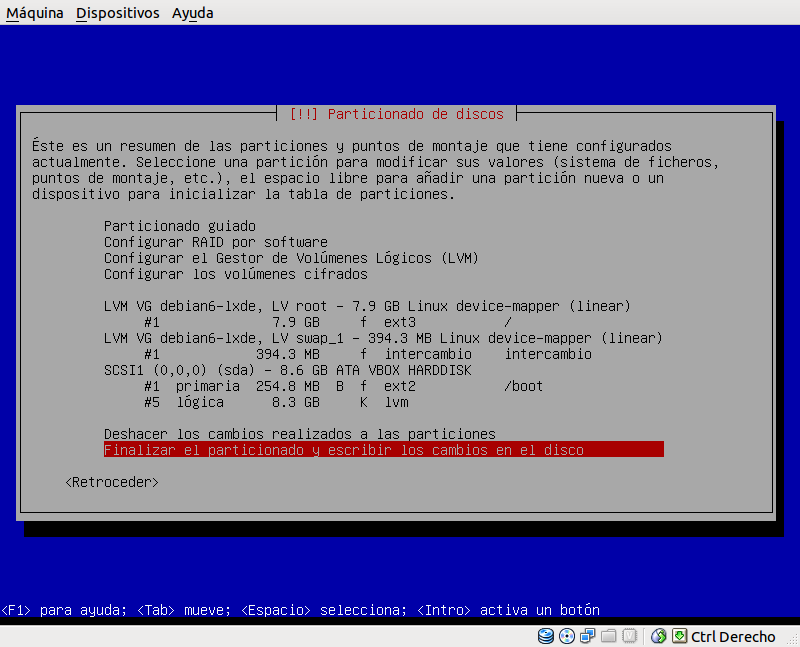

*(Ejecutada en los cursos 201415, 201314)*

#1. Introducción

Vídeos
* [Learning Linux : Lesson 20 Managing LVM]
* [LVM. Learning Linux: Lesson 21 LVM snapshots"]

#2. Instalar SO sobre LVM

Vamos a instalar un sistema operativo GNU/Linux Debian, sobre unos discos con LVM.

> Otra forma de producir un efecto similar al de LVM, es mediante el uso de 
sistemas de ficheros como BtrFS o ZFS (Consultar).
> Nosotros NO vamos a usar ZFS sino LVM en nuestra práctica, pero si algún 
grupo desea usar ZFS debe hablar con el profesor.

##2.1 Preparar MV
Realizar las siguientes tareas:
* Crear MV para Debian, con un disco de 8GB.
* Comenzar a instalar GNU/Linux Debian, parar al llegar al particionado.

##2.2 Particionar

* Crearemos una partición de 100MB para boot. 
> Tener en cuenta que la partición "/boot" va a parte (Fuera de LVM).
* Crear en el resto una partición LVM. En la partición LVM, podemos hacer 
un grupo de volumen llamado `vg-debian`.
* Dentro del `vg-debian`, podemos los VL (volúmenes lógicos) siguientes:
    * `lv-swap` (500 MB) usar para área de intercambio
    * `lv-raiz` (5GB) usar como raíz de la instalación del SO.
    * `lv-datos` (100MB) usar como /home del sistema.
> Vemos que nos ha sobrado espacio. Lo dejamos así porque lo usaremos más adelante.

A continuación se muestran imágenes de referencia que NO tienen porqué coincidir con lo que se solicita.



A continuación se muestra imagen de muestra que NO tiene que coincidir con lo que se solicita.


* Terminamos la instalación del sistema operativo.
* Reiniciamos el sistema y comprobamos lo que tenemos:
```
    date
    hostname
    hostname -a
    hostname -f
    hostname -d
    ip a
    route -n
    host www.google.es
    fdisk -l
    vgdisplay
    lvdisplay vg-debian
```
      
##2.3 Ampliar VL
Ahora podremos ampliar *"en caliente"*, el espacio de lv-datos de 100MB a 400MB.

* Consultar el tamaño actual del volumen lógico: `lvdisplay -v /dev/vg-debian/lv-datos`
* Para ampliar el tamaño del volumen lógico: `lvextend -L 400 /dev/vg-debian/lv-datos`
* Comprobar con: `lvdisplay -v /dev/vg-debian/lv-datos`
* Comprobamos lo que tenemos ahora:
```
    ip a
    vgdisplay
    lvdisplay vg-debian
```

#3. Modificar el espacio físico LVM

> Consejo: Haz copia de seguridad de la MV (Exportar/importar de VBox, instantánea/snapshot, etc.).

Vamos a añadir al sistema anterior, más almacenamiento físico LVM, puesto que ya hemos agotado 
todo el espacio libre de los discos físicos.

Esquema de PV, VG y LV:


##3.1 Preparar la MV
* Añadimos 2 discos virtuales nuevos:
    * (Disco a) 200MB: con una partición completa del disco
    * (Disco b) 750MB: con 3 particiones de 250MB sin definir.
> NOTA: Las particiones las pueden crear con fdisk, gparted, etc.

##3.2 Crear VG y VL

* Crear un Grupo de Volumen llamado `vg-extra`, con el disco (a) y las 2 
primeras particiones del (b). (Comando vgcreate)
* Crear un nuevo Volumen Lógico llamado `lv-extra` con tamaño 690MB. 
Comando: `lvcreate -L690M -n lv-extra vg-extra`.

> NOTA: La partición 3 del disco (b) NO la estamos usando por ahora.
* Comprobamos lo que tenemos:
```
    ip a
    vgdisplay vg-extra
    lvdisplay vg-extra
```
          
##3.3 Escribir información

* Primero vamos a crear directorio (`/mnt/vol-extra`),donde vamos a montar el nuevo dispositivo (Volumen lógico).
> El nuevo dispositivo `/dev/vg-extra/lv-extra` no tiene formato. Debe ser formateado antes de montarse.
* Montar el nuevo dispotivo (Volumen Lógico) en la carpeta /mnt/vol-extra. 
A partir de ahora todo lo que escribamos en dicha carpeta se estará guardando en el dispositivo montado.
* Escribir información en `/mnt/vol-extra`. Crear algunas carpetas y ficheros con tamaño mayor a cero. 
Por ejemplo para crear un archivo de tamaño 1M podemos hacer `dd if=/dev/zero of=/mnt/vol-extra/file-size-1M bs=512 count=2048`. 
El comando dd hay que usarlo con precaución.
* Comprobar el espacio usado en `/mnt/vol-extra` (df -hT).

##3.4 Añadir más tamaño

* Añadir la tercera partición del disco (b) (no utilizada) al VG vg-extra.
```
    pvcreate /dev/sdc3
    vgextend vg-extra /dev/sdc3
    vgdisplay vg-extra (Para comprobar el cambio)
```
* Ampliar el tamaño de lv-extra a 930MB (Comando lvextend). Comprobar el aumento del espacio (lvdisplay)
* Comprobar que los datos/información no se han borrado al ampliar el volumen lógico.

#2.5 Quitar un disco físico

> En LVM los discos físicos se llaman volúmenes físicos (Physical Volumes). 

El grupo de volumen vg-extra, tiene dos volúmenes físicos que son los discos (a) y (b). 
Vamos a quitar el disco (b) del VG, sin perder la información almacenada en él.

* Primero comprobamos el tamaño utilizado de nuestros datos: `du -sh /mnt/vol-extra`. 
Este valor debe ser menor a 50 MB.
* Reducir el tamaño del volumen lógico lv-extra a 50 MB: `lvreduce --size 50MB /dev/vg-extra/lv-extra`
* Comprobamos: `lvdisplay /dev/vg-extra/lv-extra`

> INFO: Vamos a quitar un disco del VG vg-extra (Consultar enlace).

* Movemos la información del disco sdc al disco sdb:
```
    pvmove /dev/sdc1 /dev/sdb1
    pvmove /dev/sdc2 /dev/sdb1
    pvmove /dev/sdc3 /dev/sdb1
```
* Reducimos el tamaño del grupo de volumen:
```
    vgreduce vg-extra /dev/sdc1
    vgreduce vg-extra /dev/sdc2
    vgreduce vg-extra /dev/sdc3
```
* Comprobar que se mantiene la información almacenada.
* Comprobamos lo que tenemos:
```
    ip a
    vgdisplay
    lvdisplay vg-extra
```

#4. Discos dinámicos en Windows

En windows las particiones se llaman volúmenes básicos. Para poder hacer el mismo
efecto de LVM debemos convertir las particiones a volúmenes básicos.

##4.1 Volumen Distribuido
Vamos a crear un volumen dinámico *Distribuido*:
* Crea un disco duro virtual con VirtualBox de 3 GB.
* Crea dentro del mismo 5 volúmenes simples de 100, 200, 300, 400 y 500 MB respectivamente.
* Crea un volumen distribuido con el disco anterior.

> * Nota: los volúmenes simples del primer disco deben permanecer intactos.
> * Un volumen Distribuido NO es RAID0. Se parece a RAID0 y usa discos de distinto tamaño
para crear otro mayor. Es el mismo efecto que el conseguido con LVM y los volúmenes lógicos.


# ANEXO A: Esquemas LVM


