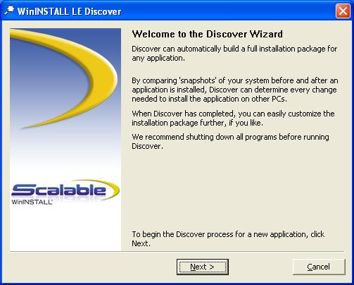
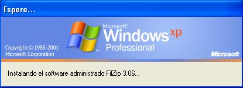

# 1. Políticas o directivas de grupo

* Leer la documentación que se proporciona. Concretamente el fichero `M34_directivas_grupos.pdf`.
* Consultar las dudas al profesor.
* Incluir capturas de pantalla de:
    * El proceso de configuración en el servidor
    * y de los resultados producidos en los clientes.

---

# 2. Aplicar directivas (I)

Realizar las siguientes tareas:

* Antes de empezar la práctica vamos a crear un "snapshot" (instantánea) de la máquina virtual por seguridad.
* Crear las OU (Unidades Organizativas) `jediXXc1718` y `sithXXc1718`.
* Mover los usuarios a su correspondiente OU.
* Enlaces de interés:
    * Sobre [cómo aplicar una GPO a un grupo en Win Server 2008](http://www.aprendeinformaticaconmigo.com/windows-server-2008-filtrar-una-gpo-para-aplicarla-a-grupos/).
    * Vídeo sobre [Crear políticas de grupo (GPO) para Win Server 2012 R2](https://www.youtube.com/watch?v=LnO0aeK8_P4&t=647s)

> **IMPORTANTE**: No aplicar la directivas a todo el dominio. 
> Sólo a las unidades organizativas que se especifiquen. 
> Un error grave es aplicar las directivas a todo el site en lugar de a cada OU.
> Este error puede afectar al correcto funcionamiento del servidor.

* Dentro de la OU de los jedis crear la GPO `gpo_jediXX`.
* Dentro de la OU de los siths crear la GPO `gpo_sithXX`.

> **INFO**
> Para editar configuraciones de Directiva de grupo:
> * En Group Policy Management (Administración de directivas de grupo), en el árbol de consola, desplegar Group Policy Objects (Objetos de Directiva de grupo). Click con el botón derecho del ratón en el GPO y seleccionar Edit (Editar).
> * En el Editor de objetos de Directiva de grupo, buscar la Directiva de grupo que queremos modificar y hacemos doble clic. En el cuadro de diálogo Propiedades, cambiamos la configuración y Aceptar.

Vamos a aplicar las siguientes directivas a las OU anteriores. Elegir unas para una OU y otras para la otra.
* En la sección de `Configuración de usuario / Directivas / Plantillas administrativas / Menú Inicio y barra de tareas` (User configuration / Administrative Templates / Start Menu and Taskbar)
    * `Quitar el menú Ejecutar del menú Inicio`
    * `Quitar el icono de Red del menú inicio`
    * `Quitar icono de Red`
    * `Quitar Conexiones de red del menú Inicio`
* En la sección `Configuración de usuario / Directivas / Plantillas administrativas / Panel de control` (User configuration / Administrative Templates / Control Panel)
    * `Prohibir el acceso al Panel de control`
* En la sección `Configuración de usuario / Directivas / Plantillas administrativas / Escritorio` ( User configuration / Administrative Templates / Active Desktop)
    * `Ocultar el icono Ubicaciones de red del escritorio`
* En la sección de `Configuración de usuario / Directivas / Plantillas administrativas / Componentes de Windows / Explorador de Windows` (User configuration / Administrative Templates / Windows Components / Windows Explorer) 
    * Ocultar estas unidades específicas en Mi PC (Hide these specified drives in My Computer) o Impedir el acceso a las unidades desde Mi PC (Prevent Access to drives from my computer). Elegir un combinación adecuada como bloquear las unidades A y B (Restrict A y B drives only).
    * `Quitar <Conectar a unidad de red> y <Desconectar de unidad de red>`

Al terminar de configurar las directivas, hacemos lo siguiente:
* Abrir consola como administrador y ejecutar `gpupdate /force` para forzar las
actualizaciones de las directivas. En algunos casos, después de definir una política,
ésta tarda un tiempo en activarse, pero usando el comando anterior, nos aseguramos
de que este paso de activación se realice inmediatamente.
* Capturar imagen del resumen de la configuración de cada una de las directivas creadas
(`Ir a directiva -> Configuración`).
* Capturar imágenes donde se muestren los efectos de las directivas de usuario en las MV cliente.

---

# 3. Aplicar directivas (II)

> Enlaces de interés
>
> * Crear política de instalación para nuestro paquete MSI
>    * [Crear GPO de despliegue de software](http://www.aprendeinformaticaconmigo.com/windows-server-2008-crear-gpo-de-despliegue-de-software/)
>    * La política de despliegue la vamos a crear a nivel de cuenta de usuario. Marcamos "Asignada" e "Instalar al iniciar Sesión".
> * Crear y probar las directivas del siguiente enlace Windows Server 2008
>    * [Active Directory directivas a usuarios](https://losindestructibles.wordpress.com/2011/05/22/windows-server-2008-active-directory-gpo-directivas-a-usuarios/)
> *  [Cómo utilizar directiva de grupo para instalar software de forma remota en Windows Server 2008 y Windows Server 2003](https://support.microsoft.com/es-es/help/816102/how-to-use-group-policy-to-remotely-install-software-in-windows-server-2008-and-in-windows-server-2003)

* IMPORTANTE: Vamos a crear otro "snapshot" de la máquina virtual.

Vamos a crear nuestro propio paquete de instalación MSI.
* Consultar enlace sobre cómo [Crear paquetes MSI con WinINSTALL](http://www.ite.educacion.es/formacion/materiales/85/cd/windows/11Directivas/crear_paquetes_msi.html).

## 3.1 Instalar en el servidor

**En el servidor**
* Descargar el programa WinINSTALL
    * http://www.downloadsource.es/3414/WinINSTALL-LE/
    * http://www.freewarefiles.com/downloads_counter.php?programid=52066
* Una vez instalada la aplicación hemos de asignar permisos de acceso remoto a la carpeta compartida WinINSTALL.
* Crear la carpeta `e:\softwareXX`.
    * Esta carpeta con permisos de lectura para todos los usuarios.
    * Este carpeta con permisos lectura/escritura para todos los administradores.
* Crear un recurso compartido de red `E:\softwareXX`.
    * Este recurso con permisos de lectura para todos los usuarios.
    * Este recurso con permisos lectura/escritura para todos los usuarios del dominio.
* Crear la subcarpeta `e:\softwareXX\firefox`.

## 3.2 Descargar software en el cliente y crear MSI

**En el cliente**
* Entramos con el usuario administrador del dominio.
* Descargar el instalador de Firefox. ¡OJO! Sólo descagar. NO instalar todava. El instalador de Firefox debe tener un
tamaño de varios MBs. Si tiene pocos KBs no es el instalador, sino un programa para descargar el instalador.
* `Inicio -> Ejecutar -> \\ip-del-servidor\WinINSTALL\Bin\Discover.exe`,
para iniciar la aplicación WinINSTALL LE de forma remota,

* Indicamos el nombre que vamos a asociar al paquete MSI (`firefoxXX.msi`).
* Ruta de red donde almacenaremos el MSI, en nuestro caso
`\\ip-del-servidor\softwareXX\firefox\firefoxXX.msi`.

* Unidad donde se almacenarán los ficheros temporales => C:.
* Unidades que serán analizadas para realizar la foto inicial;
en nuestro caso sobre la unidad C: de nuestro equipo cliente.
* Indicar los ficheros que serán excluidos del análisis;
en nuestro caso aceptaremos las opciones propuestas por el asistente por defecto.
* Pulsamos Finish para comenzar la generación de la foto inicial del equipo.

> En el tiempo comprendido entre la ejecución de este proceso y la ejecución
del proceso de la foto final, es crítico ejecutar únicamente el software
de instalación del paquete MSI a generar.
> Cualquier modificación que se haga durante este proceso, se grabará en el paquete MSI obtenido, 
aunque no forme parte de las modificaciones realizadas de la aplicación durante su instalación.

* Una vez que la foto inicial haya sido realizada, pulsamos Aceptar, y
a continuación se nos mostrará otra ventana en el que seleccionaremos el fichero
de instalación de la aplicación de la que vamos a generar el paquete MSI.
En nuestro caso el fichero firefox.exe que nos habíamos descargado.
* Comienza la instalación de la aplicación de firefox.exe de modo manual.
* Volvemos a inicio -> ejecutar -> `\\ip-del-servidor\WinINSTALL\Bin\Discover.exe`,
para iniciar el proceso de creación de la foto final del sistema.
Este que puede durar varios minutos.
* Podremos confirmar que el paquete ha sido creado correctamente en el equipo "SERVIDOR",
yendo a la carpeta `E:\softwareXX\firefox`.
* Limpiamos el equipo cliente:
    * Eliminar el fichero firexfox.exe que nos habíamos descargado.
    * Desinstalar el programa Firefox del cliente.

## 3.3 Crear nueva GPO en el servidor

**Vamos al servidor:**
* Crear las OU `maquinasXXc1617` y mover los equipos del dominio dentro de esta UO.
* Vamos a crear una directiva (`gpo_softwareXX`) para la instalación del
software `firefox.msi` para la OU anterior.
* Asociamos a la directiva de grupo de Instalación de software ubicada en
`Configuración del equipo -> Directivas -> Configuración de software`,
un nuevo paquete de instalación de software de la aplicación.
    * Configurar la instalación del paquete en modo `Asignado`.

> **ADVERTENCIAS**
>
> * Cuando indiquemos la ruta al paquete MSI, debemos indicar su
ruta de red y NO su ruta del sistema de ficheros.
>     * Ejemplo correcto: `\\ip-del-servidor\softwareXX\firefox\firefox.msi`
>     * Ejemplo INCORRECTO: `E:\softwareXX\firefox\firefox.msi`
> * La configuración de instalación de paquete `Publicado` no instala el programa,
pero lo deja disponible por si el usuario lo quiere instalar a través de la
herramienta de `Instalación de Software` del panel de control.

* Abrir consola como administrador y ejecutar `gpupdate /force` para forzar las
actualizaciones de las directivas.
* Capturar imagen del resumen de la configuración de cada una de las directivas creadas
(`Ir a directiva -> Configuración`).

## 3.4 Comprobar desde los clientes

**Vamos al otro cliente:**
* Entramos con un usuario del dominio y se debe instalar automáticamente el programa que hemos configurado
en las directivas. OJO. Este paso puede tardar bastante tiempo.

---

# ANEXO A
