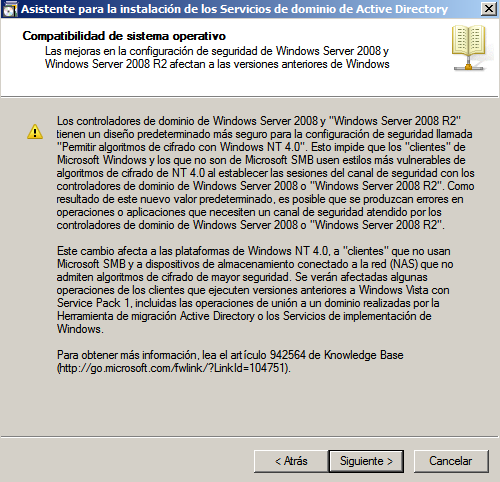
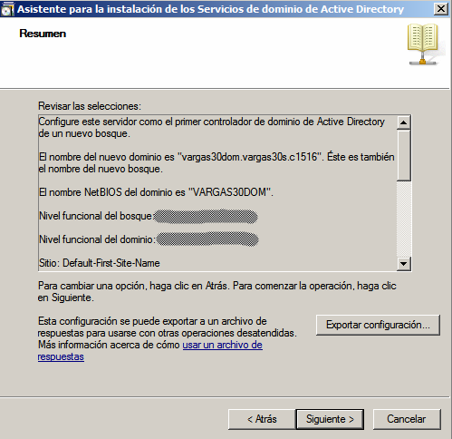
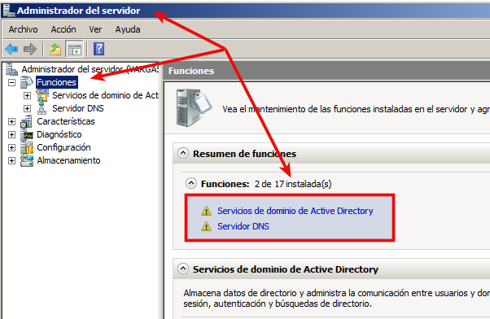
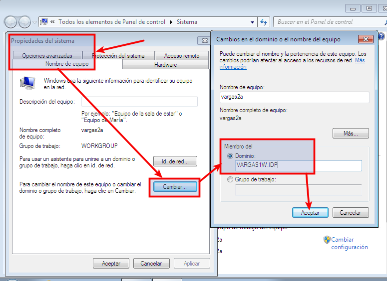
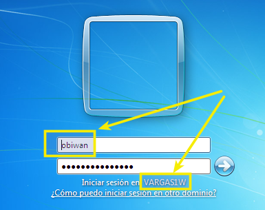
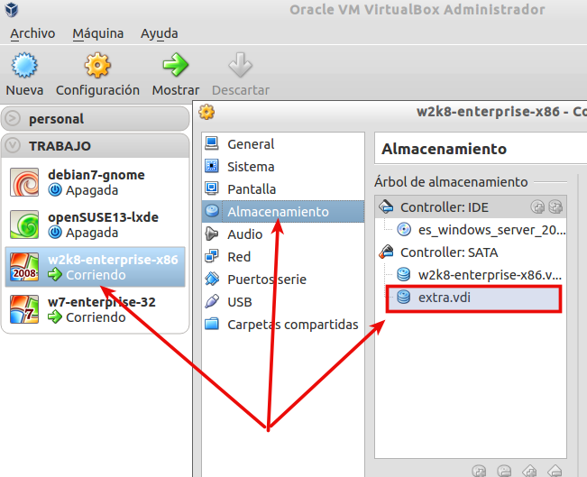
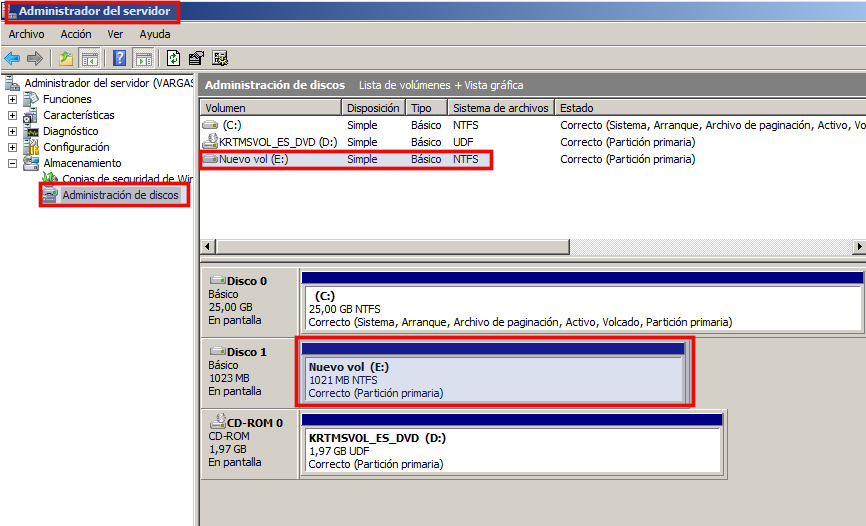
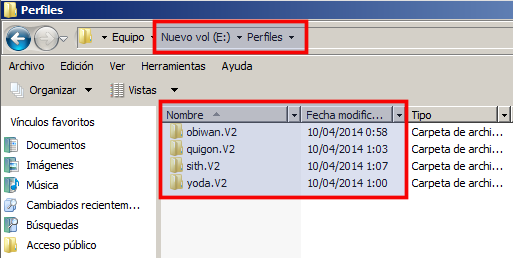

# Introducción

* En esta práctica vamos a montar un PDC (Controlador Primario de Dominio) con Windows 2012 Server (Anteriormente usábamos Windows 2008 Server).
* Leer/consultar la documentación de la unidad.
* Realizaremos las prácticas en MV's que pueden estar todas en el mismo PC o en varios diferentes.

---

# 1. Preparativos

Necesitaremos:
* 1 MV con Windows 2008 Server Enterprise ( [Consultar configuración](../../global/configuracion/windows-server.md)).
    * Poner como DNS1 el valor `127.0.0.1`.
* 2 MV con Windows 7 Enterprise
( [Consultar configuración](../../global/configuracion/windows.md)).

> **NOTA**
>
> * Las diferencias entre las distintas versiones de SO Windows: Standard, Professional, Enterprise, etc.
son las funcionalidades/características que vienen activas o deshabilitadas.
> * Si trabajamos con Windows 2003 Server el disco duro en VirtualBox debe estar configurado
con el controlador IDE, para evitar problemas con los drivers SATA.
> * Recién instalado, WinServer es estricto con la política de seguridad, en cuanto a cómo
deben definirse las claves (Mayúsculas, minúsculas, números y caracteres especiales y
longitud superior a 10).
> * Se puede deshabilitar en las `Directivas de seguridad local -> Directivas de cuenta`,
pero reduciríamos la seguridad de las contraseñas. Un ejemplo de contraseñas segura: `obiwanKENOBI2016`.

* Windows Server tiene una herramienta en `Inicio -> Administrar el Servidor`,
que nos permite consultar la configuración del servidor, instalar/desinstalar
paquetes/funciones/servicios, y acceder a los paneles de administración de los distintos servicios.

---

# 2. Instalar el Controlador de dominio

> * **DA**:
>     * El DA(Directorio Activo) es una base de datos LDAP, que guarda la información de los objetos de nuestro dominio.
> * **NOMBRE DE DOMINIO**:
>     * Cada PDC se identifica con su nombre de dominio, el cuál debe ser único. Hay que evitar que el nombre de dominio se repita con la configuración de otro compañero.
>     * En realidad podríamos poner cualquier nombre, pero lo haremos según indique el profesor, para organizar mejor las distintas máquinas de la clase.
>     * Además los nombres de dominio NO debe ser muy largos. Preferiblemente menos de 10 letras, para evitar problemas con los clientes Windows anteriores a Vista/7/8.


## Instalar en Windows 2012 Server

Instalación:
* Hacer una instántanea de la MV antes de nada.
* Ir a `Inicio -> Administrar el servidor -> Agregar roles`.
(Servicio de Dominio de Directorio Activo y el Servicio DNS).
* Ir a Configurar Directorio Activo.
    * Crear un bosque nuevo => SI
    * FQDN del dominio => `segundoapellidoXXdom.curso1718` # Este es el nombre del dominio
    * Nivel funcional del bosque => Windows Server 2012 R2
    * Servidor DNS => SI
    * Carpetas de almacenamiento => Dejar valores por defecto.

> INFO [Advertencia con la delegación del servicio DNS](https://social.technet.microsoft.com/Forums/es-ES/d77ff7bb-0204-4cfd-94fd-c5160f794793/problema-durante-dcpromo?forum=wsades)

* Al terminar hay que reiniciar el sistema.
* Capturar imagen de `Panel del servidor` donde se muestren los servicios instalados.

## Instalar en Windows 2008 Server

Instalación:
* Hacer una instántanea de la MV antes de nada.
* Para activar la función de controlador de dominios podemos hacerlo de dos formas:
    * En Windows 2012 Server ir a `Inicio -> Administrar el servidor -> Agregar roles`.
    (Servicio de Dominio de Directorio Activo y el Servicio DNS).
    * En Windows 2008 Server podemos abrir una consola (cmd) y ejecutar el comando `dcpromo`.

Veamos imagen del comando `dcpromo` en ejecución:


* Se inicia el asistente de configuración de los servicios del dominio de AD. Ponemos los
siguientes valores:
```
* Modo experto => NO
* Crear un dominio nuevo de un bosque nuevo => SI
* FQDN del dominio => `segundoapellidoXXdom.curso1718` # Este es el nombre del dominio
* Nivel funcional del bosque => Windows Server 2008
* Servidor DNS => SI
* Carpetas de almacenamiento => Dejar valores por defecto.
```





* Al terminar hay que reiniciar el sistema.

Vemos imagen, donde podemos comprobar que se han instalado varios "roles" para controlar el dominio:



Veamos imagen de configuración de nuestro servidor:


> Enlace de interés sobre [cómo recombrar un dominio de Windows Server 2008](http://www.cesarherrada.com/2012/06/como-renombrar-un-dominio-en-windows-server-2008.html)

## Comprobaciones

* Ir a `Herramientas -> DNS` para comprobar que aparece dentro
de `Zona de búsqueda directa` nuestro `nombre-de-dominio`.
* Abrir una consola y ejecutar `nslookup nombre-de-dominio`. Debe aparecer
la IP de nuestro servidor PDC.

---

# 3. Usuarios del dominio

* Leer/consultar los apuntes para entender los conceptos siguientes:
usuario local, usuario del dominio, equipo del dominio, grupo local, grupo del dominio.
* Enlace de interés:
    * [Definiciones de ámbito local, global y universal](https://msdn.microsoft.com/es-es/library/cc755692%28v=ws.10%29.aspx)
    * [Deshabilitar políticas de clave en Windows 2008 Server](http://www.radians.com.ar/blog/?p=403)  
    * [Usuarios y Grupos](http://www.ite.educacion.es/formacion/materiales/85/cd/windows/10Usuarios/index.html).

Vamos a crear usuarios y grupos del dominio:
* Ir a `Inicio -> Herramientas Administrativas -> Usuarios y Equipos de Active Directory`
* Crear el grupo `jedi1718`:
    * Ámbito global
    * Tipo Seguridad
    * Con los siguientes usuarios de dominio: `yoda`, y `obiwan`.
* No confundir usuarios locales con usuarios del dominio.
* Crear el grupo `sith1718`:
    * Ámbito global
    * Tipo Seguridad
    * Con los siguientes usuarios de dominio: `vader` y `maul`.

Vemos imagen con los usuarios del dominio creados:


---

# 4. Equipos del dominio

## 4.1 Preparativos

```
MV's CLIENTES:
* Necesitaremos 2 MV's con Windows 7, que actuarán como equipos del dominio.
* Podemos crear una MV, y luego clonarla, modificando la MAC de la segunda MV, para
  no tener problemas de conectividad por tarjetas de red duplicadas.
```

* [Configurar las MVs](../../global/configuracion/windows.md)
    * **FECHA/HORA**: Es muy importante que todos los equipos estén bien sincronizados en cuanto al reloj. No puede haber diferencias de más de 5 minutos.
    * **RED**: Además cada cliente debe tener como DNS1 la IP del PDC, y como DNS2 al 8.8.4.4.
    * Abrir una consola y ejecutar `nslookup nombre-de-dominio`. Debe aparecer
la IP de nuestro servidor PDC.
* Unir el equipo cliente al dominio.
    * Ir a `Equipos (Botón derecho) -> Propiedades -> Cambiar configuración -> Cambiar -> Dominio (Escribir el nombre del dominio) -> Aceptar`.

Veamos imagen de ejemplo:

     

## 4.2 Problemas en la unión al dominio

Espero que no tengas problemas y puedas saltar este apartado, si no es así... sigue leyendo.

Si tuviéramos poblemas al realizar esta tarea de unión del equipo al dominio, tenemos varias opciones:

* Esperar 5 minutos y repetir el proceso. Las redes SMB/CIFS tardan un tiempo en propagar la información de los equipos por la red.
* Volver a comprobar que todas las configuraciones son correctas. Repite el paso uno (NOTA: Pon un compañero contigo mientras lo haces. 4 ojos ven más que 2).
* Consultar la información que contiene el servidor DNS del W2k8server. Si está vacía probar a resinstalar AD y DNS en W2k8server
(NOTA: Una configuración incorrecta del servidor DNS hará que no se puedan unir los equipos al dominio).
* Probar a poner como puerta de enlace del cliente la IP del servidor PDC.
* Configurar las máquinas servidor y cliente en la misma red interna de VirtualBox (Consultar configuración de red de VirtualBox) y vuelve a intentarlo (NOTA: Pueden darse problemas si se repiten IP's no nombres de máquinas en la red. Al crear una red interna tenemos una zona aislada bajo nuestro control).
* ¿Repetimos?

## 4.3 Comprobaciones

Entrar en los equipos cliente usando los usuarios del dominio.
Podemos comprobarlos por entorno gráfico o usando comandos.




* Para entrar como usuario local poner "VARGAS2A\profesor". Esto es, "nombre-de-máquina\nombre-usuario-local".


También podemos realizar la comprobación anterior usando comandos de la siguiente forma:
* Abrimos consola PowerShell y ejecutamos los comandos:
    * `whoami`, muestra nuestro usuario actual. Que debe ser un usuario del dominio.
    * `net user`, muestra los usuarios locales del sistema.
* Comprobar en el PDC que aparecen los equipos CLIENTE1 y CLIENTE2 como equipos del dominio.


 
---

# 5. Perfiles móviles

Material de lectura/estudio/consulta:
* Leer/consultar los apuntes para entender los conceptos de perfiles, perfil móvil y perfil obligatorio.
* Consultar Vídeo [Windows Server 2008 - Perfiles moviles con Windows 7](https://youtu.be/kgGmLWO6dzs)

## 5.1 Crear un segundo disco:

* Crear un segundo disco (1GB). Lo usaremos para guardar los perfiles.



* Hay que formatear el disco NTFS y asignarle la letra E.



## 5.2 Crear Perfiles de usuarios:

* En el PDC, crear la carpeta `E:\perfiles`. 
* Definir permisos lectura/escritura para todos los usuarios del dominio en la carpeta.
* Usar modo avanzado para compartir la carpeta por red con el nombre `perfiles$`.
    * Se recuerda que para acceder a la carpeta compartida de red, los usuarios
    deben tener permisos en el recurso de red y en la carpeta del sistema de ficheros.
* En el PDC, modificar el atributo `ruta de acceso al perfil` de los siguientes usuarios del dominio:
    * yoda: `\\ip-del-PDC\perfiles$\%username%`
    * obiwan: `\\ip-del-PDC\perfiles$\obiwan`
    * vader: `\\ip-del-PDC\perfiles$\%username%`
    * maul: `\\ip-del-PDC\perfiles$\maul`
* Iniciar sesión en CLIENTE1 con los usuarios obiwan y maul.
* Para cada usuario modificar el entorno del escritorio, colores, iconos.
* Para el usuario del dominio obiwan
    * Crear la carpeta jedy en el escritorio
    * Crear fichero `Escritorio/jedi/personajes.txt`. Escribir dentro los nombres de los 2 jedis.
* Para el usuario dominio maul
    * Crear la carpeta sith en el escritorio
    * Crear fichero `Escritorio/sith/personajes.txt`. Escribir dentro los nombres de los 2 siths.

> De este modo el "perfil" de cada usuario será diferente en aspecto y contenido.

* Debemos comprobar que se han creado las carpetas con los perfiles en el servidor.



## 5.3 Limpiar el equipo cliente

* Iniciar sesión en CLIENTE1 con el "administrador" del dominio.

Ver imagen de ejemplo:


* Ir a `Inicio -> Panel de Control -> Sistema -> Opciones Avanzadas -> Configuración de Perfiles de usuario`.
* Eliminar las copias de los perfiles locales en el equipo cliente.

perfiles-en-cliente

* Entrar en el equipo CLIENTE2, con los usuarios del dominio (obiwan y maul)
* Comprobar que tenemos perfiles móviles para ellos.

> El perfil móvil permite al usuario moverse por PC's diferentes y ver el mismo entorno con sus datos.

---

# 6. Perfiles obligatorios

* Enlaces de interés:
    * [Crear perfil obligatorio dando los permisos adecuados](http://somebooks.es/?p=3400).  
    * Vídeo [Usuario con perfil obligatorio Windows Server 2008](https://youtu.be/TKCmAFcKSGA).
* Convertir el perfil móvil del  Sith Maul, a perfil obligatorio.
* Comprobar que ahora el perfil no cambia.

---

# 7. Control de tiempo

* Modificar los permisos de acceso de los usuarios del dominio, de la siguiente forma:
    * Los "jedi" sólo pueden acceder de 08:00 a 14:00 y
    * Los "sith" sólo pueden acceder de 14:00 a 20:00
