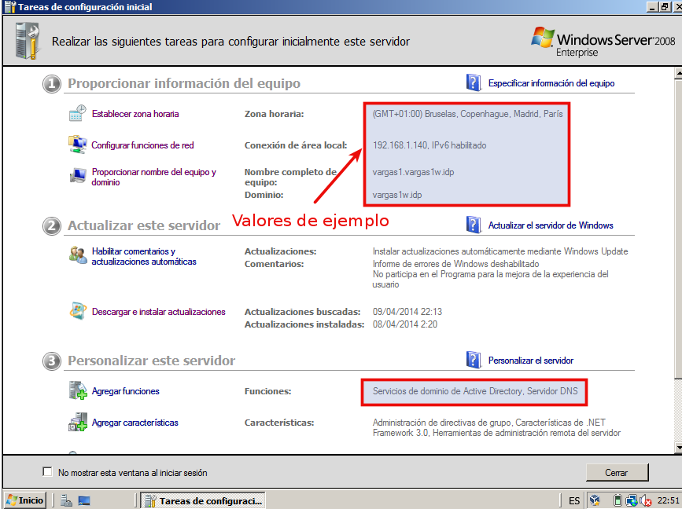
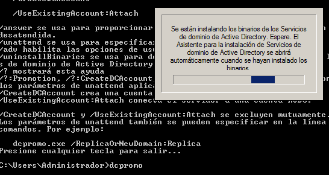
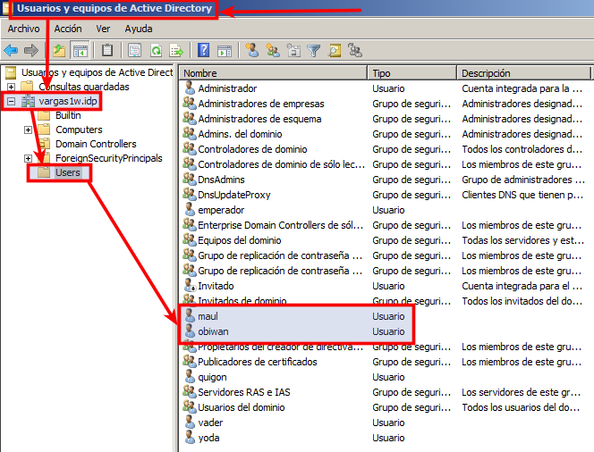
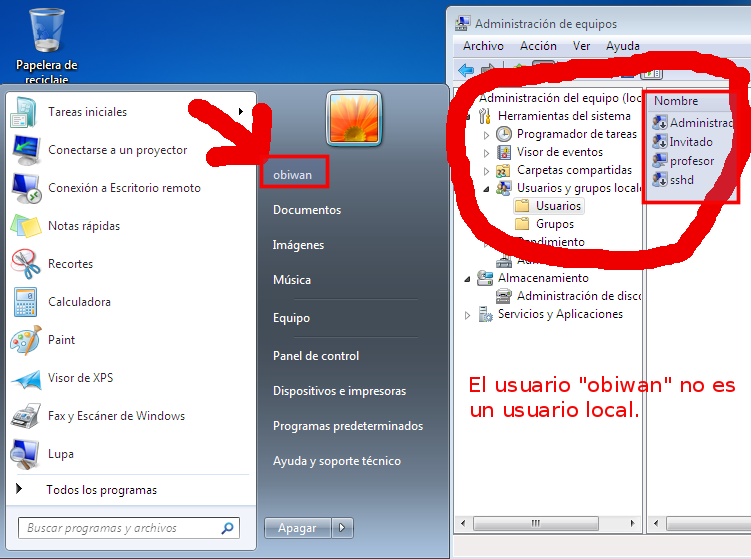
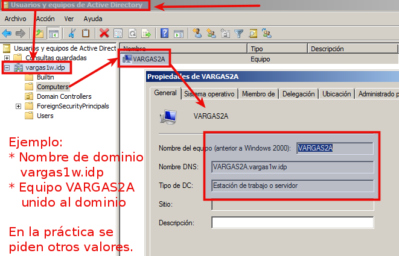

```
* Práctica utilizada en los cursos 201415, 201314, 201211
```

#0. Introducción

* En esta práctica vamos a montar un PDC (Controlador Primario de Dominio) con Servidor Windows 2008.
* Leer/consultar la documentación de la unidad y el enlace de interés 
[Usuarios y Grupos](http://www.ite.educacion.es/formacion/materiales/85/cd/windows/10Usuarios/index.html).
* Realizaremos las prácticas en MV's que pueden estar o no en el mismo PC.
     
#1. Configuración inicial

* Necesitamos una MV con Windows 2008 Server Enterprise (Consultar [configuración](../../global/configuraion-aula109.md)).

> **NOTA**
>
> * Las diferencias entre las distintas versiones de SO Windows: Standard, Professional, Enterprise, etc. 
son las funcionalidades/características que vienen activas o deshabilitadas.
> * Si trabajamos con Windows 2003 Server el disco duro en VirtualBox debe estar configurado 
con el controlador IDE, para evitar problemas con los drivers SATA.
> * Recién instalado, WinServer es estricto con la política de seguridad, en cuanto a cómo 
deben definirse las claves (Mayúsculas, minúsculas, números y caracteres especiales y 
longitud superior a 10). Se podría deshabilitar en las `Directivas de seguridad local -> Directivas de cuenta`, 
pero reduciríamos la seguridad de las contraseñas. Un ejemplo de contraseñas segura: `obiwanKENOBI2016`.

Veamos imagen de configuración inicial de nuestra máquina:



* Windows Server tiene una herramienta en `Inicio -> Administrar el Servidor`, 
que nos permite consultar la configuración del servidor, instalar/desinstalar 
paquetes/funciones/servicios, y acceder a los paneles de administración de los distintos servicios.

#2. Instalar el Controlador de dominio

**Definiciones:**
* El DA(Directorio Activo) es una base de datos LDAP, que guarda la información de los objetos de nuestro dominio.
* NOMBRE DE DOMINIO: Cada PDC se identifica con su nombre de dominio, el cuál debe ser único. Como nombre de dominio pondremos un nombre corto ( nombre-del-usuario-moodle + W.IDP). Por ejemplo si el alumno se llama KENOBI debemos poner "KENOBIW.IDP".
* En realidad podríamos poner cualquier nombre, pero lo haremos de esta forma para organizar mejor las distintas máquinas de la clase. Hay que evitar que el nombre de dominio se repita con la configuración de otro compañero.
* Además los nombres de dominio NO debe ser muy largos. Preferiblemente menos de 10 letras, para evitar problemas con los clientes Windows anteriores a Vista/7/8.

**Instalación:**
* Para activar la función de controlador de dominios podemos:
    * Abrir una consola (cmd) y ejecutar el comando "dcpromo".
    * o Ir a Inicio -> Administrar el servidor -> Agregar funciones. 
    (Servicio de Dominio de Directorrio Activo y el Servicio DNS).

Veamos imagen del comando "dcpromo" en ejecución:



* Se inicia el asistente de configuración de lo servicios del dominio de AD.
    * Modo experto => NO
    * Crear un dominio nuevo de un bosque nuevo => SI
    * FQDN del dominio => KENOBIW.IDP
    * Nivel funcional del bosque => Windows Server 2008
    * Servidor DNS => SI
    * Carpetas de almacenamiento => Dejar valores por defecto.
    * Al terminar reiniciar el sistema.

Vemos imagen, donde podemos comprobar que se han instalado varias "funciones" para controlar el dominio:


#3. Usuarios del dominio

* Leer/consultar los apuntes para entender los conceptos: 
usuario local, usuario del dominio, equipo del dominio, grupo local, grupo del dominio.
* Enlace de interés:
    * [Definiciones de ámbito local, global y universal](https://msdn.microsoft.com/es-es/library/cc755692%28v=ws.10%29.aspx) 
    * [Deshabilitar políticas de clave en Windows 2008 Server](http://www.radians.com.ar/blog/?p=403)  
* Ir a `Inicio -> Herramientas Administrativas -> Usuarios y Equipos de Active Directory`
* Crear el grupo (tipo global) JEDI con los siguientes usuarios de dominio: "yoda,", "obiwan" y "quigon". No confundir usuarios locales con usuarios del dominio.
* Crear el grupo (tipo global) SITH con los siguientes usuarios de dominio: "emperador", "vader" y "maul".

Vemos imagen con los usuarios del dominio creados:



#4. Equipos del dominio

* MV's CLIENTES: 
    * Necesitaremos 2 MV's con Windows 7 enterprise, que actuarán de clientes o equipos del dominio.
    * Podemos crear una MV, y luego clonarla, modificando la MAC de la segunda MV, para 
    no tener problemas de conectividad por tarjetas de red duplicadas.
    * Nombres NETBIOS: Según la [configuración](../../global/configuracion-aula109.md).
* FECHA/HORA
    * Es muy importante que todos los equipos estén bien sincronizados en cuanto al reloj. 
    No puede haber diferencias de más de 5 minutos.
* RED: 
    * Además el cliente debe tener como DNS1 la IP del PDC, y como DNS2 al 8.8.4.4.
* Ahora vamos a unir el equipo cliente al dominio. 
    * Ir a "Equipos (Botón derecho) -> Propiedades -> Cambiar configuración -> Cambiar -> Dominio (Escribir el nombre del dominio) -> Aceptar".

Veamos imagen de ejemplo:

     

##4.1 Problemas en la unión al dominio

Si tuviéramos poblemas al realizar esta tarea de unión del equipo al dominio:
1. Esperar 5 minutos y repetir el proceso. Las redes SMB/CIFS tardan un 
tiempo en propagar la información de los equipos por la red.
1. Volver a comprobar que todas las configuraciones son correctas. 
Repite el paso uno (NOTA: Pon un compañero contigo mientras lo haces. 4 ojos ven más que 2).
1. Consultar la información que contiene el servidor DNS del W2k8server. 
Si está vacía probar a resinstalar AD y DNS en W2k8server 
(NOTA: Una configuración incorrecta del servidor DNS hará que no se puedan unir los equipos al dominio).
1. Probar a poner como puerta de enlace del cliente la IP del servidor PDC.
1. Configurar las másquinas servidor y cliente en la misma red interna de VirtualBox (Consultar configuración de red de VirtualBox) y vuelve a intentarlo (NOTA: Pueden darse problemas si se repiten IP's no nombres de máquinas en la red. Al crear una red interna tenemos una zona aislada bajo nuestro control).


Comprobaciones

    Comprobar que podemos entrar en los equipos "kenobi2a" y "kenobi2b" usando los usuarios del dominio.


* Para entrar como usuario local poner "VARGAS2A\profesor". 
Esto es, "nombre-de-máquina\nombre-usario-local".



* Comprobar en el PDC que aparecen los equipos "kenobi2a" y "kenobi2b" como equipos del dominio.



#5. Perfiles móviles

Vídeo: "Windows Server 2008 - Perfiles moviles con Windows 7":

    [NOTA] Leer/consultar los apuntes para entender los conceptos de perfiles, perfil móvil y perfil obligatorio. Tener en cuenta que la documentación está para W2k3Server y en W2k8Server hay algunos cambios.

Segundo disco:

    Crear un segundo disco (1GB) para guardar la carpeta compartida "E:\perfiles$".

disco-extra

    Hay que formatear el disco NTFS y asignarle la letra E.

formatear-extra

Perfiles de usuarios:

    En el PDC, crear la carpeta "E:\perfiles$", como compartida por red. Permisos lectura/escritura para todos los usuarios del dominio.
    En el PDC, modificar el atributo "perfil" de los siguientes usuarios del dominio:
        yoda: \\ip-del-PDC\perfiles$\%username%
        obiwan: \\ip-del-PDC\perfiles$\%username%
        quigon: \\ip-del-PDC\perfiles$\%username%
        emperador: \\ip-del-PDC\perfiles$\sith
        vader: \\ip-del-PDC\perfiles$\sith
        maul: \\ip-del-PDC\perfiles$\sith
    Iniciar sesión en "KENOBI2A" con los usuarios yoda, obiwan, quigon y emperador. Para cada usuario modificar el entorno del escritorio, colores, iconos, crear alguna carpeta y/ fichero. De modo que el "perfil" de cada usuario sea diferente en aspecto.
    Debemos comprobar que se han creado las carpetas con los perfiles en el servidor.

perfiles

Limpiar el equipo cliente:

    Iniciar sesión en "KENOBI2A" con "administrador" del dominio.

Ver imagen de ejemplo:

login-admin-pdc

    Ir a "Inicio -> Panel de Control -> Sistema -> Opciones Avanzadas -> Configuración de Perfiles de usuario". Eliminar las copias de los perfiles locales en el equipo cliente.

perfiles-en-cliente

    Ahora ya podemos entrar en los equipos "KENOBI2A" y "KENOBI2B", con los usuarios del dominio, y comprobaremos que tenemos perfiles móviles para todos.
    [NOTA] El perfil móvil permite al usuario moverse por PC's diferentes y ver el mismo entorno con sus datos.
    En este momento los usuarios "emperador", "vader" y "maul", comparten la misma configuración.


      

1.6 Perfil obligatorios

Vídeo: "Usuario con perfil obligatorio Windows Server 2008":


    Convertir el perfil móvil de todos los SITH, a perfil obligatorio. Comprobar que ahora el perfil no cambia.
    Enlace de interés: Crear perfil obligatorio dando los permisos adecuados


1.7. Control de tiempo
Modificar los permisos de acceso de los usuarios del dominio, de la siguiente forma:

    Los "jedi" sólo pueden acceder de 08:00 a 14:00 y
    Los "sith" sólo pueden acceder de 14:00 a 20:00
