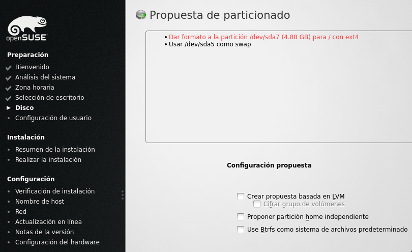
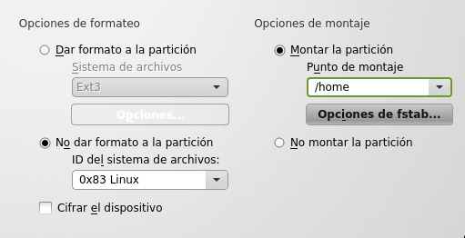
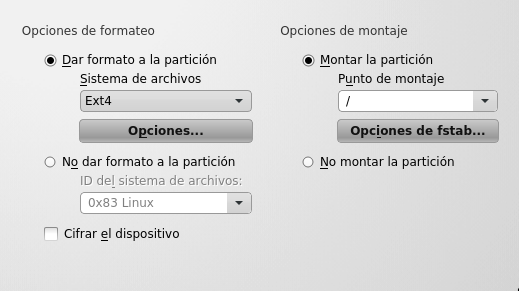
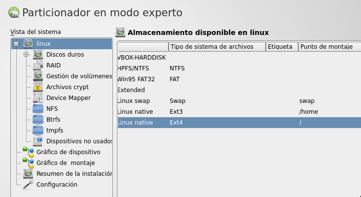
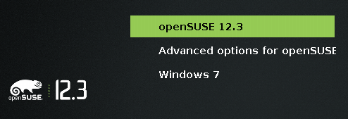

# Instalación Dual

Vamos a realizar una instalación dual Windows y GNU/Linux. Esto es, instalar
dos SSOO en la misma máquina.

* Usaremos en esta práctica las versiones Windows7 Enterprise, y OpenSUSE 13.2.
* Entregar un documento en formato ODT o PDF con las capturas solicitadas.
Incluir breves comentarios de cada captura de pantalla.

> Recuerda: Pasado una semana si no vamos a usar más dicha MV, procederemos a eliminarla completamente para liberar espacio en disco.
> Las capturas de pantallas del enunciado se han puesto como ejemplo. Al cambiar las versiones de los sistemas
operativos, muy probablemente las imágenes actuales sean diferentes.

# 1. Preparar la máquina virtual

* Crear una máquina virtual (VirtualBox).
* Configurar con:
    * tipo Windows 7 (64 bits)
    * RAM 1024MB
    * disco duro de 18GB
    * tarjeta de red en modo puente (bridge).

## 1.1 Particionado

* Usaremos un CD-LIVE (Knoppix) para crear las particiones.

> RECORDAR
> * Cuando inicia Knoppix y aparece el prompt "boot:", pondremos `knoppix lang=es`
para iniciarlo en español.
> * La tecla "=" puede estar en "¡".

* Para hacer las particiones en Knoppix, abrimos un terminal. Nos ponemos como
superusuario (comando `su` o `sudo bash`). Iniciamos la herramienta de particionado
con el usuario root ejecutando el comando `gparted`.
* Gparted -> Dispositivo -> Crear tabla de particiones -> MSDOS.
* Crear las siguientes particiones:
    * Una partición primaria, tipo NTFS para Windows (12GB),
    * Una primaria FAT32 para datos (100MB).
    * Crearemos una partición extendida que coja todo el disco restante.

* Dentro de la extendida haremos las siguientes particiones lógicas:
    * Área de intercambio o SWAP (500MB),
    * Partición de tamaño 100MB y con formato ext3.
    * Partición de tamaño 5GB y con formato ext4.
    * Quedarán libres 300 MB más o menos. Lo dejamos sin usar.

* Capturar pantalla del gparted con las particiones solicitadas, y apagar MV.

---

# 2. Instalación del primer SO

Vamos a instalar primero el SO Windows.
* Montamos ISO de instalación de Windows en la MV y la iniciamos.
* Idioma español. Leer licencia antes de aceptarla.
* Instalación personalizada. Elegir la partición 1 para instalar el SO.
Producto/Licencia:
* Clave de producto: La dejamos vacía por esta vez.
* Desactivar la opción *Activar Windows automáticamente*
* [Configuración de la MV](../../../global/configuracion/windows.md)
    * Nombre equipo: `1er-apellidoXXx`
    * IP estática 172.19.XX.12
* Comprobar la conexión de red haciendo `ping www.google.es`.
* Capturar imagen como la siguiente. Mostrando las particiones del disco duro
(`Ir a miEquipo -> Btn Derecho -> Administrar -> Almacenamiento`).


* Modificar la configuración de Windows Update y ponerla como Deshabilitada
(Sin descargas ni notificaciones).
* Ir a `miEquipo -> Btn Derecho -> Propiedades -> Cambiar conf. equipo`.
Poner nombre grupo de trabajo indicado. Reiniciar
* Ir a `miEquipo -> Btn derecho -> Propiedades`. Capturar imagen nombre de equipo y grupo de trabajo.
* Capturar imagen como la siguiente:


* Cuando terminen la instalación de Windows debemos acordarnos de desmontar
la ISO (CD de instalación) de la MV.

> Enlace de interés:
>
> * [Cómo aceder a una partición GNU/Linux desde Windows](https://es.opensuse.org/SDB:Acceder_a_la_particion_de_GNU/Linux_desde_Windows)

---

# 3. Instalación del segundo SO

A continuación vamos a instalar un SO GNU/Linux (OpenSUSE 13.2)

## 3.1 Empezamos con la ISO

* Ponemos ISO en la MV y la iniciamos.
* Pulsar F2 para cambiar el idioma a Español.
* Leer licencia y aceptar si corresponde.

## 3.2 Particionado

* Elegir instalación nueva, y DESACTIVAR la configuración automática. No vamos a usar la configuración automática porque la vamos a personalizar según las especificaciones de esta práctica.
* Entrar en el modo experto.
* Esquema de uso de las particiones:
    * Área de intercambio o SWAP (500MB),
    * Partición home (montar /home) de tamaño 100MB y con formato ext3.
    * Partición del sistema (montar /) de tamaño 5GB y con formato ext4.
    * Quedarán libres 300 MB más o menos. Lo dejamos sin usar.
* Capturar imagen como la siguiente:



* Botón derecho sobre la partición `ext3` -> para montar `/home`



* Botón derecho sobre partición `ext4` -> para montar `/`



> **IMPORTANTE**
>
> Montar la partición donde tenemos instalado el SO Windows en la ruta `/mnt/windows`.
Esto lo hacemos para poder acceder de forma sencilla a la partición Windows desde el SO
GNU/Linux.
> Esto lo hacemos para versiones de OpenSUSE 12.3 detecten sin problemas el Windows y
se configure automñaticamente el gestor de arranque.

* Aceptar.
* Capturar imagen como la siguiente:



* Verificar y siguiente.


## 3.3 Entorno, usuario y SSH

* Elegir zona horaria (Canarias)
* Selección de entorno gráfico: XFCE

> En teoría podríamos elegir el entorno gráfico que quisiéramos.
> * Gnome y KDE son bonitos pero recargados y pesados. Es probable que no quepan en el espacio disponible.
> * XFCE y LXDE son escritorios ligeros y ocupan poco espacio en disco.

* Crear los usuarios ([Configuración](../../../global/configuracion-aula109.md)).
* Desmarcar inicio de sesión automático.
* Habilitar y abrir el Servicio SSH. NOTA: Esto lo activamos para permitir el acceso remoto a esta máquina virtual ([Configurar acceso remoto](../../../global/acceso-remoto.md))

## 3.4 Instalar

* Comprobar que todo es correcto y procedemos a "Instalar".


* [Configuración de la MV](../../../global/configuracion-aula109.md)
    * IP estática 172.19.XX.32
    * Poner como nombre del host o equipo `1er-apellidoXXi`.
* Poner NO a "Modificar nombre de HOST mediante DHCP". En caso contrario
el nombre del equipo puede cambiar en cada reinicio.


* ¿Desea actualización en línea? -> OMITIR actualización.
No vamos a actualizar el SO en este momento. Esto lo hacemos para minimizar el consumo
de ancho de banda que se produce en las actualizaciones.
* Entrar al sistema.
* Comprobar que la conexión de red está bien haciendo `ping www.google.es`
* Reiniciar el sistema.
* Capturar imagen como la siguiente donde se muestra el arranque inicial
donde se ve un menú para eligir el sistema operativo a iniciar.



## 3.5 Con el SO instalado

* Entrar al sistema con nuestro usuario.
* Vamos al la herramienta `YAST -> Ajustes de red` para poner los siguientes valores:
    * [Configuración de la MV](../../../global/configuracion-aula109.md)
    * IP estática 172.19.XX.32
    * Poner como nombre del host o equipo `1er-apellidoXXi`.
* Abrir un terminal.
* Ejecutar `ping www.google.com` para comprobar la conexión de red.
* Ejecutar comando su para convertirnos en superusuario (clave de root).
* Como superusuario (root) ejecutar los comandos siguientes y capturar su salida:
```
    date      # Muestra la fecha/hora del sistema
    hostname  # Muestra nombre del sistema
    uname -a  # Muestra datos del kernel
    ip a      # Muestra información de red
    df -hT    # Muestra información de ocupación del disco
    fdisk -l  # Muestra información de particiones
    lsblk     # Muestra UUID de las particiones
```
* Al iniciarse la MV deben aparecer los dos SSOO en el menú de inicio (Boot Loader).

---

# ANEXO

## Error con el menu de arranque Windows

Si al iniciarse la MV no aparece Windows en el menú de arranque, entonces
lo podemos solucionar haciendo los siguientes paso:

* `su` (Convertirnos en superusuario)
* `cd /etc/grub.d` (Cambiamos de directorio)
* `zypper install nano` (Para instalar el programa nano)
* `nano 11_windows` (Creamos archivo nuevo con el siguiente contenido)

```
#!/bin/sh -e
echo "Adding Windows 7" >&2
cat<<EOF
menuentry "Windows 7 (david)" {
set root=(hd0,1)
chainloader +1
}
EOF
```
* Grabar el archivo y salir de nano
* `chmod +x 11_windows`
* `grub2-mkconfig -o /boot/grub2/grub.cfg` (Actualizamos el GRUB2 con el nuevo cambio)
* `reboot` (Reiniciamos la MV)
