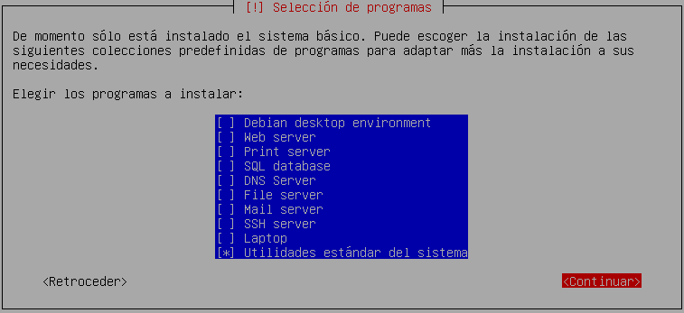

```
Curso 2017-2018
* Comprobar que funciona el comando file
* Instalar wget, zip
```

# Instalación personalizada

* Usaremos un CD-Live de Knoppix y otro de instalación de Debian.
* Entregar un documento en formato ODT o PDF con los pasos realizados.

> NOTA: No borrar esta máquina virtual Debian al terminar, porque la usaremos en las próximas unidades de trabajo.

---

# 1. Preparar la Máquina virtual

Capturar imagenes de los siguientes pasos:
* Crear una nueva MV con:
    * Tipo Debian 64 bits
    * Tamaño de disco de 10GB y
    * Tarjeta de red en modo bridge (Puente).

---

# 2. Knoppix

> Knoppix es una distribución de GNU/Linux que viene en CD-Live.
> Por defecto, viene provista de un conjunto de herramientas muy útiles.

* Descargar del servidor la ISO de Knoppix y el fichero md5.
* Comprobar que la descarga de los ficheros se hizo de forma correcta:
    * `md5sum -c nombre-fichero.md5`
    * Debe aparecer mensaje `la suma coincide`.
* Iniciar la MV con CDLive de Knoppix.
    * Cuando aparezca el prompt `boot:` pulsar F3.
    * Leer la pantalla.
    * Para iniciar el SSOO en español, escribir: `knoppix lang=es`
* Abrir una consola, ponerse como root (comando su) y ejecutar gparted (comando gparted).

>Ahora vamos a usar gparted para crear una partición en el disco.

* `Gparted -> Dispositivo -> Crear tabla de particiones tipo MSDOS (MBR)`
* Vamos a crear una partición extendida que ocupe todo el disco (Consultar documentación de gparted). Aplicar los cambios.
* Cerrar gparted y apagar Knoppix.

---

# 3. Instalando SO Debian

Capturar imágenes de los siguientes pasos:
* Descargar del servidor la ISO de Debian y su fichero md5.
* Comprobar que la descarga fue correcta, ejecutando el comando siguiente:
    * `sha256sum -c nombre-fichero.sha256`
    * Debe aparecer mensaje `la suma coincide`.

NO hace falta capturar imagen de los siguientes pasos:
* Montar la ISO en la MV para comenzar la instalación.
* Elegir idioma español.
* En la [configuración de la MV](../../../global/configuracion/debian.md) podremos valores a:
    * Nombre del equipo
    * Nombre de dominio
    * La clave de root
    * Nombre de usuario y su clave
* Zona horaria Canarias.

* Método de particionado manual. Crear el siguiente esquema de particiones:
    1. Partición lógica para la Swap de 1GB (Tipo Área de Intercambio)
    1. Partición lógica para la Raíz del sistema (Montar /) de 7GB tipo ext4.
    1. Partición lógica para el Home (Montar /home) de 500MB tipo ext3.
    1. Partición lógica sin usar (No se monta) de 100MB de tipo ext2.
    1. Dejar el resto sin usar.

Capturar imagen del esquema de particionado final.

Veamos un ejemplo:


* Elegimos una réplica de red de España. El valor de Proxy lo dejamos vacío.

> Para marcar y desmarcar usar la barra espaciadora. OJO. No vamos a instalar entorno gráfico, o entorno de escritorio.
> Por el momento queremos un sistema sólo en modo texto.

* En la selección de programas (Usar la tecla ESPACIO para marcar/desmarcar):
    * NO seleccionar entorno gráfico
    * Marcar *Utilidades estándar del sistema* y
    * Marcar *SSH Server*

Veamos imagen de ejemplo:


* ¿Instalar el cargador de arranque GRUB en el registro principal de arranque? SI.
Esto es el disco `/dev/sda`.
* Instalación completa -> Continuar.

---

# 4. Con el SO instalado

NO hace falta capturar imágenes de lo siguiente:

* Entrar al sistema como root (superusuario)
* Vamos a configurar la tarjeta de red con la siguiente [Configuración de la MV](../../../global/configuracion/debian.md).

> Enlace de interés:
> * Información sobre [configurar la tarjeta de red](http://www.driverlandia.com/configurar-tarjeta-de-red-con-ip-estatica-en-debian-sin-interfaz-grafica/) en Debian.

* Entrar al sistema como root (superusuario)

Capturar imagen de los siguientes comandos:

```
    date         # Muestra la fecha/hora del sistema
    hostname -a  # Muestra nombre del sistema
    hostname -d  # Muestra nombre de dominio
    uname -a     # Muestra datos del kernel
    ip a         # Muestra información de red
    df -hT       # Muestra información de ocupación del disco
    fdisk --list # Muestra información de particiones (Ejecutar como superusuario)
    lsblk        # Muestra información de las particiones
    blkid        # Muestra los códigos UUID de las particiones
```
* Salir con el comando `exit`.

## Acceso externo

NO hace falta capturar imagen de lo siguiente:
* En la ventana de la MV, ir a panel superior de VirtualBox-> dispositivos -> montar CD de Debian.
* Configuración del [Acceso remoto SSH](../../../global/acceso-remoto.md)

> Vamos a instalar el programa openssh para que el profesor pueda acceder remotamente a la máquina.
> * Ejecutar comando como superusuario: `apt-get install openssh-server` y
> * Configurar `/etc/ssh/sshd_config` con `PermitRootLogin yes`

* Cuando la instalación termine, volver a ir a Dispositivos -> desmontar el CD de Debian.
* Desde la máquina real hacer `ssh usuario@ip-de-la-máquina-virtual`, para
comprobar que funciona bien el acceso desde fuera.
* Apagar el sistema con el comando: `halt`
