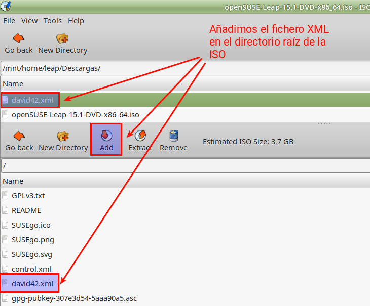
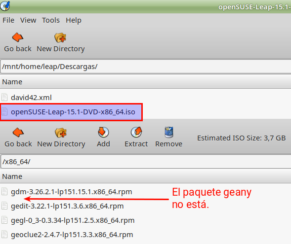

```
Curso           : 201920, 201819, 201718
Area            : Sistemas operativos, instalaciones
Descripción     : Instalación desatendida OpenSUSE
Requisitos      : OpenSUSE Leap 15.0
Tiempo estimado : 4 horas
```

# Instalación desatendida

Una instalación desatendida del sistema operativo ejecuta el proceso completo
de la instalación del sistema operativo de forma automática, sin hacer preguntas al usuario.

Entregar:
* Informe, capturas de imágenes o vídeo.
* Entregar XML utilizado.

---
# 1. Instalación desatendida con **autoyast**

Enlace de interés:
* ES - [Instalación desatendida con autoyast](https://dtrinf.wordpress.com/2012/11/06/instalacion-de-suse-desatendida-con-autoyast/)  
* EN - [AutoYaST Guide](https://doc.opensuse.org/projects/autoyast/)   
* ES - [Resumen de los comandos versión 13.1](https://es.opensuse.org/openSUSE:Vadem%C3%A9cum_comandos_13.1)   

# 2. Preparativos

Escogemos una MV1 con el sistema operativo OpenSUSE. Si no se hubiera creado el fichero `/root/autoinst.xml` durante la instalación entonces tenemos que crearlo como se indica a continuación.

# 2.1 Personalizamos la MV

* Crear una MV1 nueva o usar una que ya tengamos.
    * OJO: La MV deben tener configurada la opción de BIOS. NO UEFI.
    * El proceso de instalación desatendida con UEFI debe revisarse porque es diferente.
* Personalizamos nuestra máquina con los siguientes cambios:
    * Nombre de máquina `1er-apellidoXXy`.
    * Instalamos paquetes que no vengan por defecto preinstalados. Por ejemplo: `geany`, `tree`, `vim`, `git`, `dia`.
    * Creamos usuario `nombre-del-alumno`.

# 3. Fichero de respuestas

## 3.1 Crear el fichero de respuestas

Como necesitamos las respuestas a las preguntas del instalador, vamos a crear un fichero `autoinst.xml` que "copia" la configuración de nuestro sistema actual.

* Instalamos la herramienta Autoyast (Paquetes `autoyast2`, `autoyast2-installation`).
* Ir a `Yast -> Crear fichero de configuración Autoyast (Autoinstallation Cloning System)` (Por el terminal es igual usando el comando `/sbin/yast2 clone_system`).
* El perfil se guarda en `/root/autoinst.xml`.
* `cp /root/autoinst.xml nombre-alumnoXX.xml`. Hacemos una copia de seguridad del perfil.

## 3.2 Configurar USB en la MV de VirtualBox

* Abrir VirtualBox. Ir a `Ayuda -> Acerca de` para consultar la versión que tenemos instalada. Por ejemplo: "5.2.38".
* Descargar "Oracle Extension Pack" correspondiente a mi versión de VirtualBox (https://download.virtualbox.org/virtualbox/).
Este paquete sirve para incluir los siguiente controladores: USB 2.0 and USB 3.0 Host Controller, Host Webcam, VirtualBox RDP, PXE ROM, Disk Encryption, NVMe.


* Aceptar e instalar.
* Seleccionamos nuestra MV1 y `configuración -> USB -> Añadir`. Elegimos nuestro USB y aceptamos.


* Iniciar la MV1. Ya podemos usar el USB desde dentro de la MV1. :+1:

## 3.3 Copiar fichero XML en pendrive

Vamos a copiar el fichero de control en un USB:
* Estamos en la MV1.
* Poner el pendrive y montarlo por el entorno gráfico.
* Abrir un terminal como root.
* `df -hT |grep media`, consultar la ruta donde está montado el USB.
* `cp /root/nombre-alumnoXX.xml /run/media/...`, copiar el archivo XML en la ruta del USB.
* Podemos apagar la MV1.

# 4. Instalación desatendida desde USB

Ya tenemos nuestro fichero XML de respuestas en un pendrive. Ahora vamos a realizar una instalación desatendida en una nueva máquina MV2.
* En VirtualBox crear una MV2 nueva, con un tamaño de disco duro similar a la MV1.
* Configurar MV2 para acceder al pendrive USB, igual que hicimos con la MV1.
* Ponemos el DVD (ISO) de instalación de OpenSUSE en la MV2.
* Ponemos pendrive con el fichero de control XML en la máquina real.
* Iniciar la MV2.


* Elegimos `Installation`.
* Completar `Boot Options` con: `autoyast=usb:///nombre-del-alumnoXX.xml`

> **OJO**: que son 3 barras seguidas después de los dos puntos. Esto es lo mismo que escribir "autoyast=usb://localhost/nombre-del-alumnoXX.xml". Entonces cuando la máquina es localhost se puede omitir.

* La instalación se debe realizar de forma automática y desatendida.
* Durante el proceso de instalación habrá una parada donde el instalador nos advirte que no ha podido encontrar algunos paquetes de software (Por ejemplo: geany, tree, git, etc.). Aceptamos y seguimos. Este problema lo vamos a resolver más adelante.

# 5. Instalación desatendida desde ISO

En la instalación desatendida anterior desde USB, tuvimos un problema porque algunos paquetes que se iban a instalar no estaban disponibles en la ISO de instalación. Vamos a realizar de nuevo la instalación desatendida pero en esta ocasión vamos a modificar la ISO original.

## 5.1 Preparar los paquetes RPM

Vamos a localizar los ficheros RMP de los paquetes: geany, tree y git.

* tree: https://software.opensuse.org/download/package?package=tree&project=openSUSE%3ALeap%3A15.1
* geany: https://software.opensuse.org/download/package?package=geany&project=openSUSE%3ALeap%3A15.1
*  git: https://software.opensuse.org/download/package?package=git&project=openSUSE%3ALeap%3A15.1

## 5.2 Preparar la ISO

* Ir la máquina real.
* Copiar el fichero `nombre-alumnoXX.xml` en la máquina real.
* Instalar el programa `isomaster` en la máquina real. NOTA: Es un programa para modificar el contenido de ficheros ISO.
* Iniciamos `isomaster` y abrimos el fichero ISO de OpenSUSE.



* Añadir el fichero XML dentro del directorio raíz de la ISO.
* Añadir los paquetes RPM dentro del directorio `x86_64` de la ISO.



> NOTA: ¿Por qué se elige esa ruta? Con `zypper info tree`, consultamos información del paquete. Y si nos fijamos en su arquitectura, vemos que tiene `x86_64`. Si repetimos el proceso con el resto de paquetes vemos que son todos de la misma arquitectura.

* Grabar ISO modificada con el nombre `opensuse-nombredelalumnoXX.iso`

## 5.3 Instalación desatendida desde la ISO

Ya tenemos nuestro fichero XML de respuestas dentro de la ISO. Ahora vamos a realizar una instalación desatendida en una nueva máquina MV3.
* En VirtualBox crear una MV3 nueva, con un tamaño de disco duro similar a la MV1.
* Ponemos el DVD (ISO) de instalación de OpenSUSE en la MV3.
* Iniciar la MV3.


* Elegimos `Installation`.
* Completar `Boot Options` con: `autoyast=file:///nombre-del-alumnoXX.xml`

> **OJO**: que son 3 barras seguidas después de los dos puntos. Esto es lo mismo que escribir "autoyast=file://localhost/nombre-del-alumnoXX.xml". Entonces cuando la máquina es localhost se puede omitir.

* La instalación se debe realizar de forma automática y desatendida. En este caso hemos resuelto el problema de los paquetes RPM que no se encontraban, porque los hemos añadido en nuestra ISO personalizada.

# 6. INFO: Otras formas de instalación

**Carpetas compartidas SMB/CIFS**: El fichero de control se pone en una carpeta compartida de Windows de un equipo de nuestra red LAN.

* Boot options: `autoyast=cifs://servidor/carpeta/nombre-del-alumnoXX.xml`

**Servidor web HTTP**: El fichero de control se pone accesible desde un servidor Web (HTTP) en la red LAN o WAN.
* En clase podemos copiar el fichero XML en el servidor web proporcionado por el profesor, para que se accesible a través de la red. El fichero tendrá el nombre `nombredelalumnoXX.xml`.
* Establecer la configuración de red de forma manual, pulsando F4 -> Configuración de red.

Ejemplos de boot options:
* `autoyast=http://ip-del-servidor-web/autoyast/nombre-de-alumnoXX.xml`.
* Con información de configuración de red. Esto es: `hostip=172.19.XX.31/16 gateway=172.19.0.1 autoyast=http://172.20.1.2/autoyast/nombre-de-alumnoXX.xml`

---
# ANEXO

* `zypper refresh`
* `zypper install --download-only tree`, para descargar el fichero RPM del paquete tree.
* `sudo find / -name tree |grep rpm`, para localizar la ruta donde se ha descargado el fichero.
* Repetimos el proceso para todos los paquetes que necesitemos.
