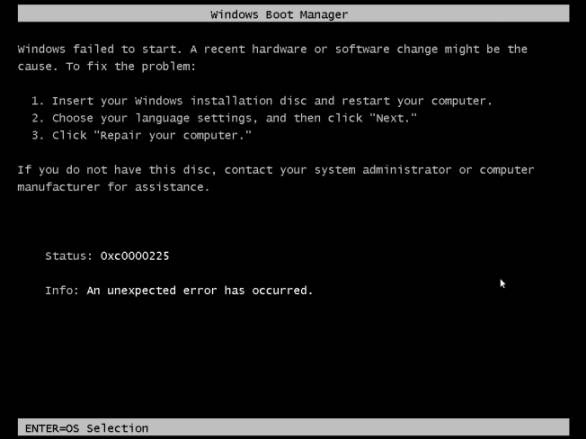
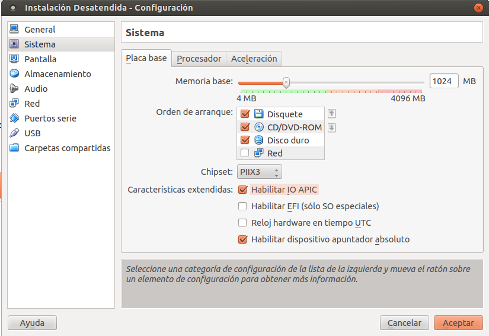

```
Area            : Sistemas Operativos, instalaciones
Curso           : 201819, 201718
Descripción     : Instalación desatendida de Windows 7
Requisitos      : WAIK, Windows 7 ENTERPRISE
Tiempo estimado : 4 horas
```
---
# Instalación desatendida de Windows 7

**Objetivo:** Crear instalación desatendida para SO Windows 7.

> Vamos a crear una imagen ISO de windows 7 con instalación desatendida.
El sistema operativo se instalará en la máquina sin necesidad de que un usuario supervise la instalación ya que todos los parámetros configurables son configuradas anteriormente en un archivo que incluiremos en la ISO llamado `autounattend.xml`.

**Entregar:**
* Informe/imágenes/vídeo (a elegir) de los pasos realizados.
* Fichero `autounattend.xml`.

**Enlaces de interés:**
* [Instalación desatendida Windows7 - IES Valle del Jerte 7](http://informatica.iesvalledeljerteplasencia.es/wordpress/creacion-de-imagen-de-windows-7-con-instalacion-desatendida/).
* [Instalación desatendida Windows7 - David del Río Pascual](http://www.daviddelrio.es/instalacion-desatendida-de-windows/)
* [Instalación desatendida con Windows 10](https://www.rafaelsantos.es/web/informatica/windows/39-instalacion-de-windows-desatendida)

---
# 1. Instalar WAIK

## 1.1 Copiar ficheros

Ir a la máquina real.
* Descargar la ISO de Windows 7.
Ir a una máquina virtual con Windows.
* Crear la carpeta `C:\W7`.
* Montar la ISO Windows 7 de 64 bits en la unidad CD de la MV
* Copiar el contenido de la unidad de CD a la carpeta `C:\W7`.

## 1.2 WAIK: Descargar e Instalar

* Descargar el [Kit de instalación automatizada de Windows (AIK) para Windows 7](https://www.microsoft.com/es-es/download/details.aspx?id=5753)
* Instalamos la herramienta WAIK.
* Ir `Inicio -> Todos los programas -> Microsoft Windows AIK -> Administrador de imágenes del sistema de Windows`. Ejecutar como administrador.

---
# 2. Crear fichero de respuestas

## 2.1 Abrir el archivo de catálogo

Ahora deberemos crear un catálogo que es el que nos dirá que tiene, que se puede y no se puede hacer dentro de la imagen seleccionada de Windows 7.

* Ir a `Archivo -> Seleccionar imagen de Windows` y buscamos el archivo siguiente (dependiendo de nuestra versión) y lo abrimos:
    * `C:\W7\sources\install_Windows 7 PROFESSIONAL.clg.`
    * `C:\W7\sources\install_Windows 7 ENTERPRISE.clg.`
    * OJO: Elegir la versión de Windows 7 para la que queremos crear el archivo de autorespuesta. Debe corresponder con la versión de la ISO que usamos inicialemente (Apartado 2.1).
* Nos saldrá en la esquina inferior izquierda una lista que podemos desplegar con diferentes componentes y paquetes.

## 2.2 Crear el archivo de respuestas (autounattend.xml)

* Crear el archivo de autorespuesta que configuraremos a continuación.
Ir a `Archivo -> Nuevo archivo de respuesta`.
* Para agregar componentes hacemos lo siguiente:
    * Buscamos los componentes en la parte izquierda
    * Hay que añadirlos en el ciclo que se indica
    * y posteriormente completamos los valores de los parámetros asociados.

> * En el apartado `Windows Setup` encontraremos los componentes para configurar los discos, particiones e ImageInstall.
> * Usar el comando `imagex /info C:\W7\sources\install.wim` para averiguar el valor para `/IMAGE/INDEX`.
> * El campo con la información `Serial del producto` lo vamos a dejar en blanco.

* Agregar los siguientes componentes al ciclo **windowsPE**.

| Componente | Parámetro | Valor |
| :--------- | :-------- | ----- |
| amd64 Microsoft Windows International Core... neutral | InputLocale| **es-ES** |
| | SystemLocale | **es-ES** |
| | UILanguage | **es-ES** |
| | UserLocale | **es-ES** |
| amd64 Microsoft International Core / SetupUILanguage | UILanguage | **es-ES** |
| | WillShowUI | **OnError** |
| amd64 Windows Setup / DiskConfiguration | WillShowUI | **OnError** |
| amd64 Windows Setup / DiskConfiguration / Disk | DiskID | **0** |
| | WillWipeDisk | **true** |
| amd64 Windows Setup / DiskConfiguration / Disk / CreatePartitions / CreatePartition | Order:  | **1** |
| | Size | **200** |
| | Type | **primary** |
| amd64 Windows Setup / DiskConfiguration / Disk / CreatePartitions / CreatePartition | Order | **2** |
| | Type | **primary** |
| amd64 Windows Setup / DiskConfiguration / Disk / ModifyPartitions / ModifyPartition | Active | **true** |
| | Format | **NTFS** |
| | label | **System** |
| | Order | **1** |
| | PartitionID | **1** |
| amd64 Windows Setup / DiskConfiguration / Disk / ModifyPartitions / ModifyPartition | Extend | **true** |
| | Format | **NTFS** |
| | label | **Windows7** |
| | Letter | **C**|
| | Order | **2** |
| | PartitionID | **2** |
| amd Windows Setup / ImageInstall / OSImage | InstallToAvailablePartition| ** false**|
| | WillShowUI | **OnError** |
| amd64 Windows Setup / ImageInstall / OSImage / InstallTo| DiskID | **0**|
| | PartitionID | **2** |
| amd64 Windows Setup / ImageInstall / OSImage / InstallFrom / MetaData | key | **/IMAGE/NAME**|
| | Value | **Windows 7 ENTERPRISE** |
| amd64 Windows Setup / UserData| AcceptEULA | **true** |
| | FullName | **alumnoXX** |
| | Organization | **IES Puerto de la Cruz** |
| amd64 Windows Setup / UserData / ProductKey | Key | _(serial de producto)_ |
| | WillShowUI | **OnError** |

> * En el apartado `amd64 Shell Setup` encontraremos los componentes para configurar OOBE, cuentas de usuario, y OEM Information.
> * ZONA HORARIA: Para conocer nuestra zona horaria tan sólo tenemos que abrir una consola de comandos (`Inicio -> Ejecutar -> CMD`) y escribir el comando `tzutil /g`. El texto que se muestre lo escribiremos en el archivo de respuestas.

* Agregar los siguientes componentes al ciclo **oobeSystem**.

| Componente | Parámetro | Valor |
| :--------- | :-------- | ----- |
| amd64 Shell Setup | RegisteredOrganization | IES Puerto de la Cruz |
| | RegisteredOwner | **alumnoXX** |
| | TimeZone | _(Usar salida del comando "tzutil /g")_ |
| amd64 Shell Setup / OOBE | HideEULAPage | **true** |
| | NetworkLocation | **Home** |
| amd64 Shell Setup / UserAccount / LocalAccounts / LocalAccount | Description| **Administrador** |
| | DisplayName| **alumnoXX** |
| | Group | **administrators** |
| | Name | **alumnoXX** |
| amd64 Shell Setup / OEMInformation | HelpCustomized | **false** |
| | Manufacturer | **IES Puerto de la Cruz** |
| | SupportHours | **24/7** |
| | SupportURL | **www.iespuertodelacruz.es** |
| amd64 Microsoft Windows International Core... neutral | InputLocale|  **es-ES** |
| | SystemLocale| **es-ES** |
| | UILanguage | **es-ES** |
| | UserLocale| **es-ES** |

* Agregar el siguiente componentes al ciclo **specialize**.

| Componente | Parámetro | Valor |
| :--------- | :-------- | ----- |
| amd64 Shell Setup | ComputerName | **1er-apellido-alumnoXXw** |

## 2.3 Validar y guardar respuestas

* Validar el archivo de respuesta. Ir a `herramientas -> validar archivo de respuesta`.
* Guardar el archivo de respuesta `Archivo -> Guardar archivo de respuesta como`. Elegir la ruta `C:\W7\autounattend.xml`.

---

# 3. Configurar aplicaciones

* Crear la carpeta `C:\W7\applications`. Dentro pondremos un programa de instalación MSI. Por ejemplo: Evince, o el que creamos en prácticas anteriores para Firefox, etc.
* Para que la instalación automática de las aplicaciones que queramos al iniciarse el sistema después de su instalación deberemos agregar el componente:
`amd64-Microsoft-Windows-Shell-Setup_neutral -> FirstLogonCommands -> Synchronous Command`.
* Configuramos los parámetros de la siguiente forma:
    * CommandLine: Ubicación del ejecutable de la aplicación. Ejemplo: `D:\applications\ejecutable.msi`.
    * Description: Una descripción del programa que se va a instalar.
    * Order: Orden en el que se instalará la aplicación. Ejemplo: `1`.
    * RequiresUserInput: Si la aplicación necesita interacción del usuario. Ejemplo: `false`.

> Deberemos agregar este componentes tantas veces como aplicaciones queramos que se instalen al inicio.

---

# 4. Validar y guardar

* Validar el archivo de respuesta. Ir a `herramientas -> validar archivo de respuesta`.
* Guardar el archivo de respuesta `Archivo -> Guardar archivo de respuesta como`. Elegir la ruta `C:\W7\autounattend.xml`.

---

# 5. Crear la ISO

Después de configurar esta última entrada en el archivo de respuesta, debemos compilar los archivos en una ISO para después grabarla en un DVD o memoria USB y poder usarla para su instalación en cualquier equipo.

* Crear la carpeta `C:\W7desatendido`.
* Para crear la ISO, `Abrimos desde  Inicio -> Todos los programas -> Microsoft Windows AIK -> Línea de comandos de las herramientas de implementación` y se nos abrirá una consola de comandos.
* Escribir `oscdimg -n -m -bC:\W7\boot\etfsboot.com  C:\W7 c:\W7desatendido\W7desatendido.iso`
* Si todo es correcto comenzará la creación de nuestra nueva ISO desatendida.

---

# 6. Comprobamos la ISO

* Al terminar probamos a instalar el SO con la nueva ISO en una máquina virtual.
* Si al iniciar la MV con la iso recién creada, aparece el error 225.

Ver imagen:



* Una posible solución será activar APCI en la MV. Ver imagen:



> NOTA: Instalación personalizada
>
> En siguiente enlace tenemos una guía para [crear disco de instalación Windows7 personalizado](http://computerhoy.com/paso-a-paso/software/crea-tu-propio-disco-instalacion-windows-7-desatendido-7294).
>
> Esto no es lo mismo que una instalación desatendida.
> En la instalación desatendida automatizamos las respuestas del proceso
de instalación pero se hace una instalación estándar del sistema operativo.
> En una instalación personalizada estaríamos modificando los ficheros/archivos/programas
que se van a instalar, y por tanto no sería una instalación estandar del sistema operativo.
>Hay que tener en cuenta si lo permite o no la licencia.

---

# ANEXO A


## A.1 Windows 10

* https://www.rafaelsantos.es/web/informatica/windows/39-instalacion-de-windows-desatendida
    * Windows System Image Manager
* `ntlite` es una herramienta para personalizar la instalación de Windows (www.ntlite.com/download/).

## A.2 Instalación desatendida de Windows XP

> Esta parte NO hay que hacerla. Es meramente informativa.

* Enlaces de interés:[http://www.compuayuda.net/guia21-1.htm](http://www.compuayuda.net/guia21-1.htm)

NOTA:
* Si queremos evitar el usar disquetes podemos hacer esto otro.
* Al guardar los archivos txt que pone por defecto, sustituimos por el nombre de winnt.sif.
* Deberemos tener los archivos winnt.sif y winnt.bat. Estos dos archivos los meteremos en la iso, dentro de la carpeta i386.Nos ayudaremos de un programa especial para modificar las isos. Por ejemplo poweriso (Buscar en softonic)
* Con esto conseguiremos una iso de instalación desatendida personalizada.
