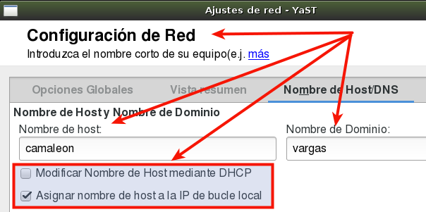

# Entrega

* Entregar 1 informe con las capturas de pantalla.
* Comentar brevemente los pasos en el informe.

---

# 1. Windows

## 1.1 Durante la instalación

* Descargar Windows:
    * La versión *Windows7 enterprise sp1 x64*.
* Crear una MV, esta vez si tendrá disco duro.
    * Dejar el tamaño de disco recomendado.
* Vamos a realizar un instalación por defecto, cambiando lo siguiente ([configuración](../../../global/configuracion/windows.md)):
    * Supongamos que el alumno se llama "David Vargas"  y está en el puesto 16.
    * Nombre de usuario : `david`
    * Nombre del equipo : `vargas16w`
    * Nombre del grupo de trabajo: `curso1920` (Adapta este valor al curso actual)
    * Siempre usar minúsculas. No poner tildes, caracteres que no estén en el teclado inglés.

## 1.2 Después de la instalación

* Abrir un terminal *PowerShell*, y capturar la salida de los siguientes comandos:
```
ipconfig
date
whoami
hostname
```

* Cuando terminamos la instalación conviene quitar la ISO de instalación de la unidad de CD/DVD para que no se inicie al arrancar la MV.

---

# 2. GNU/Linux

> Enlace de interés:
> * [Vídeo Install OpenSUSE](http://www.youtube.com/embed/nC8n1Pg6gto?list=PL3E447E094F7E3EBB)

## 2.1 Durante la intalación

* Descargar la versión de *GNU/Linux OpenSUSE* recomendada por el profesor.
* Comprobar la descarga:
```
$ sha256sum -c openSUSE-Leap-15.0-DVD-x86_64.iso.sha256 
openSUSE-Leap-15.0-DVD-x86_64.iso: La suma coincide
sha256sum: ATENCIÓN: 14: líneas tienen un formato erróneo
```

* Crear una MV, esta vez si tendrá disco duro.
    * Poner 20GB como tamaño del disco duro virtual.
* Vamos a realizar un instalación por defecto, cambiando lo siguiente ([configuración](../../../global/configuracion/opensuse.md)):
    * Supongamos que el alumno se llama "Obiwan Kenobi"  y está en el puesto 42.
    * Nombre de usuario : `obiwan`
    * Nombre del equipo : `kenobi42g`
    * Nombre del dominio: `curso1920` (Adapta este valor al curso actual)
    * Siempre usar minúsculas. No poner tildes, caracteres que no estén en el teclado inglés.

## 2.2 Después de la instalación

> Cuando decimos nombre de host es lo mismo que nombre de máquina

* Una vez instalado el sistema operativo, ejecutar el programa
`Yast`. Ir a `Ajustes de red -> Nombre de Host/DNS`.
    * Escribir nombre de host/máquina
    * Escribir nombre de dominio
    * Deshabilitar `Modificar nombre...`
    * Activar `Asignar nombre...`



* Abrir un terminal y capturar la salida de los siguientes comandos:
```
ip a
date
whoami
hostname -f
sudo blkid
sudo fdisk -l
```

* Cuando terminamos la instalación conviene quitar la ISO de instalación de la unidad de CD/DVD para que no se inicie al arrancar la MV.

---

# 3. Live CD

Vamos a practicar con un SO en live CD.
* Descargar una ISO Live del sistema operativo Knoppix (versión 7 por ejemplo).
* Crear una máquina virtual sin disco duro.
* Iniciar el SO en modo LIVE.

> Para que se nos cargue en español debemos poner en el inicio **boot:**` knoppix lang=es`

* Probar el sistema.
* Abrir un terminal y capturar la salida de los siguientes comandos:
```
ip a
sudo blkid
date
whoami
hostname
```

* Crear algunos archivos y carpetas.
* Reiniciar el SO live.
* Comprobar que los archivos/carpetas creados anteriormente no se han guardado.

