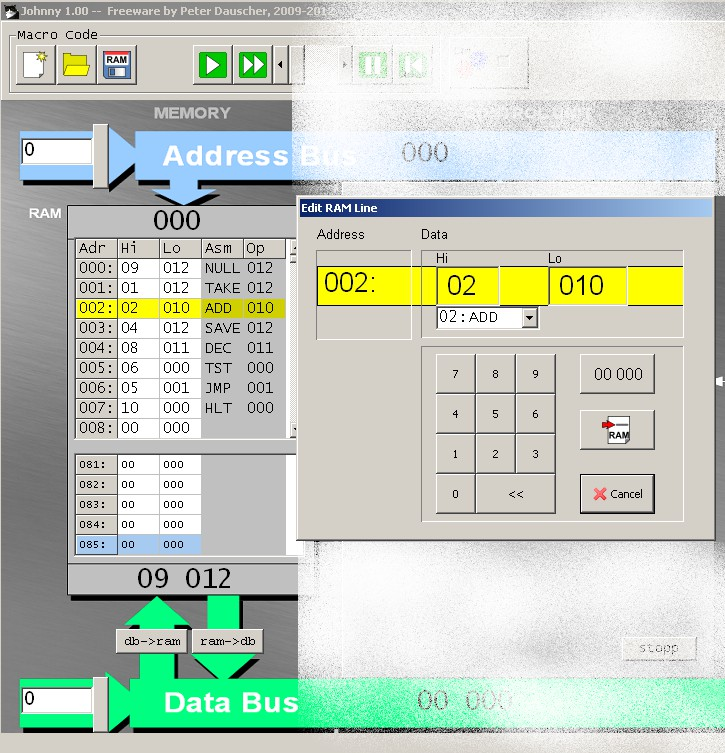

#4. El procesador
El procesador consta de tre partes: La Unidad Aritmético Lógica,
la memoria (RAM) y la Unidad de Control. Estas unidades están
interconectadas por los buses.

A continuación se explica cada unidad en detalle.

##4.1 La memoria (RAM)
La memoria de acceso aleatorio (RAM) consta de 1000 posiciones,
cada una con la posibilidad de almacenar números de 0 a 19999.
De modo qie tres dígitos decimales son suficientes para direccionar
cada posición de memoria.

La posición 10000 y la 1000 están separadas un bit de otras posiciones
puesto que representan el código de operación de las macro instrucciones.

Hay dos botones que se usan (disparando las microinstrucciones `ram->db` y `db->ram`)
para mover los datos desde la localización direccionada al bus y viceversa.

Las posiciones se pueden editar usado en GUI; mediante el menú desplegable se pueden
elegit las macro intrucciones. En el GUI, se muestran dos secciones de memoria RAM
(Las cuales se pueden superponer). De esta forma se pueden mostrar simultáneamente
las instrucciones y los datos afectados.

#4.2. La Unidad Aritmético Lógica
The Arithmetic Logic Unit consists merely of the accumula-
tor. The accumulator can be reset ( acc:=0 ), incremented
( acc++ ), decremented ( acc-- ). db->acc
transports a data word from the bus into the accumulator;
acc->db does the opposite.
A value from the bus can be added ( plus ) or subtracted
( minus ).
In the so-called BONSAI Mode (to be explained later in Sec-
tion 9) some of these micro instructions are suppressed.
